# 第二章 Flask与HTTP

## 1. HTTP的请求响应循环是什么样的？
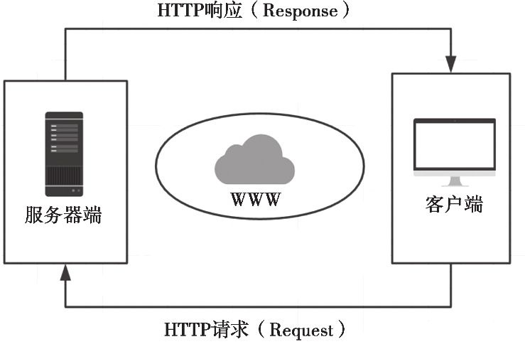

---

## 2. Flask服务器是如何与客户端通信的？
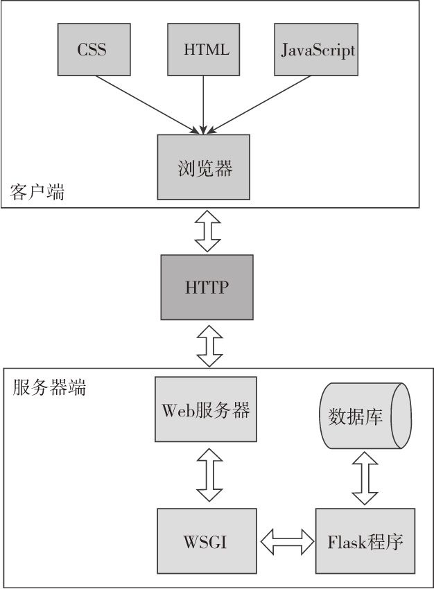
* 用户访问一个URL，浏览器便生成对应的HTTP请求，经由互联网发送到对应的Web服务器；
* Web服务器接受请求，**通过WSGI将HTTP格式的请求数据转化为Flask程序能够使用的Python数据**；
* Flask根据请求的URL执行对应的视图函数，获取返回值生成响应；
* 响应依次经过WSGI转化成HTTP响应，再经由web服务器传递，最终被发送请求的客户端接收；
* 浏览器渲染响应中的HTML和CSS代码，并执行JavaScript代码，最终把解析后的页面展示在浏览器窗口中。

---

## 3. Flask的Reuquest对象有哪些常用的属性和方法？
* 对于URL：
  
  以URL http://helloflask.com/hello?name=Grey 为例，reuqesrt提供了多种url：

  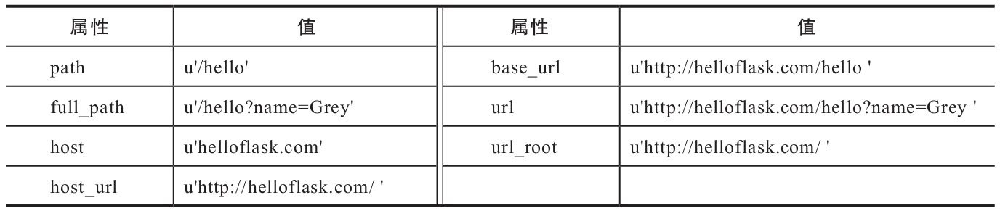

* 对于请求报文, 常用属性及方法：
  
  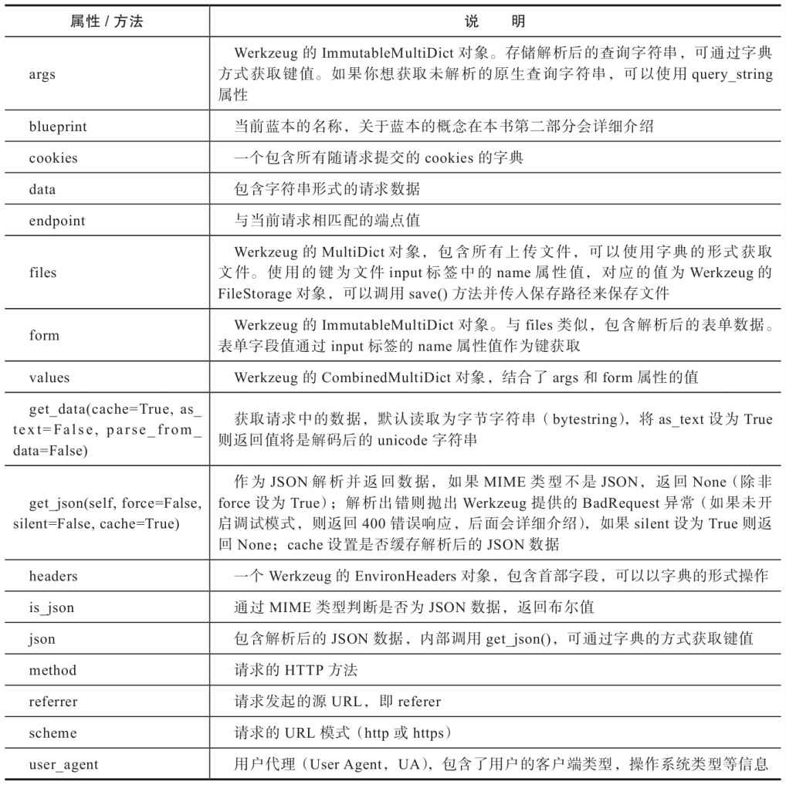

  其中，`MutliDict`类是字典的子类，它主要实现了同一个键对应多个值的情况。这时就可以通过`getlist()`方法来获取文件对象列表。而`ImmutableMultiDict`类继承了`MutliDict`类，但其值不可更改。
  [参考](https://werkzeug.palletsprojects.com/en/2.0.x/datastructures/)

  **注意**：从request对象的类型为MutliDict或ImmutableMultiDict的属性（比如files、form、args）中直接使用键作为索引获取数据时（比如request.args['name']），如果没有对应的键，那么会返回HTTP 400错误响应（Bad Request，表示请求无效），而不是抛出KeyError异常。
  
  为了避免这个错误，我们应该使用`get()`方法获取数据，如果没有对应的值则返回None；第二个参数可以设置默认值，比如`requset.args.get('name'，'Human')`。

---

## 4. 如何查看Flask的路由表？

为了便于请求分发到对应的视图函数，程序中存储了一个路由表`app.url_map`，其中定义了URL规则和视图函数的映射关系。

可以使用`falsk routes`命令查看当前程序中定义的所有路由。
```
Endpoint      Methods  Rule
------------  -------  ---------------------------------------------------
colors        GET      /colors/<any(blue, black, white, red, green):color>
go_back       GET      /goback/<int:year>
hello         GET      /hello
static        GET      /static/<path:filename>
three_colors  GET      /colors/<any('blue', 'white', 'red'):color>
```
每个路由对应的端点（Endpoint）、HTTP方法（Methods）和URL规则（Rule），其中static端点是Flask添加的特殊路由，用来访问静态文件。

---

## 5. 如何设置监听HTTP请求的方法？
视图函数默认监听的方法类型为`GET, HEAD, OPTIONS`.

可以在`app.route()`方法中使用`methods`参数传入一个包含监听方法的可迭代对象。
```python
@app.route('/hello', methods=['GET', 'POST'])
def hello():
    return '<h1>Hello, Flask!</h1>'
```

可以为同一个URL规则定义多个视图函数，分别处理不同HTTP方法的请求。

---

## 6. URL转化器如何使用？

Flask内置了集中变量转换器，使用`<转换器:变量名>`的格式将参数转换为对应类型。（**注意：两个参数和冒号之间不能有空格**）
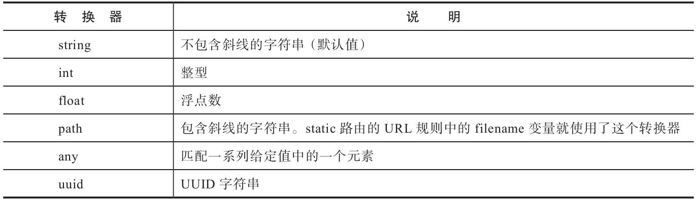

其中，在用法上唯一特别的是any转换器，你需要在转换器后添加括号来给出可选值，即`<any（value1，value2，...）：变量名>`。URL中传入的参数只能从value中选择，否则会404.
```python
@app.route('/colors/<any(blue, white, red):color>')
def three_colors(color):
    return '<p>Love is patient and kind. Love is not jealous or boastful or proud or rude.</p>'
```

如，http://localhost:5000/goback/34 对应的<int：year>表示为year变量添加了一个int转换器。

转换器不仅仅是转换变量类型，还包括URL匹配，如，如果/goback/后的字符串不是数字，而是字母，则会自动跳转到404页面，而不是抛出异常。

---

## 7. Flask提供了哪几种请求钩子？

请求钩子是用来对请求或响应进行预处理（preprocessing）和后处理（postprocessing）的方法，是用来注册在请求处理的不同阶段执行的处理函数（或称为回调函数）。
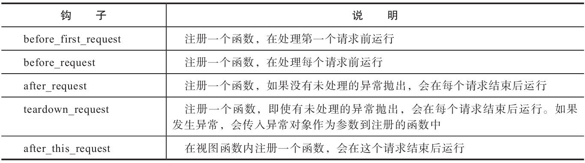

其中，`after_request`钩子和`after_this_request`钩子必须接收一个响应类对象作为参数，并且返回同一个或更新后的响应对象。

钩子使用装饰器的方式使用，每个钩子可以注册任意多个处理函数。
```python
@app.before_request
def do_something():
    pass # 这里的代码会在每个请求处理前执行
```

示例：
假如我们创建了三个视图函数A、B、C，其中视图C使用了after_this_request钩子，那么当请求A进入后，整个请求处理周期的请求处理函数调用流程如图：
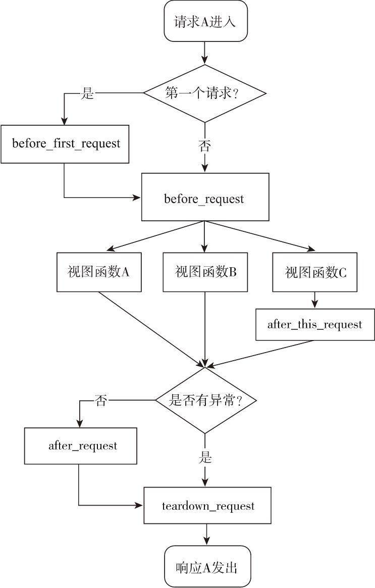

---

## 8. 钩子的使用场景有哪些？

* before_first_request：在程序中，运行程序前我们需要进行一些程序的初始化操作，比如创建数据库表，添加管理员用户。这些工作可以放到使用before_first_request装饰器注册的函数中。

* before_request：比如网站上要记录用户最后在线的时间，可以通过用户最后发送的请求时间来实现。为了避免在每个视图函数都添加更新在线时间的代码，我们可以仅在使用before_request钩子注册的函数中调用这段代码。

* after_request：我们经常在视图函数中进行数据库操作，比如更新、插入等，之后需要将更改提交到数据库中。提交更改的代码就可以放到after_request钩子注册的函数中。

* 另一种常见的应用是建立数据库连接，通常会有多个视图函数需要建立和关闭数据库连接，这些操作基本相同。一个理想的解决方法是在请求之前（before_request）建立连接，在请求之后（teardown_request）关闭连接。

---

## 9. 常见的HTTP响应状态码有哪些？

[所有状态码定义](https://datatracker.ietf.org/doc/html/rfc7231#section-6)

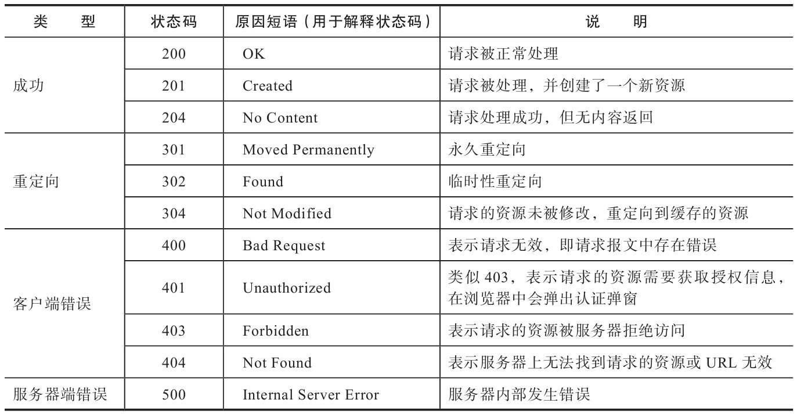

---

## 10. 如何在Flask中生成响应？
视图函数可以返回最多由三部分组成的元组：响应主体、状态码、首部字段headers。
1. 使用视图函数直接返回响应主体内容，Flask会自动添加状态码和header等内容；
2. 在视图函数的返回值中继续指定状态码和headers；
   ```python
   return '<h1>Hello, Flask!</h1>'
   return '<h1>Hello, Flask!</h1>', 201
   return '', 302, {'Location', 'http://www.example.com'}
   ```
3. 使用`make_response(body, code)方法`将视图函数返回值转换为响应Response对象。

---

## 11. 如何在Flask中使用重定向？
使用`redirect()`方法指定要重定向的URL，通常会配合`url_for()`指定端点获取URL进行使用。

使用redirect（）函数时，默认的状态码为302，即临时重定向。如果你想修改状态码，可以在redirect（）函数中作为第二个参数或使用`code关键字`传入。

```python
from flask import Flask, redirect, url_for 
...
@app.route('/hi')
def hi():
    ...
    return redierct(url_for('hello'))  # 重定向到/hello

@app.route('/hello')
def hello():
    ...
```

---

## 12. 如何在Flask中抛出错误响应？

大多数情况下，Flask会自动处理常见错误响应。HTTP错误对应的异常类在Werkzeug的`werkzeug.exceptions`模块中定义，抛出这些异常即可返回对应的错误响应。

如果想手动返回错误，可使用`abort()`方法，其参数为想要抛出的状态码。

abort（）函数前不需要使用return语句，但一旦abort（）函数被调用，abort（）函数之后的代码将不会被执行。

---

## 13. 如何修改响应的响应格式？

HTTP数据可通过多种格式传输，一般为默认的HTML。不同的响应数据格式需要设置不同的`MIME类型`，MIME类型在首部的`Content-Type`字段中定义。

> **[MIME类型](https://www.iana.org/assignments/media-types/media-types.xhtml)**（又称为media type或content type）是一种用来标识文件类型的机制，它与文件扩展名相对应，可以让客户端区分不同的内容类型，并执行不同的操作。一般的格式为`类型名/子类型名`，其中的子类型名一般为文件扩展名。

如果想修改MIME类型:
1. 可以通过make_response()方法生成相应对象，使用相应对象的`mimetype`属设置;
2. 直接设置headers中的`Content-Type`字段。
```python
rom flask import make_response

@app.route('/foo')
def foo():
    response = make_response('Hello, World!')
    response.mimetype = 'text/plain'
    return response
# 或者
response.headers['Content-Type']='text/xml；charset=utf-8'
```

---

## 14. Flask中提供的方便处理JSON内容的方法是什么？

使用`jsonify()`函数，我们仅需要传输数据或参数，就可以进行序列化，生成JSON字符串为响应的中体，并设置对于的MIME格式。

```python
jsonify(name='Grey Li', gender='male')  # 关键字参数形式传参
jsonify({name: 'Grey Li', gender: 'male'})  # 直接传参
```

在Request对象中，我们可以使用`request.get_json（）方法和request.json属性`获取JSON格式的请求体。

---

## 15. Cookie的作用是什么？

Cookie一般添加在请求和响应的headers中，来保存和获取用户信息。

Cookie指Web服务器为了存储某些数据（比如用户信息）而保存在浏览器上的小型文本数据。浏览器会在一定时间内保存它，并在下一次向同一个服务器发送请求时附带这些数据。Cookie通常被用来进行用户会话管理（比如登录状态），保存用户的个性化信息（比如语言偏好，视频上次播放的位置，网站主题选项等）以及记录和收集用户浏览数据以用来分析用户行为等。

---

## 16. 为什么要使用Cookie？

HTTP是无状态（stateless）协议。在一次请求响应结束后，服务器不会留下任何关于对方状态的信息。但是对于某些Web程序来说，客户端的某些信息又必须被记住，比如用户的登录状态，这样才可以根据用户的状态来返回不同的响应。

---

## 17. 如何为响应设置Cookie信息？

使用Response类提供的`set_cookie()`方法添加。首先使用`make_response()`方法传入响应主体生成Response响应对象，然后使用`set_cookie()`方法添加要保存在浏览器的用户信息。

Response类的常用属性及方法：
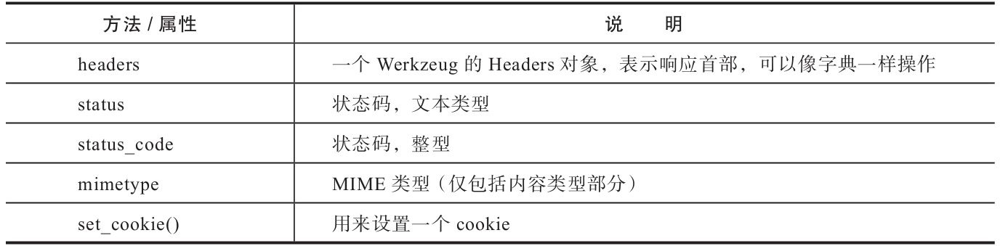
此外，还包括Request类提供的`get_json()`和`is_json()`方法和json属性也可以使用。

set_cookie()方法的参数：
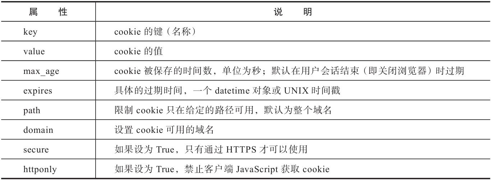
```python
from flask import Flask, make_response
...
@app.route('/set/<name>')
def set_cookie(name):
    response = make_response(redirect(url_for('hello')))
    response.set_cookie('name', name)
    return response
```
set_cookie视图会在生成的响应报文首部中创建一个`Set-Cookie`字段，即“Set-Cookie：name=Grey；Path=/”。通过浏览器查看，可以看到名为name的cookie。浏览器再次发送到该服务器的请求会自动携带设置的Cookie信息。

---

## 18. 如何从请求中读取Cookie信息？

Cookie可以从请求对象的`cookies属性`中读取。
```python
from flask import Flask, request

@app.route('/')
@app.route('/hello')
def hello():
    name = request.args.get('name')
    if name is None:
        name = request.cookies.get('name', 'Human')  # 从Cookie中获取name值
    return '<h1>Hello, %s</h1>' % name
```
---

## 19. session与cookie有什么不同？
cookie的内容是明文，很容易被读取和篡改。session则是对cookie内容使用秘钥进行了签名加密存储。（**注意**: session的内容也可以通过工具进行读取(即使不知道密钥)，因此不能存放密码等敏感信息。）

> session指用户会话（user session），又称为对话（dialogue），即服务器和客户端/浏览器之间或桌面程序和用户之间建立的交互活动。在Flask中，session对象用来加密Cookie。默认情况下，它会把数据存储在浏览器上一个名为session的cookie里。

使用session对象存储的Cookie，用户可以看到其加密后的值，但无法修改它。因为session中的内容使用密钥进行签名，一旦数据被修改，签名的值也会变化。这样在读取时，就会验证失败，对应的session值也会随之失效。所以，除非用户知道密钥，否则无法对session cookie的值进行修改。

---

## 20. 如何为session设置密钥？

session通过密钥对数据进行签名以加密数据。
1. 密钥可以通过`Flask.secret_key属性`；
   ```python
   app.secret_key = 'secret string'
   ```
2. 还可以`SECRET_KEY环境变量`写入`.env`文件进行设置，设置在环境变量中的密钥需要使用`os.getenv()`方法进行读取。
   ```python
   # .env文件中设置
   SECRET_KEY=secret string

   # 读取
   import os
   # ...
   app.secret_key = os.getenv('SECRET_KEY', 'secret string')
   ```

---

## 21. 如何操作session中的数据？

session中的数据可以像字典一样通过键读取，或是使用 get() 方法。

如果想删除session中的某个键值对，可以使用 pop() 方法。

---

## 22. 如何设置session cookie属性的生命周期？

默认情况下，session cookie会在用户关闭浏览器时删除。

通过将`session.permanent属性`设为True可以将session的有效期延长为`Flask.permanent_session_lifetime属性值`对应的datetime.timedelta对象，也可通过配置变量`PERMANENT_SESSION_LIFETIME`设置，默认为31天。

---

## 23. Flask是如何将request做到不用传参即可全局访问的？

每个视图函数都需要上下文信息，但是我们在视图函数中使用request时，他并不是以参数的形式传入视图函数的，而是直接使用了全局的request对象，然后在函数里调用request的属性和方法。这是因为Falsk会在每个请求进入后自动激活当前请求的上下文，激活请求上下文后，request被临时设置为全局可访问。而当请求结束后，Flask就会销毁对应的请求上下文。这是一种动态的全局变量。

在多线程服务器中，同一时间可能会有多个请求在处理，每个请求都有各自的请求报文，请求对象只在各自的线程中是全局的。Flask使用**本地线程**（local thread）技术将请求对象在特定的线程和请求中全局可访问。

---

## 24. Flask提供了哪些上下文全局变量？

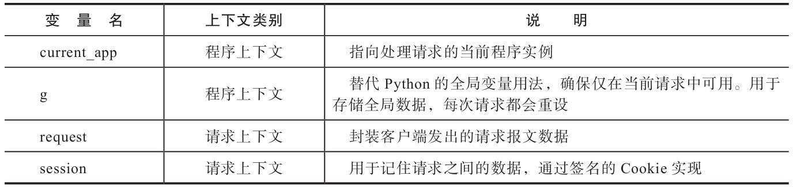

> 这四个变量都是**代理对象（proxy）**，即指向真实对象的代理。如果要获取原对象，可以对代理对象使用`_get_current_object()`方法获取被代理的真实对象。

在不同的视图函数中，request对象都表示和视图函数对应的请求，也就是当前请求（current request）。而程序也会有多个程序实例的情况，为了能获取对应的程序实例，而不是固定的某一个程序实例，我们就需要使用current_app变量。

g存储在程序上下文中，而程序上下文会随着每一个请求的进入而激活，随着每一个请求的处理完毕而销毁，所以每次请求都会重设这个值。我们通常会使用它结合请求钩子来保存每个请求处理前所需要的全局变量，比如当前登入的用户对象，数据库连接等。前面我们在hello视图中从查询字符串获取name的值，如果每一个视图都需要这个值，那么就要在每个视图重复这行代码。借助g我们可以将这个操作移动到before_request处理函数中执行，然后保存到g的任意属性上。另外，g也支持使用类似字典的get（）、pop（）以及setdefault（）方法进行操作。
```python
from flask import g

@app.before_request
def get_name():
    g.name = request.args.get('name')
```
---

## 25. 上下文会在什么情况下自动激活和销毁？
* 程序上下文：
  * 使用flask run命令启动程序时；
  * 使用旧的 app.run() 方法启动程序时；
  * 执行使用@app.cli.command() 装饰器注册的flask命令时；
  * 使用flask shell命令启动Python shell时；
  * 请求进入后自动激活请求上下文，程序上下文也自动激活。
* 请求上下文：
  * 请求进入时。

当请求处理完毕后，请求上下文和程序上下文就会自动销毁。即，在处理请求时，二者拥有相同的生命周期。所以，我们可以在视图函数中或在视图函数内调用的函数/方法中使用所有上下文全局变量。

在上下文未被激活而是用全局变量时会报错 RuntimeError。

---

## 26. 如何手动激活上下文，从而使用以上变量？

* 程序上下文：
  * 使用 `app.app_context()`方法获取，配合with语句作为上下文：
    ```python
    >>> from app import app
    >>> from flask import current_app
    >>> with app.app_context():
        ... current_app.name
    'app'
    ```
  * 使用`push()`方法激活，使用`pop()`方法销毁：
    ```python
    >>> from app import app
    >>> from flask import current_app
    >>> app_ctx = app.app_context()
    >>> app_ctx.push()
    >>> current_app.name
    'app'
    >>> app_ctx.pop()
    ```
* 请求上下文：
  * 使用`test_request_context()`方法临时创建：
    ```python
    >>> from app import app
    >>> from flask import request
    >>> with app.test_request_context('/hello'):
    ...     request.method
    'GET'
    ```
  * 同样也可使用push() 和 pop()方法显式推送和销毁请求上下文。

---

## 27. 哪些函数只能在激活上下文后使用？

`url_for()`和`jsonify()`等函数依赖于上下文，只能在视图函数中使用。其中jsonify（）函数内部调用中使用了current_app变量，而url_for（）则需要依赖请求上下文才可以正常运行。

---

## 28. 上下文钩子如何使用？

Flask提供了一个上下文钩子`teardown_appcontext`，使用它注册的回调函数会在程序上下文被销毁时调用，而且通常也会在请求上下文被销毁时调用。

该装饰器注册的回调函数需要接收异常对象作为参数，当请求被正常处理时这个参数为None，函数返回值被忽略。
```python
@app.teardown_appcontext
def teardown_db(exception):
    ...
    db.close()
```

---

## 29. 在Flask中如何重定向会上一个页面？

使用场景：
用户单击某个需要登录才能访问的链接，这时程序会重定向到登录页面，当用户登录后合理的行为是重定向到用户登录前浏览的页面，以便用户执行未完成的操作，而不是直接重定向回主页。

1. 使用 HTTP referer：
   
   > HTTP referer（起源为referrer在HTTP规范中的错误拼写）是一个用来记录请求发源地址的HTTP首部字段（HTTP_REFERER），即访问来源。当用户在某个站点单击链接，浏览器向新链接所在的服务器发起请求，请求的数据中包含的`HTTP_REFERER字段`记录了用户所在的原站点URL。

   在Flask中，referer的值可以通过reuqest对象的`referrer属性`获取：`request.referrer`。不过有时该字段会是**空值**。此时则需跳转到备用的地址，如主页。
   ```python
   return redirect(request.referrer or url_for('hello'))
   ```
2. 在URL中添加查询参数next：
   
   在URL中手动加入包含当前页面URL的查询参数，这个查询参数一般命名为`next`（http://localhost:5000/do-something?next=http://helloflask.com）。
   ```python
   # 这里使用request.full_path获取当前页面的完整路径。
   url_for('do_something', next=request.full_path)

   # 重定向时获取next参数
   return redirect(request.args.get('next'))
   ```
   同样next参数也可能为空。

综上，可以将这两种方式搭配起来一起使用：首先获取next参数，如果为空就尝试获取referer，如果仍然为空，那么就重定向到默认的hello视图。

---

## 30. 如何对重定向的URL进行简单的安全验证？

鉴于referer和next容易被篡改的特性，如果我们不对这些值进行验证，则会形成[开放重定向（Open Redirect）漏洞](https://www.owasp.org/index.php/Unvalidated_Redirects_and_Forwards_Cheat_Sheet)。

确保URL安全的关键是判断URL是否属于程序内部。
```python
# python2: from urlparse import urlparse, urljoin  
# Python3需要从urllib.parse导入
from urllib.parse import urlparse, urljoin
from flask import request

def is_safe_url(target):
    ref_url = urlparse(request.host_url)
    test_url = urlparse(urljoin(request.host_url, target))
    return test_url.scheme in ('http', 'https') and \
           ref_url.netloc == test_url.netloc
```
该函数接收目标URL作为参数，并通过request.host_url获取程序内的主机URL，然后使用urljoin（）函数将目标URL转换为绝对URL。接着，分别使用urlparse模块提供的urlparse（）函数解析两个URL，最后**对目标URL的URL模式和主机地址进行验证**，确保只有属于程序内部的URL才会被返回。

---

## 31. AJAX异步请求的作用是什么？

> AJAX指异步Javascript和XML（Asynchronous JavaScript And XML），它不是编程语言或通信协议，而是一系列技术的组合体。主要用途是在不重新加载当前页面的情况下，与服务器通信获取数据，局部更新页面内容。

简单来说，AJAX基于[XMLHttpRequest](https://xhr.spec.whatwg.org/ )让我们可以在不重载页面的情况下和服务器进行数据交换。加上JavaScript和DOM（Document Object Model，文档对象模型），我们就可以在接收到响应数据后局部更新页面。而XML指的则是数据的交互格式，也可以是纯文本（Plain Text）、HTML或JSON。XMLHttpRequest不仅支持HTTP协议，还支持FILE和FTP协议。

应用场景：加载长文章，加载页面瀑布流信息等

## 32. 如何在前端页面发送AJAX请求？

使用jQuery提供的`ajax()`函数可以发送AJAX请求。这是一个底层函数，有丰富的自定义配置，常用参数有：
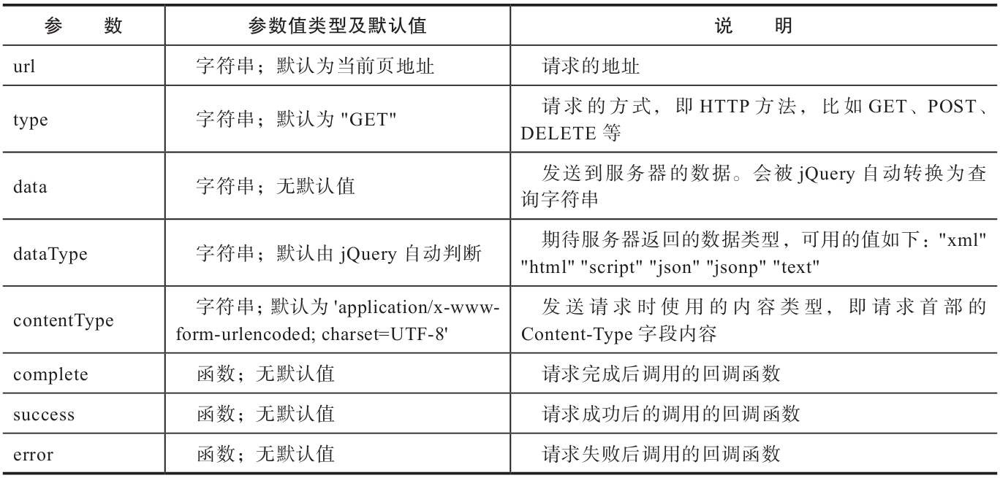
[完整参数参考](https://api.jquery.com/jQuery.ajax/#jQuery-ajax-settings)

jQuery还提供了其他快捷方法：用于发送GET请求的`get（）方法`和用于发送POST请求的`post（）方法`，还有直接用于获取json数据的`getjson（）`以及获取脚本的`getscript（）`方法。[参考](https://api.jquery.com/category/ajax/)


jQuery是流行的JavaScript库，它包装了JavaScript，让我们通过更简单的方式编写JavaScript代码。使用jQuery实现AJAX并不是必须的，你可以选择使用原生的XMLHttpRequest、其他JavaScript框架内置的AJAX接口，或是使用更新的[Fetch API](https://fetch.spec.whatwg.org/)来发送异步请求。

---

## 33. AJAX返回的局部数据有哪几种？

常见的局部数据有以下三种：
1. 纯文本或局部HTML模板：
   纯文本可以在java script用来直接替换掉页面中的文本值；
   局部HTML则可以直接插入到页面中。
2. JSON数据：
   JSON数据可以在JavaScript中直接操作。在jQuery的ajax()方法的success回调中，响应主体中的JSON字符串会被解析成JSON对象。
3. 空值：
   不需要返回给客户端数据，则直接返回空值，和204状态码。

## 34. 使用AJAX异步加载长文章示例：

我们将显示一篇很长的虚拟文章，文章正文下方有一个“加载更多”按钮，当加载按钮被单击时，会发送一个AJAX请求获取文章的更多内容并直接动态插入到文章下方。

```python
from jinja2.utils import generate_lorem_ipsum  

@app.route('/post')
def show_post():
    post_body = generate_lorem_ipsum(n=2)  # 生成两段随机文本
    return '''
<h1>A very long post</h1>
<div class="body">%s</div>                                          //显示文章内容
<button id="load">Load More</button>                                // “加载更多”按钮
<script src="https://code.jquery.com/jquery-3.3.1.min.js"></script> // 从CDN加载jQuery资源
<script type="text/javascript">                                     // 触发“加载更多”按钮后用来发送请求获取文章内容
$(function() {
    $('#load').click(function() {
        $.ajax({
            url: '/more',                       // 目标URL
            type: 'get',                        // 请求方法
            success: function(data){            // 返回2XX响应后触发的回调函数
                $('.body').append(data);        // 将返回的响应插入到页面中
            }
        })
    })
})
</script>''' % post_body

# 请求处理的视图函数
@app.route('/more')
def load_post():
    return generate_lorem_ipsum(n=1)
```
其中，`generate_lorem_ipsum（）函数`可以生成无意义的随机文本，参数用来指定文本的段落数量。

js脚本内容解释：

> 在第二个script标签中，我们在代码的最外层创建了一个`$(function(){...})`函数，这个函数是常见的`$(document).ready(function(){...})`函数的简写形式。这个函数用来在页面DOM加载完毕后执行代码，类似传统JavaScript中的`window.onload`方法，所以我们通常会将代码包装在这个函数中。
> 
> **美元符号\$是jQuery的简写**，我们通过它来调用jQuery提供的多个方法，所以`$.ajax()` 等同于 `jQuery.ajax()`。
> 
> 在`$(function()){...})`中，`$('#load')`被称为*选择器*，我们在括号中传入目标元素的id、class或是其他属性来定位到对应的元素，将其创建为jQuery对象。
> 
> 我们传入了“加载更多”按钮的id值以定位到加载按钮。在这个选择器上，我们附加了`.click(function(){...})`，这会为加载按钮注册一个单击事件处理函数，当加载按钮被单击时就会执行单击事件回调函数。
> 
> 在这个回调函数中，我们使用`$.ajax()`方法发送一个AJAX请求到服务器，通过url将目标URL设为“/more”，通过type参数将请求的类型设为GET。当请求成功处理并返回2XX响应时（另外还包括304响应），会触发success回调函数。
> 
> success回调函数接收的第一个参数为服务器端返回的响应主体，在这个回调函数中，我们在文章正文（通过$('.body')选择）底部使用append（）方法插入返回的data数据。

---

## 35. HTTP服务的通信方式分类有哪些？

* 客户端拉取（client pull）：不论是传统的HTTP请求-响应式的通信模式，还是异步的AJAX式请求，服务器端始终处于被动的应答状态，只有在客户端发出请求的情况下，服务器端才会返回响应。用户只能通过刷新页面或主动单击加载按钮来拉取新数据。
* 服务器端推送（server push）：服务器主动将数据推送给用户，如将聊天消息推送给群里的所有人、推送新闻、更新在线状态等。

---

## 36. 常用的HTTP推送技术有哪些？

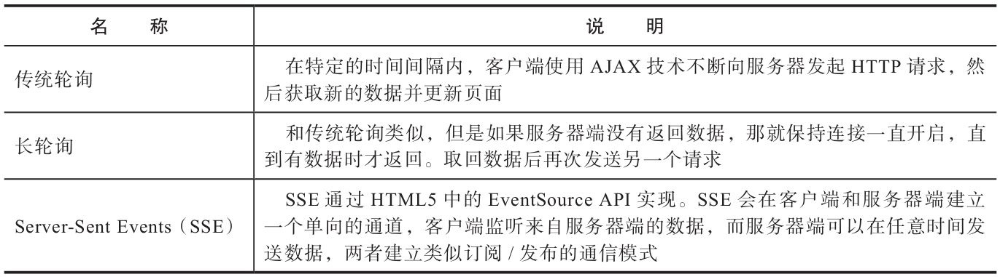

*轮询*（polling）这类使用AJAX技术模拟服务器端推送的方法实现起来比较简单，但通常会造成服务器资源上的浪费，增加服务器的负担，而且会让用户的设备耗费更多的电量（频繁地发起异步请求）。

[SSE](https://html.spec.whatwg.org/multipage/server-sent-events.html) 效率更高，在浏览器的兼容性方面，除了Windows IE/Edge，SSE基本上支持所有主流浏览器，但浏览器通常会限制标签页的连接数量。

> 除了这些推送技术，在HTML5的API中还包含了一个[WebSocket协议](https://tools.ietf.org/html/rfc6455)，和HTTP不同，它是一种基于TCP协议的全双工通信协议（full-duplex communication protocol）。和前面介绍的服务器端推送技术相比，WebSocket实时性更强，而且可以实现双向通信（bidirectional communication）。另外，WebSocket的浏览器兼容性要强于SSE。

扩展：[几种推送技术的区别](https://stackoverflow.com/questions/11077857/what-are-long-polling-websockets-server-sent-events-sse-and-comet/12855533#12855533)

---

## 37. 常见的WEB攻击有哪几种？

* 注入攻击（Injection）；
* XSS（Cross-Site Scripting，跨站脚本）攻击；
* CSRF（Cross-Site Request Forgery，跨站请求伪造）攻击；
* 此外还有文件上传漏洞、敏感信息存储、用户认证（authentication）与权限管理漏洞等。

常见漏洞及攻击形式可参考OWASP Top 10(https://owasp.org/www-project-top-ten/)或是CWE（Common Weakness Enumeration，一般弱点列举）提供的Top 25(https://cwe.mitre.org/top25/)。

为了确保你的程序所有的安全项目检查，也可以使用漏洞检查工具来检查，比如OWASP提供的WebScarab(https://github.com/OWASP/OWASP-WebScarab).

---

## 38. SQL注入攻击的原理、及该如何防止改攻击？

> [注入攻击](https://www.owasp.org/index.php/SQL_Injection )是最常见的攻击方式之一，常见的注入攻击包括系统命令（OS Command）注入、SQL（Structured Query Language，结构化查询语言）注入（SQL Injection）、NoSQL注入、ORM（Object Relational Mapper，对象关系映射）注入等。

重点介绍SQL注入：

* 攻击原理：
  
  在编写SQL语句时，如果直接将用户传入的数据作为参数使用字符串拼接的方式插入到SQL查询中，那么攻击者可以通过注入其他语句来执行攻击操作，这些攻击操作包括可以通过SQL语句做的任何事：获取敏感数据、修改数据、删除数据库表……
  ```python
  @app.route('/students')
  def bobby_table():
      password = request.args.get('password')
      cur = db.execute("SELECT * FROM students WHERE password='%s';" %   password)
      results = cur.fetchall()
      return results
  ```
  这里用GET请求来演示攻击方式，如果用户在输入密码时写入了而已攻击的SQL语句`“'or 1=1--”`，则SQL语句为`SELECT * FROM students WHERE password='' or 1=1 --;'`。其中，“;”用来结束一行语句；“--”用来注释后面的语句。这样攻击者就会获取到表中所有数据。

* 防范方式：
  
  1. 使用ORM可以再一定程度上避免SQL注入问题；
  2. 验证用户数据的输入类型；
  3. 参数化查询：
     在构造SQL语句时避免使用拼接字符串或字符串格式化（使用百分号或format（）方法）的方式来构建SQL语句。而要使用各类接口库提供的参数化查询方法，以内置的sqlite3库为例：`db.execute('SELECT * FROM students WHERE password=?, password)`。
  4. 转义特殊字符，如引号、分号、横线等。使用参数化查询时，接口会做转义工作。

---

## 39. XSS跨站脚本攻击的原理、分类，如何防范攻击？

* 攻击原理：
  
  [XSS](https://owasp.org/www-community/attacks/xss/)是注入攻击的一种，攻击者通过将代码注入被攻击者的网站中，用户一旦访问网页便会执行被注入的恶意脚本。XSS攻击可以在任何用户可定制内容的地方进行，例如图片引用、自定义链接。
  
* 分类：
  
  * 反射型XSS攻击（Reflected XSS Attack），也称非持久型XSS（Non-Persistent XSS）。这种攻击会通过URL注入攻击脚本，只有当用户访问这个URL时才会执行攻击脚本。
  * 存储型XSS攻击（Stored XSS Attack），也称持久型XSS（persistent XSS）。这种类型的XSS攻击更常见，危害也更大。它和反射型XSS类似，不过会把攻击代码储存到数据库中，任何用户访问包含攻击代码的页面都会被殃及。
  
* 示例：
  ```python
  @app.route('/hello')
  def hello():
      name = request.args.get('name')
      response = '<h1>Hello, %s!</h1>' % name
  ```
  如果攻击者在URL的name参数中输入一段js代码，如`<script>alert('Bingo!');</script>`,则视图函数返回的内容就会变为`<h1>Hello, <script>alert('Bingo!');</script>!</h1>`，从而打开一个弹窗警告。同理其他攻击也一样。

* 防范措施：
  
  1. HTML转义：
     
     对用户的输入内容进行HTMl转义，以确保用户输入的内容在浏览器中只能作为文本显示，而不是作为代码解析。
     
     如，使用markupsafe中的`escape()函数`处理用户输入：
     ```python
     from markupsafe import escape
     
     @app.route('/hello')
     def hello():
         name = request.args.get('name')
         response = '<h1>Hello, %s!</h1>' % escape(name)
     ```
     `<script>alert('Bingo!');</script>`在转义后会得到`&lt;script&gt;alert(&#34;Bingo!&#34;)&lt;/sript&gt;`HTML实体，显示为文本。

  2. 验证用户输入：
     要在所有接收用户输入的地方做好验证工作。即使使用Jinja2模板，攻击者也可能使用js语句进行攻击。
     
     如，在用户设置头像的url连接中``, 攻击者将url部分写为`123"onerror="alert('Bingo！')`, 则``会弹出窗口。因为src中传入了一个错误的URL，浏览器便会执行onerror属性中设置的JavaScript代码。

---

## 40. 跨站请求伪造CSRF攻击的原理，如何防范？

* 攻击原理：
  
  > [CSRF](https://www.owasp.org/index.php/Cross-Site_Request_Forgery_(CSRF))（Cross Site Request Forgery，跨站请求伪造）又被称为One-Click Attack或Session Riding。其攻击原理为，利用用户保存在浏览器中的cookie认证信息，向对应的站点发送伪造请求。

  如，某用户登录了A网站，认证信息保存在cookie中。当用户访问攻击者创建的B网站时，攻击者通过在B网站发送一个伪造的请求（携带A网站的cookie）提交到A网站服务器上，让A网站服务器误以为请求来自于自己的网站，于是执行相应的操作，该用户的信息便遭到了篡改。

* 防范措施：
  
  1. 正确使用HTTP方法：
     
     * GET方法属于安全方法，不会改变资源状态，仅用于获取资源，因此又被称为幂等方法（idempotent method）。页面中所有可以通过链接发起的请求都属于GET请求。

     * POST方法用于创建、修改和删除资源。在HTML中使用form标签创建表单并设置提交方法为POST，在提交时会创建POST请求。

     正确使用HTTP方法后，攻击者就不能通过GET请求修改数据了。

  2. 使用CSRF令牌校验：
     
     当处理非GET请求时，要避免CSRF攻击，关机是判断请求是否来自有自己的网站。这是referrer是不可靠的。处理在表单中加入验证码之外，一般的做法是通过在客户端页面中加入伪随机数来防止CSRF攻击，这个伪随机数成为CSRF令牌（token）。

     在HTML中，POST方法的请求通过表单创建。我们把在服务器端创建的伪随机数（CSRF令牌）添加到表单中的隐藏字段里和session变量（即签名cookie）中，当用户提交表单时，这个令牌会和表单数据一起提交。在服务器端处理POST请求时，我们会对表单中的令牌值进行验证，如果表单中的令牌值和session中的令牌值相同，那么就说明请求发自自己的网站。
     
     CSRF令牌在用户向包含表单的页面发起GET请求时创建，并且会在一段时间内过期。但是攻击者也可能会得到这个数据。

     对于AJAX请求，我们可以在XMLHttpRequest请求首部添加一个自定义字段X-CSRFToken来保存CSRF令牌。

     通常使用扩展来创建和验证token，常用的包有[Flask-SeaSurf](https://github.com/maxcountryman/flask-seasurf)和[Flask-WTF内置的CSRFProtct](https://github.com/lepture/flask-wtf)等。

* 注意：如果程序包含XSS漏洞，那么攻击者可以使用跨站脚本攻破可能使用的任何跨站请求伪造（CSRF）防御机制，比如使用JavaScript窃取cookie内容，进而获取CSRF令牌。