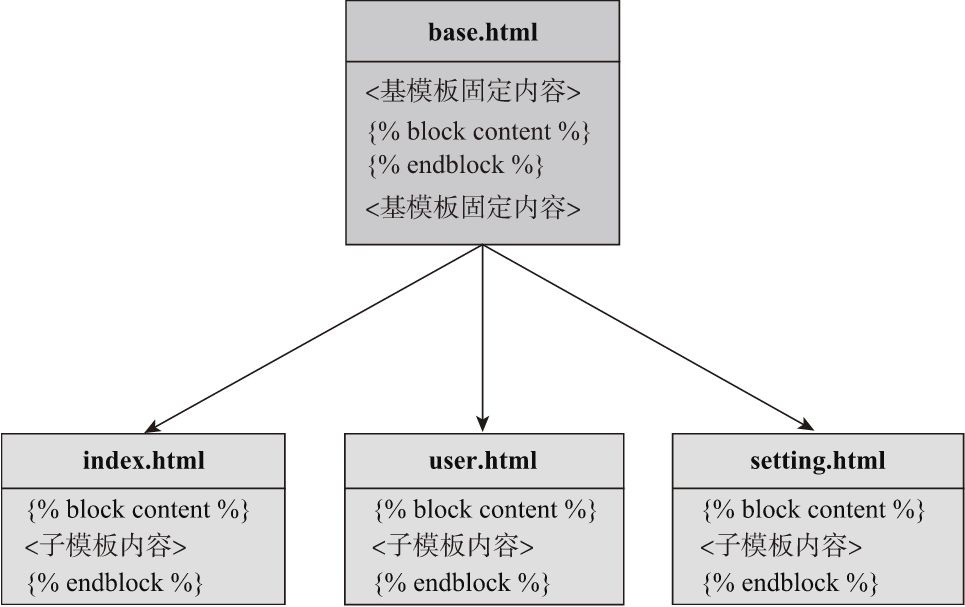

# 第三章 模板

## 1. 什么是模板？

在WEB开发中，为了使业务逻辑和展示逻辑分离，需要把前端的HTML文件单独放在文件中，同时，HTML中有一些根据业务逻辑动态变化的变量，需要使用特殊的语法来标记这些变量。这类包含固定内容和动态部分的可重用文件称为模板（template）。

模板可以是任何格式的纯文本文件，比如HTML、XML、CSV、LaTeX等。

***

## 2. 什么是模板引擎？

模板引擎（template engine）负责读取并执行模板中的特殊语法标记，并根据传入的数据将变量替换为实际值，输出最终的HTML页面。这个过程称为渲染（rendering）。

Flask默认的模板引擎为Jinja2，他除了可以设置变量，还可以在模板中添加if判断、for循环、调用函数等。

***

## 3. Jinja2中有那几种常见的定界符？其语法是什么？

定界符是用来在Jinja2模板中表示python语句和表达式的特殊字符。模板支持python语法，但不支持所有的语法。应在模板中适度使用。

常见的定界符：

1.  语句：用来执行if、for等python语句：

    ``

    **注意**：在控制语句结束后，必须添加结束标签``或``：

    ```HTML
    
        <i>{{ user.bio }}</i>
    
        <i>This user has not provided a bio.</i>
    

    
    <li>{{ movie.name }} - {{ movie.year }}</li>
    
    ```

2.  表达式：获取字符串、变量、函数调用等：

    `{{ ... }}`

    模板支持使用`.`来获取变量属性。如，传入一个字典变量后，可以直接使用`user.name`, 等同于`user['name']`。

    *   模板支持使用大部分python对象，如字符串、列表、字典、元组、整型、浮点型、布尔值；

    *   支持基本的运算符号（+、-、\*、/等）；

    *   比较符号（比如==、！=等）；

    *   逻辑符号（and、or、not和括号）

    *   以及in、is、None；

    *   布尔值（True、False）

3.  注释：

    `{# ... #}`

***

## 4. Jinja2 为for循环提供了哪些特殊变量？


[完整for循环变量列表](https://jinja.palletsprojects.com/en/2.10.x/templates/#for)

***

## 5. 如何渲染定义的模板文件？

Flask提供了`render_template()`函数用来渲染模板，其第一个参数为HTML模板名称，Flask会在根目录下的`templates`文件夹下寻找模板文件，因此使用相对与templates目录的路径；之后的参数使用关键字参数形式传入模板中定义的变量和变量值。

```python
from flask import Flask, render_template
...
@app.route('/watchlist')
def watchlist():
    return render_template('watchlist.html', user=user, movies=movies)
```

Flask还提供了一个`render_template_string()`函数用来渲染模板字符串。

区别：参数不同，用法相同

* render_template：渲染一个指定的模板文件。
* render_template_string：渲染一个指定的模板字符串。

***

## 6. Jinja2接收Flask传来的各种变量后如何调用？

传入Jinja2的各种变量可以是字符串、列表和字典，也可以是函数、类和类实例，这完全取决于在视图函数中传入的值。在模板中使用对应方法调用即可。

```html
<p>这是列表my_list的第一个元素：{{ my_list[0] }}</p>
<p>这是元组my_tuple的第一个元素：{{ my_tuple[0] }}</p>
<p>这是字典my_dict的键为name的值：{{ my_dict['name'] }}</p>
<p>这是函数my_func的返回值：{{ my_func() }}</p>
<p>这是对象my_object调用某方法的返回值：{{ my_object.name() }}</p>
```

注意：在模板中调用函数时，视图函数传入的是函数对象本身，即传函数名即可。不是传函数的调用（函数返回值）。传入后再在Jinja2模板中加括号调用函数，也可以向函数中传参。

***

## 7. Jinja2模板示例：

展示用户收藏的电影列表的[HTML](https://www.w3.org/wiki/HTML_structural_elements)模板文件。

```HTML
<!DOCTYPE html>
<html lang="en">
<head>
    <meta charset="UTF-8">
    <title>{{ user.username }}'s Watchlist</title>
</head>
<body>
<a href="{{ url_for('index') }}">&larr; return</a>
<h2>{{ user.username }}</h2>

    <i>{{ suer.bio }}</i>

    <i>This user has not provided a bio.</i>


{# 下面是电影清单 #}
<h5>{{ user.username }}'s Watchlist({{ movies|length }}):</h5>
<ul>
    
        <li>{{ movie.name }} - {{ movie.year }}</li>
    
</ul>
</body>
</html>
```

模板中使用的`&larr`是HTML实体，他们除了用来转义HTML保留符号外，通常会被用来显示不容易通过键盘输入的字符。`&larr`为左箭头，常用的还有`&copy`来显示版权标志。查看[所有HTML实体](https://dev.w3.org/html5/html-author/charref)(https://www.w3school.com.cn/html/html_entities.asp)。

模板中`{{ movies|length }}`中的 `|`称为过滤器，可以用来修改和过滤变量值。这里表示获取movies列表的长度。

渲染后的模板文件内容：
```HTML
<!DOCTYPE html>
<html lang="en">
<head>
    <meta charset="utf-8">
    <title>Grey Li's Watchlist</title>
</head>
<body>
<a href="/">&larr; Return</a>
<h2>Grey Li</h2>
<i>A boy who loves movies and music.</i>
<h5>Grey Li's Watchlist (10):</h5>
<ul>
    <li>My Neighbor Totoro - 1988</li>
    <li>Three Colours trilogy - 1993</li>
    <li>Forrest Gump - 1994</li>
    <li>Perfect Blue - 1997</li>
    <li>The Matrix - 1999</li>
    <li>Memento - 2000</li>
    <li>The Bucket list - 2007</li>
    <li>Black Swan - 2010</li>
    <li>Gone Girl - 2014</li>
    <li>CoCo - 2017</li></ul>
</body>
</html>
```
原模板中所有的Jinja2语句、表达式、注释都会在执行后被移除，而所有的变量都会被替换为对应的数据。

---

## 8. 模板有哪些方便的辅助工具？
1. 模板上下文：
   * 内置上下文变量
   * 自定义上下文
2. 全局对象：
   * 内置全局对象
   * 自定义全局对象
3. 过滤器：
   * 内置过滤器
   * 自定义过滤器
4. 测试器：
   * 内置测试器
   * 自定义测试器
5. 模板环境对象

---

## 9. 模板中有哪些上下文变量，如何使用？

模板上下文包含汗多变量，其中包括使用redner_template()函数手动传入的变量以及Flask默认传入的变量。

1. 可以在模板中自定义变量：使用`set`标签和`endset`标签。可以将一部分模板数据定义为变量。
   ```html
   
   
   
       <li><a href="/">Home</a>
       <li><a href="/about">About</a>
   
   ```
2. 内置上下文变量：可以直接在模板中使用。
   
3. 自定义上下文：
   模板全局变量可以在多个模板文件中使用这同一个变量，而不必每次通过视图函数重复传递。
---

## 10. 如何自定义上下文, 即如何传递模板全局变量？

传递模板全局变量供多个模板文件使用，需要借助模板上下文处理函数。

使用`app.context_process`装饰器或直接调用`app.context_process(method_name)`方法可以用来注册模板上下文处理函数，他们可以帮我们完成统一传入变量的工作。函需要返回一个包含变量键值对的字典。

当调用render_template()函数渲染任意一个模板时，所有使用app.context_processor装饰器注册的模板上下文处理函数（包括Flask内置的上下文处理函数）都会被执行，这些函数的返回值会被添加到模板中供直接使用。

```python
@app.context_processor
def inject_foo():
    foo = 'I am foo.'
    return dict(foo=foo)  # 等同于return {'foo': foo}
```
或
```python
def inject_foo():
    foo = 'I am foo.'
    return dict(foo=foo)

app.context_processor(inject_foo)
```
上下文处理函数除了可以传递字符串、列表等数据，也可以传递函数、类或类实例。

---

## 11. 模板中可使用的全局对象/函数有哪些?

全局对象是指可以再所有模板文件中都可以直接使用的对象，包括在模板中导入的模板。

模板中可使用的内置全局函数：
* Jinja2常用的的有3个：
  
  [所有全局函数](https://jinja.palletsprojects.com/en/2.10.xtemplates/  #list-of-global-functions)
* Flask提供2个内置全局函数：
  
* Flask除了把`g, session, config, request对象`注册为上下文变量，也将它设置为全局变量。

---

## 12. 如何自定义全局函数？

1. 使用上面的模板上下文处理函数`app.context_processor()`装饰器传入函数变量，将函数注册为全局函数；
2. 使用`app.template_global`装饰器直接将函数注册为模板全局函数，也可以直接调用`app.tempalte_global()`方法。默认使用函数的原名称传入模板，也可以使用name参数自定义。
   ```python
   @app.template_global()
   def bar():
       return 'I am bar.'
   # 或者
   app.add_template_global(your_global_function)
   ```

   **注意**：app.template_gloabl()只能用于注册全局函数，不能[注册全局变量](#anchor)。

---

## 13. 过滤器如何使用？

过滤器（filter）是一些可以用来修改和过滤变量值的特殊函数。

1. 变量和过滤器之间使用`管道符|`隔开。需要参数的过滤器可以像函数一样使用括号传参。
   ```
   {{ name|title }}     # 将name字符串标题化，类似python中的name.title()
   {{ movies|length }}  # 获取movies列表的长度
   ```
2. 将过滤器作用域一部分模板数据，使用`filter标签`和`endfilter标签`声明开始和结束：
   ```
   
       This text becomes uppercase.
   
   ```
   upper方法会将其中的文字转化为大写。

---

## 14. Jinja2提供了哪些常用的过滤器？


[完整过滤器列表](https://jinja.palletsprojects.com/en/2.10.x/templates/#builtin-filters)

其中过滤器的第一个参数表示被过滤的变量值或字符串，其他参数可通过括号传入。

过滤器可以像管道一样叠加使用。
```
<h1>Hello, {{ name|default('陌生人')|title }}!</h1>
```

根据Flask的设置，Jinja2会自动对模板中的变量进行转义，所以我们不用手动使用escape过滤器或调用escape（）函数对变量进行转义。默认的自动开启转义仅针对.`html、.htm、.xml以及.xhtml后缀的文件`，用于渲染模板字符串的`render_template_string（）函数`也会对所有传入的字符串进行转义。

---

## 15. 如何避免对用户输入进行转义？

在确保安全的情况下，如果不想对某些输入转义，将变量解析为HTML，可以：
1. 使用safe过滤器；
2. 在渲染前将变量转换为Markup对象：
   ```python
   from flask import Markup
   
   @app.route('/hello')
   def hello():
       text = Markup('<h1>Hello, Flask!</h1>')
       return render_template('index.html', text=text)
   ```
   之后便可在模板中直接使用 {{ text }}。

**注意**： 绝对不要直接对用户输入的内容使用safe过滤器，否则容易被植入恶意代码，导致XSS攻击。

---

## 16. 如何自定义过滤器？

使用`app.template_filter()`装饰器注册，或者直接使用`app.template_filter()`函数。方法接收带过滤的参数，返回处理后的参数。默认使用函数名称为过滤器名，也可使用name参数指定。使用时和内置过滤器用法相同。

```python
# 定义：为字符串添加音符图标（HTML实体&#983）
from flask import Markup

@app.template_filter()
def musical(s):
    return s + Markup(' &#9835;')

# 使用：
{{ name|musical }}
```

---

## 17. 测试器如何使用，常用的内置测试器有哪些？

测试器（test）是一些用来测试变量或表达式，返回布尔值的函数。变量和测试器之间使用`is连接`。

判断age变量是否为数字：
```

　　{{ age * 365 }}

　　无效的数字。

```

常用的测试器：


[完整测试器列表](https://jinja.palletsprojects.com/en/2.10.x/templates/#list-of-builtin-tests)

is的左侧是测试器函数的第一个参数（value），其他参数可以添加括号传入，也可以在右侧使用空格连接：
```
...
等同于
...
```

## 17. 如何自定义测试器？

使用`app.tempalte_test()`装饰器或直接调用该方法注册函数为测试器。方法接收参数进行判断，返回布尔值。默认函数名为测试器名，也可通过name参数自定义。

```python
@app.template_test()
def baz(n):
    if n == 'baz':
        return True
    return False
```

---

## 18. 模板环境对象是什么？

Jinja2提供了一个模板环境类[`jinja2.Environment类`](https://jinja.palletsprojects.com/en/3.0.x/api/#jinja2.Environment), 可以控制Jinja2的渲染行为，所有的配置选项、上下文变量、全局函数、过滤器和测试器都存储在Environment实例上。

使用Flask时，Flask会创建一个Environment对象存储在`app.jinja_env`属性上。

在程序中，我们可以使用app.jinja_env更改Jinja2的设置。如自定义所有定界符（不建议）：使用`variable_start_string`和`variable_end_string`分别自定义变量定界符的开始和结束符号
```python
app = Flask(__name__)
app.jinja_env.variable_start_string = '[['
app.jinja_env.variable_end_string = ']]'
```

---

## 19. 如何通过模板环境对象修改模板？

模板环境中的全局函数、过滤器和测试器分别存储在Enviroment对象的`globals、filters和tests属性`中，这三个属性都是`字典`对象。

除了使用Flask提供的装饰器和方法注册自定义函数，也可以直接操作这三个字典来添加相应的函数或变量，这通过向对应的字典属性中添加一个键值对实现，传入模板的名称作为键，对应的函数对象或变量作为值。

1. <span id = "anchor">添加自定义全局变量</span>：
   
   和`app.template_global（）`装饰器不同，直接操作globals字典允许传入任意Python对象，而不仅仅是函数，类似于上下文处理函数的作用。使用app.`jinja_env.globals`分别向模板中添加全局函数bar和全局变量foo：
   ```python
   def bar():
       return 'I am bar.'
   foo = 'I am foo.'
   
   app.jinja_env.globals['bar'] = bar
   app.jinja_env.globals['foo'] = foo
   ```

2. 添加自定义过滤器：
   
   使用`app.jinja_env.filters`向模板中添加自定义过滤器smiling：
   ```python
   def smiling(s):
       return s + ' :)'
   
   app.jinja_env.filters['smiling'] = smiling
   ```

3. 添加自定义测试器：
   使用`app.jinja_env.tests`向模板中添加自定义测试器baz：
   ```python
   def baz(n):
       if n == 'baz':
           return True
       return False
   
   app.jinja_env.tests['baz'] = baz
   ```

---

## 20. Jinja2的模板组织结构有哪些？

1. 独立模板：一般使用的为每一类页面编写的HTML模板文件，如主页模板、用户资料模板等。这些模板可以直接在视图中渲染并作为HTML响应主体；
2. 局部模板（次模板、非独立模板）：仅包含部分代码，不能直接在视图函数中渲染，需要插入到独立模板中使用。如ajax返回的局部数据可以使用局部模板渲染；
3. 宏（macro）：类似python的函数，可以将一部分模板代码封装到宏中，使用传递的参数来构建内容，最后返回构建后的内容。方便代码块重用；
4. 模板继承：通过定义一个基模板，将网页上的导航栏、也叫等相同的通用内容放入其中，之后每一个继承基模板的字幕版在被渲染时都会自动包含这些部分。

---

## 21. 局部模板如何定义和使用？

* 定义：
  
  当多个独立模板中都会使用同一块HTML代码时，我们可以把这部分代码抽离出来，存储到局部模板中。这样一方面可以避免重复，另一方面也可以方便统一管理。

  如，多个页面都要在顶部显示一个提示栏，这个横幅可以定义在`_banner.html`局部模板中。**为了和普通模板区分开，局部模板的命名通常以一个下划线开始。**。

* 使用：
  
  使用`include标签`来将局部模板插入到任意的模板文件中：
  ```
  
  ```

---

## 22. 如何创建和使用宏？

[宏](https://jinja.palletsprojects.com/en/3.0.x/templates/#macros)一般单独存储在`macros.html 或 _macros.html`文件中。

* 创建：
  
  使用`macro和endmacro标签`声明宏的开始喝结束。在开始标签中定义宏的名称和接收的参数：
  ```HTML
  
      
          I am qux.
      
          We are quxs.
      
  
  ```

* 使用：
  
  在要使用的模板中，使用`import语句`导入并调用：
  ```
  
  ...
  {{ qux(amount=5) }}
  ```

* 使用宏的注意事项：
  
  在使用宏时我们需要注意上下文问题。在Jinja2中，出于性能的考虑，并且为了让这一切保持显式，默认情况下`包含（include）`一个局部模板会传递当前上下文到局部模板中，但`导入（import）`却不会。
  
  具体来说，当我们使用render_template（）函数渲染一个foo.html模板时，这个foo.html的模板上下文中包含下列对象：
  
  1. Flask使用内置的模板上下文处理函数提供的g、session、config、request。
  2. 扩展使用内置的模板上下文处理函数提供的变量。
  3. 自定义模板上下文处理器传入的变量。
  4. 使用render_template（）函数传入的变量。
  5. Jinja2和Flask内置及自定义全局对象。
  6. Jinja2内置及自定义过滤器。
  7. Jinja2内置及自定义测试器。
  
  使用include标签插入的局部模板（比如_banner.html）同样可以使用上述上下文中的变量和函数。
  
  而导入另一个并非被直接渲染的模板（比如macros.html）时，这个模板仅包含下列这些对象：

  1. Jinja2和Flask内置的全局函数和自定义全局函数。
  2. Jinja2内置及自定义过滤器。
  3. Jinja2内置及自定义测试器。

  因此，如果我们想在导入的宏中使用第一个列表中的*2、3、4项*，就**需要在导入时显式地使用`with context声明`传入当前模板的上下文：  `  `**
  
  虽然Flask使用内置的模板上下文处理函数传入session、g、request和config，但它同时也使用app.jinja_env.globals字典将这几个变量设置为全局变量，所以我们仍然可以在不显示声明传入上下文的情况下，直接在导入的宏中使用它们。

---

## 23. 如何定义基模板和子模板使用模板继承？

1. 编写基模板：
   
   基模板存储了程序页面的固定部分，通常被命名为`base.html或layout.html`。基模板可以被继承的关键在于`块（block）`的使用。块使用`block和endblock标签`来声明开始和结束，块之间可以嵌套使用。块名称可以随意指定，而且并不是必须的。为了避免块的混乱，块的结束标签可以指明块名，同时要确保前后名称一致。

   当子模板继承基模板后，子模板通过定义同名的块来执行继承操作，就会自动包含基模板的内容和结构，让子模板方便地覆盖或插入内容到基模板中。

   以下基模板包含了一个基本的HTML结构和一个简单的导航条和页脚：
   ```HTML
   <!DOCTYPE html>
   <html>
   <head>
       
           <meta charset="utf-8">
           <title>Template - HelloFlask</title>
   　　　　
       
   </head>
   <body>
   <nav>
       <ul><li><a href="{{ url_for('index') }}">Home</a></li></ul>
   </nav>
   <main>
       
   </main>
   <footer>
       
           ...
       
   </footer>
   
   </body>
   </html>
   ```
   这个基模板中，定义了6个块：head、title、styles、content、footer和scripts，分别用来划分不同的代码。其中，head块表示\<head\>标签的内容，title表示\<title\>标签的内容，content块表示页面主体内容，footer表示页脚部分，styles块和scripts块，则分别用来包含CSS文件和JavaScript文件引用链接或页内的CSS和JavaScript代码。

   以content块为例，模板继承示意图如下：
   

2. 编写子模板：
   
   在子模板中，我们不需要再定义基模板中重复的部分，只需要对特定的块内容进行修改。使用`extends标签`声明扩展基模板，它告诉模板引擎当前模板派生自base.html。

   **注意**：`extends标签必须是子模板的第一个标签`。

   ```HTML
   
   
   
   
   
   <h1>Template</h1>
   <ul>
       <li><a href="{{ url_for('watchlist') }}">Watchlist</a></li>
       <li>Filter: {{ foo|musical }}</li>
       <li>Global: {{ bar() }}</li>
       <li>Test: I am baz.</li>
       <li>Macro: {{ qux(amount=5) }}</li>
   </ul>
   
   ```
---

## 24. 在子模板中可以对父模板中的块执行那些操作？

1. 覆盖内容：当在子模板里创建同名的块时，会使用子块的内容覆盖父块的内容。
   
2. 追加内容：如果想要向基模板中的块追加内容，需要使用Jinja2提供的`super（）函数`进行声明，这会向父块添加内容。
   ```HTML
   
   {{ super() }}
   <style>
       .foo {
           color: red;
       }
   </style>
   
   ```
   这向基模板中的styles块追加了一行\<style\>样式定义。

   当子模板被渲染时，他会继承基模板所有内容，然后根据我们定义的块进行覆盖和追加操作。

---

## 25. 为什么要进行空白控制？

在渲染后实际输出的HTML文件中，模板中的Jinja2语句、表达式和注释会保留移除后的空行。虽然没有必要严格控制HTML的输出，因为多余的空白不会影响HTML的解析。去除空行主要是为了减小文件体积，提高数据传输速度。

编写模板应该以可读性为先，所以可不关心空行的去除。

---

## 26. 如何进行空白控制？

1. 如果想在渲染时自动去掉空行，可以在定界符内侧添加`减号`。比如，``会移除该语句前的空白，同理，在右边的定界符内侧添加减号将移除该语句后的空白：
   ```HTML
   //模板原文
   
       <i>{{ user.bio }}</i>
   
       <i>This user has not provided a bio.</i>
   
   
   //有空白的HTML
   <i>{{ user.bio }}</i>
   
   <i>This user has not provided a bio.</i>
   
   //添加减号的模板
   
       <i>{{ user.bio }}</i>
   
       <i>This user has not provided a bio.</i>
   
   
   //去掉空白的HTML
   <i>{{ user.bio }}</i>
   <i>This user has not provided a bio.</i>
   ```
   [参考](http://jinja.pocoo.org/docs/latest/templates/#whitespace-control)

2. 使用模板环境对象提供的`trim_blocks`和`lstrio_blocks`属性设置，前者用来删除Jinja2语句后的第一个空行，后者用来删除Jinja2语句所在行之前的空格和制表符：
   ```python
   app.jinja_env.trim_blocks = True
   app.jinja_env.lstrip_blocks = True
   ```

3. 宏内部的空白控制行为不受trim_blocks和lstrip_blocks属性控制，需要手动设置：
   ```HTML
   
       
           I am qux.
       
           We are quxs.
       
   
   ```

---

## 27. 在模板中如何使用静态文件？

一个Web项目不仅需要HTML模板，还需要许多静态文件，如CSS、js、图片、音视频等。在Flask中，这些文件放在与程序文件同级目录下的`static`目录下。

* 常规引用：
  在HTML文件中引用静态文件，需要使用`url_for()`函数获取静态文件的URL。Flask中，静态文件的端点为`static`, 默认URL规则为`/static/<path:filename>`, 其中filename是相对static目录的相对路径。

  示例：
    static目录下存放了一张头像图片avatar.jpg，则可以在模板中使用`url_for('static', filename='avatar.jpg')`获取文件的URL（http://localhost:5000/static/avatar.jpg）。模板中的Jinja2 语句为``。
    
    调用存放的CSS文件styles.css语句`<link rel="stylesheet" type="text/css" href="{{ url_for('static', filename= 'styles.css' ) }}">`.

* 自定义路径引用：
  如果想用其他路径存储静态文件，可以在实例化Flasklz时使用`static_folder`参数指定，静态文件URL路径中的/static也会随文件夹名称变化。在实例化Flask类时使用`static_url_path`参数可以自定义静态文件URL的路径。

---

## 28. 什么是favicon？如何为网站添加它？

Favicon（favorite icon，收藏夹头像/网站头像）指favicon.ico文件，又称shortcut icon、tab icon、website icon或bookmark icon。即显示在浏览器标签、地址栏和收藏夹中的网站小图标，作为网站的特殊标记。

添加：

  * 首先需要一个favicon文件，并放到static目录下。它通常是一个宽高相等的ICO格式文件，命名为favicon.ico。也可以使用PNG或（无动画的）GIF格式。
  * 可以显示的在HTML页面中声明Favcion的路径，在\<head\>部分添加一个\<link\>元素，然后将rel属性设置为icon：`<link rel="icon" type="image/x-icon" href="{{ url_for('static', filename='favicon.ico') }}">`.
  
---

## 29. 如何在模板文件中使用CSS框架？

CSS框架内置了大量可以直接使用的CSS样式类和js函数，可以快速让程序页面变得美观和易用。CSS可以下载后本地导入模板也可以直接从CDN获取文件。

以使用[Bootstrap](http://getbootstrap.com/)为例，下载Bootstrap资源文件然后分类别放在static目录下。

通常CSS和js资源引用会在基模板中定义：
```HTML
...

    <link rel="stylesheet" href="{{ url_for('static', filename='css/bootstrap.min.css') }}">

...

    <script src="{{ url_for('static', filename='js/jquery.min.js') }}"></script>
    <script src="{{ url_for('static', filename='js/popper.min.js') }}"></script>
    <script src="{{ url_for('static', filename='js/bootstrap.min.js') }}"></script>

...
```
其中，Bootstrap所依赖的[jQuery](https://jquery.com/)和[Popper.js](https://jquery.com/)需要单独下载，这三个JavaScript文件在引入时要按照`jQuery→Popper.js→Boostrap`的顺序引入。

使用CDN加载是更改方便的做法，只需要将相应的URL替换为CDN的URL即可：
```HTML

    <link rel="stylesheet" href="https://maxcdn.bootstrapcdn.com/bootstrap/4.0.0/css/bootstrap.min.css">

...

    <script src="https://code.jquery.com/jquery-3.2.1.slim.min.js"></script>
    <script src="https://cdnjs.cloudflare.com/ajax/libs/popper.js/1.12.9/umd/popper.min.js"></script>
    <script src="https://maxcdn.bootstrapcdn.com/bootstrap/4.0.0/js/bootstrap.min.js"></script>

...
```

---

## 30. 如何使用宏加载静态资源？

为了方便加载静态资源，可以创建一个专门的宏：
```HTML

    
        
    
    
        <link rel="stylesheet" href="{{ filename_or_url }}" type="text/css">
    
        <script type="text/javascript" src="{{ filename_or_url }}"></script>
    
        <link rel="icon" href="{{ filename_or_url }}">
    

```
在模板中导入宏后，只需要在调用时传入静态资源的类别和文件路径或是否在本地资源的布尔值就会获得完整的资源加载语句。

---

## 31. 如何实现消息闪现？

Flask提供的函数`flash()`可以用来闪现需要显示给用户的消息，在视图函数中调用flash()方法传入消息内容后，消息会存储到`session`中，需要在模板中使用全局函数`get_flashed_messages()`获取消息并将其显示出来。因为使用到了session所以需要设置密钥。

当使用`get_flashed_messages()`方法获取消息后，session中存储的所有消息都会被移除，所以刷新页面时不会再弹出消息了。

```python
from flask import Flask, render_template, flash

app = Flask(__name__)
app.secret_key = 'secret string'

@app.route('/flash')
def just_flash():
    flash('I am flash, who is looking for me?')
    return redirect(url_for('index'))
```

注意：Jinja2、Flask、Werkzeug等相关依赖均将文本的类型设为Unicode，python3可以直接传递中文信息，但在python2中需要将中文字符转为utf-8再发送。

因为每个页面都可能需要显示消息，所以可以把获取并现实消息的代码放在基模板中的content块的上面：
```HTML
<main>
    
        <div class="alert">{{ message }}</div>
    
    
</main>
```

---

## 32. 如何自定义错误页面？

注册错误处理函数来自定义错误页面，这类函数需要接收一个异常类对象为参数，返回值会作为响应的主体，同时返回值中要注明对应的HTTP状态码。注册时，使用`app.errorhandler()`装饰器，并传入错误状态码为装饰器的参数。

* 首先要创建错误页面的模板文件，如/templates/errors/404.html;
  ```HTML
  
  
  404 - Page Not Found
  
  
  <h1>Page Not Found</h1>
  <p>You are lost...</p>
  
  ```
* 注册错误处理函数：
  ```python
  from flask import Flask, render_template
  ...
  @app.errorhandler(404)
  def page_not_found(e):
      return render_template('errors/404.html'), 404
  ```

错误处理函数接收异常对象为参数，内置的异常对象提供了下列常用属性：

不过，当发生500错误时，传入错误处理器的是真正的异常对象，通常不会提供这几个属性。


Flask通过抛出Werkzeug中定义的HTTP异常类来表示HTTP错误，错误处理函数接收的参数就是对应的异常类。基于这个原理，你也可以使用app.errorhandler（）装饰器为其他异常注册处理函数，并返回自定义响应，只需要在app.errorhandler（）装饰器中传入对应的异常类即可。

---

## 33. 在js和CSS文件中如何使用Jinja2？

当程序体量变大时，很多时候需要在js和CSS代码中使用Jinja2提供的变量或控制语句。

不过，只有使用`render_templatye()`传入的模板文件才会被渲染，如果仅把Jinja2代码写在单独的js或CSS文件中，尽管在HTML中引用了他们，这些Jinja2代码永远也不会执行。

1. 行内/嵌入式js/CSS：
   
   如果要在JavaScript和CSS文件中使用Jinja2代码，那么就在HTML中使用`<style>和<script>标签`定义这部分CSS和JavaScript代码。
   
   在这部分CSS和JavaScript代码中加入Jinja2时，不用考虑编写时的语法错误，比如引号错误，因为Jinja2会在渲染后被替换掉，所以只需要确保渲染后的代码正确即可。

   并不推荐使用这种方法，这会使js、CSS的维护变得困难。避免把大量JavaScript代码留在HTML中的办法就是尽量**将要使用的Jinja2变量值在HTML模板中定义为JavaScript变量**。

2. 定义为js/CSS变量：
   * 将Jinja2变量定义为js变量：
     
     对于想要在JavaScript中获取的数据，如果是元素特定的数据，比如某个文章条目对应的id值，可以通过HTML元素的`data-*属性`存储, 可以自定义横线后的名称，作为元素上的自定义数据变量，比如data-id，data-username等：
     `<span data-id="{{ user.id }}" data-username="{{ user.username }}">{{ user.username }}</span>`

     在HTML中，“data-*”被称为自定义数据属性（custom data attribute），我们可以用它来存储自定义的数据供JavaScript获取。

     然后，在js文件中，可以使用DOM元素的`dataset`属性获取`data-*属性值`，如`element.dataset.username`；或者使用`getAttribute()`方法，如`element.getAttribute('data-username')`; 使用jQuery时，可以直接使用jQuery对象调用`data方法`获取，如`$element.data('username')`.

     对于需要全局使用的数据，则可以在页面中使用嵌入式js定义变量，如果无法定义为js变量，那就考虑定义为函数：
     ```HTML
     <script type="text/javascript">
         var foo = '{{ foo_variable }}';
     </script>
     ```

     **注意**: 当在js中插入太多Jinja2语法时，获取应该考虑将程序转变为Web API（Restful），专心使用js来编写前端。

   * 将Jinja2变量定义为CSS变量：

     同理，可以在HTML中将Jinja2变量定义为CSS变量，使用`--*`格式，*为自定义的数据名称：
     ```HTML
     <style>
     :root {
         --theme-color: {{ theme_color }};
         --background-url: {{ url_for('static', filename='background.jpg') }}
     }
     </style>
     ```

     然后在CSS文件中，使用`var()`函数传入变量名获取对应的变量值：
     ```CSS
     #foo {
         color: var(--theme-color); 
     }
     #bar {
         background: var(--background-url); 
     }
     ```