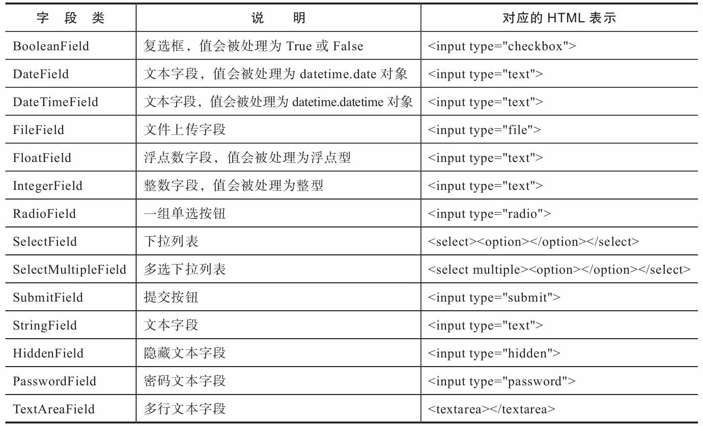
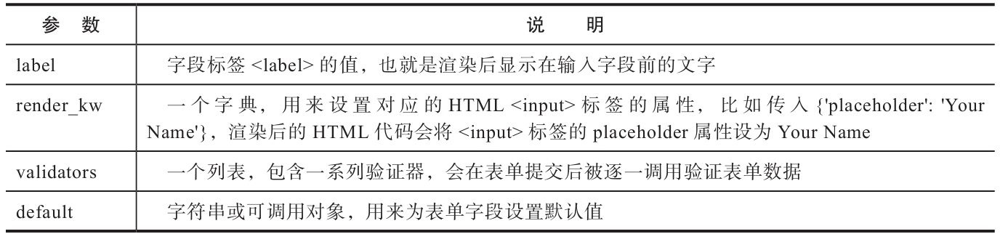
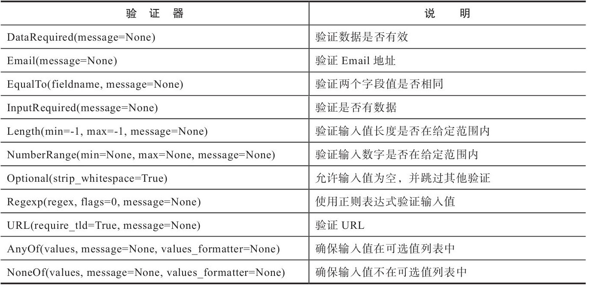
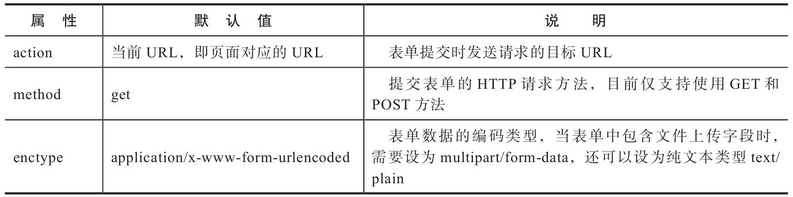
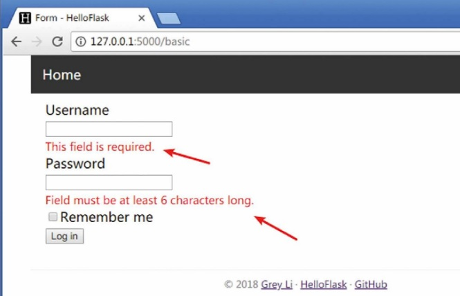
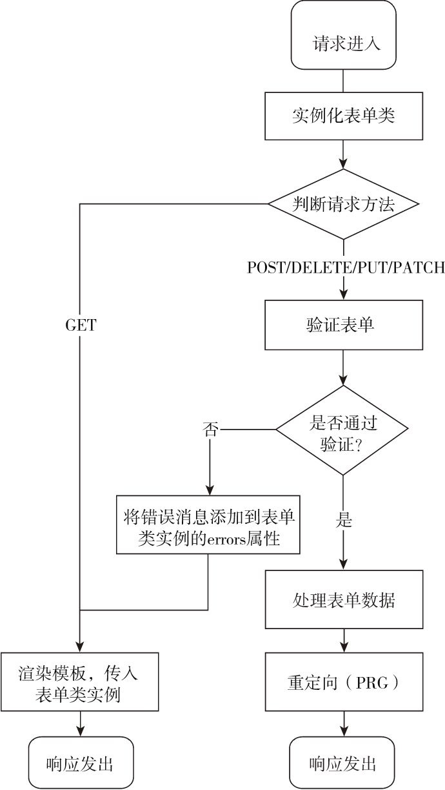
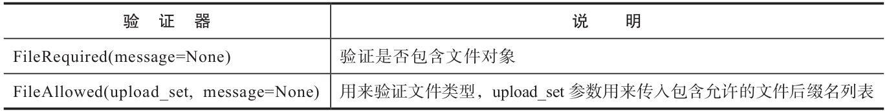
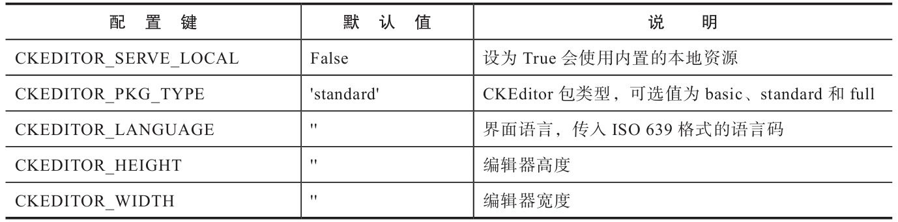

# 第4章 表单

## 1. 表单的作用是什么？

> 表单(form)是web网页和用户交互的常见方式之一，主要用来提交用户输入的内容。

使用场景：注册、登录、撰写文章、编辑设置等

主要操作：创建表单、验证用户输入、向用户提示输入错误、获取保存的数据。

***

## 2. Flask中使用哪些工具来操作表单？

相关的工具如下：

*   [WTFforms](https://github.com/wtforms/wtforms)：WTForms是一个python表单库，可以方便的对表单进行定义、验证（服务器端）和处理。

    文档：(<https://wtforms.readthedocs.io/en/latest/>)

*   [Flask-WTF扩展](https://github.com/lepture/flask-wtf)：该扩展集成了WTForms，更便于在Flask中使用。他将表单数据解析、CSRF保护、文件上传等功能与Flask集成，另外还附加了reCAPTCHA（Google的免费验证码服务，国内无法使用）支持。

    安装： `pipenv install flask-wtf`

    文档：(<https://flask-wtf.readthedocs.io/en/latest/>)

*   [Flask-CKEditor](https://github.com/greyli/flask-ckeditor)

    文档：(<https://flask-ckeditor.readthedocs.io/>)

***

## 3. 如何在HTML中定义表单？

在HTML中，表单通过\<form>标签创建，表单中的字段使用\<input>标签定义, 表示输入，\<label>标签可以定义字段的标签文字。

```HTML
<form method="post">
    <label for="username">Username</label><br>
    <input type="text" name="username" placeholder="Héctor Rivera"><br>
    <label for="password">Password</label><br>
    <input type="password" name="password" placeholder="19001130"><br>
    <input id="remember" name="remember" type="checkbox" checked>
    <label for="remember"><small>Remember me</small></label><br>
    <input type="submit" name="submit" value="Log in">
</form>
```

\<br>表示换行。

HTML form参考：(<https://www.w3school.com.cn/html/html_forms.asp>)

***

## 4. 如何使用wtforms定义表单类？

当使用wtforms创建表单时，表单由python类表示，这个类需要继承从wtforms导入的`Form类`。

一个表单由多个字段（field）组成，每个字段会对应表单类的一个`类属性(不是对象属性)`。每个字段属性通过`实例化`wtforms提供的`字段类(*Field)`表示。字段属性的名称将作为对应HTML\<input>元素的name属性和id属性值。

字段属性名**大小写敏感，不能以下划线和validate开头**。

```python
from wtforms import Form, StringField, PasswordField, BooleanField, SubmitField
from wtforms.validators import DataRequired, Length

class LoginForm(Form):
    username = StringField('Username', validators=[DataRequired()])
    password = PasswordField('Password', validators=[DataRequired(), Length(8, 128)])
    remember = BooleanField('Remember me')
    submit = SubmitField('Log in')
```

这里的LoginForm表单类中定义了四个字段：文本字段StringField、密码字段Password-Field、勾选框字段BooleanField和提交按钮字段SubmitField。

有些字段最终生成的HTML代码是相同的，不过wtforms会在表单提交后（由浏览器发送到服务器端处理时）根据表单类中字段的类型对数据进行处理，转换为对应的python类型进行数据处理。

***

## 5. 常用的WTForms字段类和验证器类有哪些，如何使用他们？



这些类需要在表单类中实例化后作为字段使用，对每个字段还可以通过传入参数，来设置生成的HTML代码中的元素属性，常用的参数如下：



其中，`validators`参数表示对字段进行数据验证使用的验证器列表。validator是一系列用于验证字段数据的类，自`wtforms.validators模块`中导入。

常用的WTForms验证器有：



其中, `message`参数是在实例化验证器类时用来传入自定义错误消息的，如不设置，默认返回英文错误信息。[进行中文设置](#Chinese-setting)

`name = StringField('Your Name', validators=[DataRequired(message=u'名字不能为空！')])`

> 补充：InputRequired验证器和DataRequired很相似，但InputRequired仅验证用户是否有输入，而不管输入的值是否有效。例如，由空格组成的数据也会通过验证。当使用DataRequired时，如果用户输入的数据不符合字段要求，比如在IntegerField输入非数字时会视为未输入，而不是类型错误。

***

## 6. 字段类实例化时传入的validators参数有何注意点？

实例化字段类时，其`validators`参数需要接收一个传入`可调用对象`组成的列表。内置的验证器通过实现`__call__()`方法的类表示，所以`需要在验证器后添加括号`（实例化为对象进行调用）。

之后，我们还可以[自定义验证器函数、工厂函数或类](#define-validator)，其中：

*   自定义验证器函数作为参数传入时，不需要括号，即传入函数本身，而不是函数的调用返回值。（函数本身就是可调用的）。

*   自定义验证器工厂函数作为参数传入时，需要加括号。因为工厂函数的返回值就是一个函数，即调用工厂函数返回一个可调用的验证函数对象。

*   自定义验证器类和内置的验证器类用法相同，需要实现`__call__方法`然后实例化传入。

***

## 7. 如何使用Flask-WTF定义表单？

使用Flask-WTF定义表单时，仍然可以使用WTForms提供的字段类和验证器，创建的方法也完全相同。只不过表单类要继承Flask-WTF提供的`FlaskForm类`。`FlaskForm类`继承自`Form类`, 与Flask进行了一些集成，更方便使用。

```python
from flask_wtf import FlaskForm
from wtforms import StringField, PasswordField, BooleanField, SubmitField
from wtforms.validators import DataRequired, Length

class LoginForm(FlaskForm):  # 继承自FlaskForm
    username = StringField('Username', validators=[DataRequired()])
    password = PasswordField('Password', validators=[DataRequired(), Length(8, 128)])
    remember = BooleanField('Remember me')
    submit = SubmitField('Log in')
```

**注意**：配置键`WTF_CSRF_ENABLED`用来设置是否开启CSRF保护，默认为True。Flask-WTF会自动在实例化表单类时添加一个包含CSRF令牌值的隐藏字段，字段名为`csrf_token`。

***

## 8. 如何用定义的表单类输出HTML代码？

实例化表单类后，调用该对象的属性（以函数形式调用）即可得到HTML代码。

以使用WTForms定义的LoginForm类为例，实例化表单类，然后将实例属性转换为字符串或`直接调用`就可以获取表单字段对应的HTML代码：

```python
>>> form = LoginForm()
>>> form.username()
u'<input id="username" name="username" type="text" value="">'
>>> form.submit()
u'<input id="submit" name="submit" type="submit" value="Submit">'
```

字段\<label>元素的HTML代码则可以通过`form.字段名.label`形式获取：

```python
>>> form.username.label()
u'<label for="username">Username</label>'
>>> form.submit.label()
u'<label for="submit">Submit</label>'
```

***

## 9. 如何修改表单类来自定义HTML\<input>元素中的各种属性？

在创建HTML表单时，常会需要使用HTML\<input>元素的其他属性来对字段进行设置。

比如，添加class属性设置对应的CSS类为字段添加样式；添加placeholder属性设置占位文本。默认情况下，WTForms输出的字段HTML代码只会包含`id和name属性`，属性值均为表单类中对应的`字段属性名称`。

如果要添加额外的属性，通常有两种方法:

1.  在定义表单类时，对字段类使用`render_kw`参数传入字典:

    比如下面为username字段使用`render_kw`设置了`placeholder` HTML属性：

    `username = StringField('Username', render_kw={'placeholder': 'Your Username'})`

    该字段调用后输出的HTML代码为：

    `<input type="text" id="username" name="username" placeholder="Your Username">`

2.  在调用字段时通过添加括号使用关键字参数传入额外的HTML属性：

    ```python
    >>> form.username(style='width: 200px;', class_='bar')
    '<input class="bar" id="username" name="username" style="width: 200px;" type="text">'
    ```

    **注意**：`class`是python的关键字，这里我们使用`class_`来代替class。渲染后的HTMl中会显示正常的class属性，在模板中调用时则可以直接使用class。

    该方法虽然也可以修改`id和name`属性，但是表单提交后，服务器端的WTForms需要通过name属性来获取对应的数据，所以`不能修改name属性值`.

***

## 10. 如何在模板中渲染表单？

1.  首先需要将表单类实例传入模板，供模板使用：

    在视图函数中实例化表单类，然后在`render_template()`函数中使用关键`form`将表单实例传入模板。

    ```python
    from forms import LoginForm

    @app.route('/basic')
    def basic():
        form = LoginForm()
        return render_template('login.html', form=form)  # 传递参数
    ```

2.  在模板中，调用表单类的属性即可获取字段对应的HTML代码进行使用。如果需要传入参数，也可以添加括号：

    ```HTML
    <form method="post">
        {{ form.csrf_token }} <!-- 渲染CSRF令牌隐藏字段 -->
        {{ form.username.label }}{{ form.username }}<br>
        {{ form.password.label }}{{ form.password }}<br>
        {{ form.remember }}{{ form.remember.label }}<br>
        {{ form.submit }}<br>
    </form>
    ```

*   注意：

    代码中，我们除了渲染各个字段的标签和字段本身，还调用了`form.csrf_token`属性渲染Flask-WTF为表单自动创建的CSRF令牌字段。form.csrf\_token字段包含了自动生成的CSRF令牌值，在提交表单后会自动被验证，为了确保表单通过验证，我们必须在表单中手动渲染这个字段。

    Flask-WTF为表单类实例提供了一个`form.hidden_tag（）方法`，这个方法会依次渲染表单中所有的`隐藏字段`。因为csrf\_token字段也是隐藏字段，所以当这个方法被调用时也会渲染csrf\_token字段。

渲染后获得的HTML代码如下：

```HTML
<form method="post">
    <input id="csrf_token" name="csrf_token" type="hidden" value="IjVmMDE1ZmFjM2VjYmZjY...i.DY1QSg.IWc1WEWxr3TvmAWCTHRMGjIcDOQ">
    <label for="username">Username</label><br>
    <input id="username" name="username" type="text" value=""><br>
    <label for="password">Password</label><br>
    <input id="password" name="password" type="password" value=""><br>
    <input id="remember" name="remember" type="checkbox" value="y"><label for="remember">Remember me</label><br>
    <input id="submit" name="submit" type="submit" value="Log in"><br>
</form>
```

结合前面提到的使用render\_kw参数或是在调用字段时传入参数来定义字段的额外HTML属性，通过这种方法添加CSS类，生成一个Bootstrap风格的表单：

```HTML
...
<form method="post">
    {{ form.csrf_token }}
    <div class="form-group">
       {{ form.username.label }}
       <!-- 添加class属性，供CSS样式使用 -->
       {{ form.username(class='form-control') }}  
    </div>
    <div class="form-group">
        {{ form.password.label }}
        {{ form.password(class='form-control') }}
    </div>
    <div class="form-check">
        {{ form.remember(class='form-check-input') }}
        {{ form.remember.label }}
    </div>
    {{ form.submit(class='btn btn-primary') }}
    </form>
...
```

**注意**：如果想手动编写HTML表单代码，要注意`表单字段的name属性值必须和表单类的字段名称相同`，否则WTForms将会在视图函数中无法获取正确数据。

***

## 11. ⭐ Flask使用表单的全过程是怎样的？

用户GET请求获取表单--填写表单并使用POST请求提交--服务器处理用户数据返回响应。

1.  在程序文件中定义表单类，设置各种字段属性；

2.  用户在浏览器使用GET请求打开含有表单的页面；

3.  视图函数接收GET请求，实例化表单类，传给模板文件进行渲染；

4.  模板文件将渲染得到的HTML显示在浏览器中；

5.  用户在浏览器中为表单输入内容，点击提交，使用POST请求发送表单内容到服务器；

6.  表单到达服务器后交由对应的视图函数，首先进行csrf令牌的校验和数据的验证；

7.  如数据不合规返回对应错误信息；如数据合规，则继续处理用户输入数据，如存入数据库等，返回响应或跳转页面。

***

## 12. 服务器端在获得带有表单的请求后，对于其中数据的大致处理步骤是什么？

1. 解析请求，获取表单数据；
2. 对数据进行必要的转换，比如将勾选框的值转换成python的布尔值；
3. 验证数据是否符合要求，同时验证CSRF令牌；
4. 如果数据验证未通过则需要生成错误消息，并在模板中显示错误信息；
5. 如果数据验证通过，就把数据保存到数据库或做进一步处理。
   
使用Flask-WTF可以极大简化以上步骤。

***

## 13. HTML中是如何提交表单的？

在HTML中，当\<form>标签声明的表单中类型为\<submit>的提交字段被单击时，就会创建一个表单提交的HTTP请求，请求中包含各个字段的数据。

表单的提交行为主要由三个属性控制：

* action属性用来指定表单被提交的目标URL，默认是当前页面URL，也就是渲染改模板的路由所在的URL。也可以通过修改该属性，发送到其他URL。
* method属性，控制HTTP请求的发送方式，通常使用POST方式：
  * GET：表单数据以查询字符串的形式加入URL，URL长度不能超过3000个字符，且不能包含敏感信息。
    `http://localhost:5000/basic?username=Jack&password=12345`
  * POST: 表单数据放入请求body中，会用对应各式进行编码。
    ```
    POST /basic HTTP/1.0
    ...
    Content-Type: application/x-www-form-urlencoded
    Content-Length: 30
    
    username=Jacki&password=12345
    ```

***

## 14. 表单数据的验证方式分哪几种？

表单数据验证是Web表单的最重要主题之一，主要分为两类：
1. 客户端验证方式：
   
   > 客户端验证（client side validation）是指在客户端（浏览器）对用户的输入值进行验证。这种方式可以动态的即时提醒用户输入错误。

   可以使用HTML5内置的验证属性实现基本验证（type、required、min、max、accept等），如验证用户有没有输入内容可以使用required标志：
   `<input type="text" name="username" required>`

   如果使用这种方式，可以在定义表单时进行编辑，通过`render_kw`传入属性或在模板中调用时通过括号传入：
   `{{ form.username(required='') }}`对于不需要属性值的属性传递空值即可。

   HTML5提供了基本的客户端验证，完善的验证机制可以通过javascript来实现，或使用js库：[jQuery Validation Plugin](https://jqueryvalidation.org/), [Parsley.js](http://parsleyjs.org/), [Bootstrap Validator](http://1000hz.github.io/bootstrap-validator/)。


2. 服务器端验证方式：
   
   > 服务器端验证（server side validation）是指用户将输入的数据提交到服务器，在服务器进行验证。如果验证出错则将错误放入响应返回。用户再次修改表单提交，直至验证通过（或禁止继续提交）。

   无论是否使用客户端验证，我们都要进行服务器端验证。

***

## 15.  WTForms如何对表单数据进行验证？

WTForms会在实例化表单类时传入表单数据，然后对表单实例调用`validate（）`方法。这会逐个对字段（包括CSRF令牌字段）调用字段实例化时定义的验证器（validators参数列表），返回表示验证结果的布尔值。

如果验证失败，就把错误消息存储到表单实例的`errors属性`对应的字典中。

```python
>>> from wtforms import Form, StringField, PasswordField, BooleanField 
>>> from wtforms.validators import DataRequired, Length                
>>> class LoginForm(Form):                                             
...     username = StringField('Username', validators=[DataRequired()])
...     password = PasswordField('Password', validators=[DataRequired()
, Length(6, 128)])

>>> form = LoginForm(username='', password='123')  # 不传入用户名                      
>>> form.data  # 表单数据字典
{'username': '', 'password': '123'}
>>> form.validate()  # 对数据进行验证
False
>>> form.errors  # 错误消息字典
{'username': [u'This field is required.'], 'password': [u'Field must be
 at least 6 characters long.']}

>>> form2 = LoginForm(username='Jack', password='123456')            
>>> form2.data
{'username': 'Jack', 'password': '123456'}
>>> form2.validate()
True
>>> form2.errors
{}
```

因为我们的表单使用POST方法提交，如果单纯使用WTForms，我们在实例化表单类时需要首先把request.form传入表单类。而使用Flask-WTF时，表单类继承的`FlaskForm基类默认会从request.form获取表单数据，所以不需要手动传入`。

***

## 16. 不同方式提交的表单其数据处理有何不同？

* POST：使用POST方式提交的表单，其数据会被Flask解析为字典，可以通过request对象的`form`属性获取（request.form）；
* GET：使用GET方法提交的表单的数据同样会被解析为字典，不过要通过请求对象的`args`属性获取（request.args）

***

## 17. 如何在视图函数中验证表单？

对于不同请求类型，需要执行不同的代码：

* 首先是实例化表单：
* 处理不同请求类型：
  * GET：直接渲染模板返回响应，给用户表单(如，用户进入登录页)
  * POST：调用`validate()`方法验证表单数据（如，用户在登录页提交用户名、密码）

```python
from flask import request
...
@app.route('/basic', methods=['GET', 'POST'])
def basic():
    form = LoginForm()  # GET + POST
    if request.method == 'POST' and form.validate():
        ...  # 处理POST请求
    return render_template('forms/basic.html', form=form)  # 处理GET请求
```

WTForms会自动对CSRF令牌字段进行验证，如果没有渲染该字段会导致验证出错，错误消息为“CSRF token is missing”。

Flask-WTF提供的`validate_on_submit()`方法合并了验证POST请求和验证数据两个操作，以上代码刻简化为：
```python
@app.route('/basic', methods=['GET', 'POST'])
def basic():
    form = LoginForm()
    if form.validate_on_submit():  # 简化
        ... 
    return render_template('basic.html', form=form)
```
除了POST方法，`form.validate_on_submit()`方法对使用PUT、PATCH和DELETE方法的表单也会验证。

*** 

## 18. 如何获取表单中的数据值？

表单类的`data`属性是一个匹配所有字段与对应数据的字典，可以通过`form.字段数形.data`的形式获取对应字段的数据值。

```python
from flask import Flask, render_template, redirect, url_for, flash
...
@app.route('/basic', methods=['GET', 'POST'])
def basic():
    form = LoginForm()
    if form.validate_on_submit():
        username = form.username.data  # 获取用户名数据
        flash('Welcome home, %s!' % username)
        return redirect(url_for('index'))
    return render_template('basic.html', form=form)
```
这里使用了[PRG模式](#PRG)。

***

## 19. <span id="PRG">什么是PRG模式，为什么要使用这种模式？</span>

> PRG(Post/Redirect/Get)模式是一种用来防止重复提交表单的技术，即通过对提交表单的POST请求返回重定向响应将最后一个请求转换为GET请求。

原因：

在浏览器中，当单击F5刷新/重载时的默认行为是`发送上一个请求`。如果上一个请求是POST请求，那么就会弹出一个确认窗口，询问用户是否再次提交表单。为了避免出现这个容易让人产生困惑的提示，我们尽量不要让提交表单的POST请求作为最后一个请求。这就是为什么我们在处理表单后返回一个重定向响应，这会让浏览器重新发送一个新的GET请求到重定向的目标URL。最终，最后一个请求就变成了GET请求。

***

## 20. 如何获取表单数据验证错误的信息？

如果`form.validate_on_submit（）`返回`False`，那么说明验证没有通过。对于验证未通过的字段，WTForms会把错误消息添加到表单类的`errors属性`中，这是一个匹配表单字段的类属性到对应的错误消息列表的字典。

一般会直接通过字段名来获取对应字段的错误消息列表，即`form.字段名.errors`。

```HTML
<form method="post">
    {{ form.csrf_token }}
    {{ form.username.label }}<br>
    {{ form.username() }}<br>
    <!-- 获取数据错误信息 -->
    
        <small class="error">{{ message }}</small><br>
    
    {{ form.password.label }}<br>
    {{ form.password }}<br>
    
        <small class="error">{{ message }}</small><br>
    
    {{ form.remember }}{{ form.remember.label }}<br>
    {{ form.submit }}<br>
</form>
```

在使用DataRequired和InputRequired验证器时，WTForms会在字段输出的HTML代码中添加`required属性`，所以会弹出浏览器内置的错误提示。同时，WTForms也会在表单字段的`flags属性`添加`required标志`（比如`form.username.flags.required`），所以我们可以在模板中通过这个标志值来判断是否在字段文本中添加一个*号或文字标注，以表示必填项。

***

## 21. 表单处理的总体流程是什么？



***

## 22. <span id="Chinese-setting">如何设置表单的错误提示消息语言？</span>

Flask-WTF内置了多种语言的错误消息以供设置。

如果想要改变内置错误消息的默认语言，可以通过自定义表单基类来实现（Flask-WTF>0.14.2）。

创建一个MyBaseForm基类，所有集成该类的表单类的内置错误消息语言都会设置为简体中文：
```python
from flask_wtf import FlaskForm

app = Flask(__name__)
app.config['WTF_I18N_ENABLED'] = False

class MyBaseForm(FlaskForm):
    class Meta:
        locales = ['zh']

class HelloForm(MyBaseForm):
    name = StringField('Name', validators=[DataRequired()])
    submit = SubmitField()
```
首先将配置变量`WTF_I18N_ENABLED`设为`False`，让Flask-WTF使用WTForms内置的错误消息翻译。在基类中定义`Meta`类，并在`locales`列表中加入简体中文的地区字符串。简体中文和繁体中文的地区字符串分别为`zh和zh_TW`。

在创建表单时，继承该类即可将错误消息语言设为中文，另外也可以在实例化表单类时通过meta关键字传入localES值：
`form = MyForm(meta={'locales': ['en_US', 'en']})`

---

## 23. 如何在模板中使用宏方便的渲染表单？

在模板中渲染表单时，通常要做大量工作：
* 调用字段属性，获取\<input>定义；
* 对调用的label属性，获取\<labe>定义；
* 渲染错误消息

我们可以定义一个宏，避免为每个字段重复这些代码：
```HTML

    {{ field.label }}<br>
    {{ field(**kwargs) }}<br>
    
        
            <small class="error">{{ error }}</small><br>
        
    

```
这个宏接收表单实例的字段属性和附加的关键字参数为输入，返回包含\<label>标签、表单字段、错误消息列表的HTML代码。
```HTML

...
<form method="post">
    {{ form.csrf_token }}
    {{ form_field(form.username)}}<br>
    {{ form_field(form.password) }}<br>
    ...
</form>
```
使用时将每个类属性传入`form_field()`宏即可。

---

## 24. 如何自定义验证器？

除使用WTForms提供的验证器来验证表单字段，我们还可以在表单类中定义方法来验证特定字段。

1. 行内验证器（in-line validator）：仅用来验证自己表单类中的特定表单字段，不具有通用性。
   
   ```python
   from wtforms import IntegerField, SubmitField
   from wtforms.validators import ValidationError
   
   class FortyTwoForm(FlaskForm):
       answer = IntegerField('The Number')
       submit = SubmitField()
   
       def validate_answer(form, field):  # 验证器方法
           if field.data != 42:
               raise ValidationError('Must be 42.')
   ```
   当表单类中包含以`validate_字段属性名`形式命名的方法时，在验证字段数据时会同时调用这个方法来验证对应的字段，这也是为什么表单类的字段属性名不能以validate开头。
   
   验证方法接收两个位置参数，依次为`form`和`field`，前者为表单类实例，后者是字段对象，可以通过field.data获取字段数据，这两个参数将在验证表单时被调用传入。
   
   验证出错时抛出从wtforms.validators模块导入的`ValidationError异常`，传入错误消息作为参数。
   
2. <span id="define-validator">全局验证器：可重用的通用验证器。</span>
	
	如上面的行内验证器相同，如果没有额外的参数，只需要定义一个函数即可，不过函数不定义在表单类中。
	```python
    from wtforms.validators import ValidationError
    
    def is_42(form, field):  # 定义验证器
        if field.data != 42:
            raise ValidationError('Must be 42')
    
    class FortyTwoForm(FlaskForm):
        answer = IntegerField('The Number', validators=[is_42])  # 使用验证器
        submit = SubmitField()
	```
	**注意**：这里在使用实例化表单类时，直接传入了验证器函数对象，而不是对象的调用。因为`validators`列表中的元素必须是可调用对象。这与使用WTForms自带的验证器类不同。
	
	* 使用工厂函数：
      
      实际上，验证器需要支持传入参数，至少需要为验证器传入一个meaasge参数来设置自定义错误消息，这时，验证函数可以实现成`工厂函数`，即返回一个可调用对象的函数：
	  ```python
      from wtforms.validators import ValidationError
      
      def is_42(message=None):
          if message is None:
              message = 'Must be 42.'
      
          def _is_42(form, field):
              if field.data != 42:
                  raise ValidationError(message)
      
          return _is_42  # 返回一个函数
      
      class FortyTwoForm(FlaskForm):
          answer = IntegerField('The Number', validators=[is_42()])
          submit = SubmitField()
      ```
	  在现在的is_42（）函数中，我们创建了另一个_is_42（）函数，这个函数会被作为可调用对象返  回。这时在`validators`参数处传递的就是工厂函数的调用了。
	
    * 使用实现__call__()方法的类：
      
      在更复杂的验证场景下，你可以使用实现了`__call__（）`方法的类（可调用类）来编写验证器.[参考WTForms文档](https://wtforms.readthedocs.io/en/3.0.x/validators/#custom-validators)。
	 
---

## 25. 在HTML中如何实现文件上传？

在HTML中，渲染一个文件上传字段只需要将\<input>标签的`type属性设为file`，即`<input type="file">`。这会在浏览器中渲染成一个文件上传字段，单击文件选择按钮会打开文件选择窗口，选择对应的文件后，被选择的文件名会显示在文件选择按钮旁边。

---

## 26. 服务器端如何防范文件上传漏洞？

除了常规的CSRF防范，我们还需要注意：
* 验证文件的类型
* 验证文件的大小
* 过滤文件的名称

---

## 27. 如何使用Flask-WTF实现文件上传？

1. 定义上传表单类：
   
   使用Flask-WTF提供的`FileField类`定义文件上传字段。
   ```python
   from flask wtf.file import FileField, FileRequired, FileAllowed

   class UploadForm(FlaskForm):
       photo = FileField('Upload Image', validators=[FileRequired(), FileAllowed(['jpg', 'jpeg', 'png', 'gif'])])
       submit = SubmitField()
    ```
    这里我们上传一张照片到服务器。Flask-WTF在`flask_wtf.file`模块提供了两个文件相关的验证器：
    
    
    `FileRequired`确保提交的表单字段中包含文件数据；

    `FileAllowed`用来验证上传文件的文件类型，其`upload_set`参数需要传入一个包含允许文件类型的后缀名列表。

    FileAllowed是在服务器端验证上传文件，使用HTML5中的`accept`属性也可以在客户端实现简单的过滤，该属性接收MIME类型字符串或文件后缀，使用逗号分隔：
    ```HTML
    <input type="file" id="profile_pic" name="profile_pic" accept=".jpg, .jpeg, .png, .gif">
    ```
    当用户单击文件选择按钮后，打开的文件选择窗口会默认将accept属性值之外的文件过滤掉。尽管如此，用户还是可以选择设定之外的文件，所以我们仍然需要进行服务器端验证。

2. 渲染上传表单：

   渲染上传表单时，唯一需要注意的是：当表单中包含文件上传字段时（input标签的type属性为file），需要将表单的`enctype属性设置为multipart/form-data`。告诉浏览器将上传数据发送到服务器，否则**仅会把文件名作为表单数据提交**。

   实例化表单类：
   ```python
   @app.route('/upload', methods=['GET', 'POST'])
   def upload():
       form = UploadForm()
       ...
       return render_template('upload.html', form=form)
   ```
   文件上传表单：
   ```HTML
   <form method="post" enctype="multipart/form-data">
       {{ form.csrf_token }}
       {{ form_field(form.photo) }}
       {{ form.submit }}
   </form>
   ```


3. 处理上传文件：
   
    文件上传请求提交后，上传的文件在请求对象的`file属性(request.file)`中获取。该属性是werkzeug提供的`ImmutableMultiDict字典`对象，存储字段的name键值和文件对象的映射。

    如 `ImmutableMultiDict([('photo', <FileStorage: u'0f913b0ff95.JPG' ('image/jpeg')>)])`

    上传的文件会被Flask解析为Werkzeug中的`FileStorge`对象（werkzeug.datastructures.FileStorage）。当手动处理时，我们需要使用文件上传字段的name属性值作为键获取对应的文件对象。`request.files.get('photo')`.

    当使用Flask-WTF时，他会自动获取对应的文件对象，然后通过表单类属性的`data属性`获取上传文件。

    处理文件上传请求的视图函数：
    ```python
    import os
    
    app.config['UPLOAD_PATH'] = os.path.join(app.    root_path, 'uploads')
    
    @app.route('/upload', methods=['GET', 'POST'])
    def upload():
        form = UploadForm()
        if form.validate_on_submit():
            f = form.photo.data
            filename = random_filename(f.filename)
            f.save(os.path.join(app.config    ['UPLOAD_PATH'], filename))
            flash('Upload success.')
            session['filenames'] = [filename]
            return redirect(url_for('show_images'))
        return render_template('upload.html', form=form)
    ```
    当表单通过验证后，我们通过`form.photo.data`获取存储上传文件的FileStorage对象。
    
    接下来需要[处理文件名](#filename-handle)，随机生成新的文件名。

    然后，[将文件保存到文件系统](#save-file)中。

    如果想要显示上传的图片，可以[获取其URL](#get-file-url)。
	
	上传成功后，使用flash（）发送一个提示，并将文件名保存到session中，最后重定向到show_image视图。该视图在渲染后可以从session中获取文件名，渲染出上传后的图片。这里将filename作为列表传入session，可以兼容上传多个文件的情况。

---

## 28. 如何限制上传文件的大小？

如果用户上传的文件过大，可能会拖垮服务器。通过Flask内置变量`MAX_CONTENT_LENGTH`可以限制请求报文的最大长度，单位为字节（byte）。

如，限制最大长度为3M：`app.config['MAX_CONTENT_LENGTH'] = 3 * 1024 * 1024`

当请求数据（上传文件大小）超过限制后，会返回`413错误响应（Request Entity Too Large）`。

在*开发环境*中，Flask不会抛出413，而是直接中断连接；

不过在*生产环境*中，服务器会正确返回413。

* 在Flask-WTF 0.15.0中加入了`FileSize`验证器，验证上传的文件大小是否在设置的最大和最小值之间。

---

## 29. 还有哪些Flask扩展可以实现文件上传？

扩展[Flask-Uploads](https://github.com/maxcountryman/flask-uploads)内置了在Flask中实现文件上传的便利功能。Flask-WTF提供的FileAllowed（）也支持传入Flask-Uploads中的`上传集对象（Upload Set）`作为upload_set参数的值。\
另外，同类的扩展还有[Flask-Transfer](https://github.com/justanr/Flask-Transfer)。

---

## 30. <span>如何处理上传文件的文件名？</span>

通常有三种方式处理：

1. 使用原文件名：
   
   如果能够确定文件的来源安全，可以直接使用原文件名，通过FileStorage对象的filename属性获取：`filename = f.filename`

2. 使用过滤后的文件名：

   因为攻击者可能通过在文件名中加入恶意路径来攻击，所以必须处理文件名。

   如，恶意用户在文件名中加入表示上级目录的`..`（如../../../../home/username/.bashrc或../../../etc/passwd），当保存文件时，如果表示上级目录的..数量正确，就会导致服务器上的系统文件被覆盖或篡改，还可能执行恶意脚本。

   使用wergzeug提供的`secure_filename()`函数对文件名进行过滤，传递文件名为参数，他会过滤掉所有危险字符，返回“安全的文件名”：
   ```python
   >>> from werkzeug import secure_filename
   >>> secure_filename('avatar!@#//#\\%$^&.jpg')
   'avatar.jpg'
   >>> secure_filename('avatar头像.jpg')
   'avatar.jpg'
   ```
   该方法会过滤掉文件名中的`非ASCII字符`，但如果文件名完全有非ASCII字符构成，那么就会得到一个空文件名。

3. 统一文件名：
   
   为了避免空文件名，更好的做法是统一处理上传文件的文件名，对其进行重命名。

   如使用uuid模块生成随机的文件名:
   ```python
   def random_filename(filename):
       ext = os.path.splitext(filename)[1]
       new_filename = uuid.uuid4().hex + ext
       return new_filename
   ```
   这个函数接收原文件名作为参数获取文件后缀，使用内置的uuid模块中的`uuid4（）方法`生成新的文件名，并使用hex属性获取十六进制字符串，最后返回包含后缀的新文件名。

   > UUID（Universally Unique Identifier，通用唯一识别码）是用来标识信息的128位数字，比如用作数据库表的主键。使用标准方法生成的UUID出现重复的可能性接近0。在UUID的标准中，UUID分为5个版本，每个版本使用不同的生成方法并且适用于不同的场景。我们使用的`uuid4（）`方法对应的是第4个版本：不接收参数而生成随机UUID。

---

## 31. <span id="save-file">如何保存上传的文件？</span>

1. 首先在项目目录下提前创建一个文件夹uploads用来保存上传的文件，并得到该文件夹的绝对路径保存在配置变量`UPLOAD_PATH`中：

   `app.config['UPLOAD_PATH'] = os.path.join(app.root_path, 'uploads')`

   这里的路径通过`app.root_path属性`构造，它存储了程序实例所在脚本的绝对路径，相当于`os.path.abspath（os.path.dirname（__file__））`。

2. 调用FileStorage对象的`save()`方法保存文件，参数为文件夹绝对路径和文件名。
   
   `f.save(os.path.join(app.config['UPLOAD_PATH'], filename))`

---

## 32. <span id="get-file-url">如何获取上传后文件的URL？</span>

文件保存后，我们希望能够显示上传后的图片。为了让上传后的文件能够通过URL获取，需要创建一个视图函数来返回上传后的文件：

```python
@app.route('/uploads/<path:filename>')
def get_file(filename):
    return send_from_directory(app.config['UPLOAD_PATH'], filename)
```
该视图函数类似内置的static视图，通过传入文件路径返回对应的静态文件。其中，filename变量使用`path转换器`以支持传入包含斜线的路径字符串。

使用Flask提供的`send_from_directory()`函数来获取文件，传入文件的路径和文件名作为参数。

在uploaded.html模板中，将传入的文件名作为URL变量，通过get_file（）视图获取文件URL，作为\标签的src属性值。

```HTML

```

---

## 33. 如何实现多文件上传？

Flask-WTF 0.14.2 中未添加对多个文件上传的渲染和验证支持。所以需要在视图函数中手动获取文件并验证。

1. 在客户端，通过对HTML文件上传\<input>字段开启`multiple`属性，允许多选：

```HTML
<input type="file" id="file" name="file" multiple>
```

2. 创建表单类时，使用WTForms提供的`MultipleFileField`字段类实现，添加一个DataRequired验证器来确保包含文件：
```python
from wtforms import MultipleFileField

class MultiUploadForm(FlaskForm):
    photo = MultipleFileField('Upload Image', validators={DataRequired()}
    submit = SubmitField()
```

3. 表单提交时，在服务器端对`request.files属性`调用`getlist()`方法并传入字段的name属性值，返回包含所有上传文件对象的列表。在视图函数中我们迭代该列表，逐一处理文件：
   ```python
   from flask import request, session, flash, redirect, url_for
   from flask_wtf.csrf import validate_csrf
   from wtforms import ValidationError
   
   @app.route('/multi-upload', methods=['GET', 'POST'])
   def multi_upload():
       form = MultiUploadForm()
       if request.method == 'POST':
           filenames = []
           # 验证CSRF令牌
           try:
               validate_csrf(form.csrf_token.data)
           except ValidationError:
               flash('CSRF token error.')
               return redirect(url_for('multi_upload'))
           # 检查文件是否存在
           if 'photo' not in request.files:
               flash('This field is required.')
               return redirect(url_for('multi_upload'))
           
           for f in request.files.getlist('photo'):
               # 检查文件类型
                   if f and allowed_file(f.filename):
                   filename = random_filename(f.   filename)
                   f.save(os.path.join(
                       app.config['UPLOAD_PATH'],    filename
                   ))
                   filenames.append(filename)
               else:
                   flash('Invalid file type.')
                   return redirect(url_for   ('multi_upload'))
           flash('Upload success.')
           session['filenames'] = filenames
           return redirect(url_for('show_images'))
       return render_template('upload.html', form=form)
   ```
   在请求方法为POST时，我们对上传数据进行手动验证，主要包含下面几步：
    
    1）手动调用`flask_wtf.csrf.validate_csrf`验证CSRF令牌，传入表单中csrf_token隐藏字段的值。如果抛出wtforms.ValidationError异常则表明验证未通过。

    2）其中if 'photo' not in request.files用来确保字段中包含文件数据（相当于`FileRequired`验证器），如果用户没有选择文件就提交表单则`request.files将为空`。

    3）if f用来确保文件对象存在，这里也可以检查f是否是FileStorage实例。

    4）`allowed_file（f.filename）`调用了allowed_file（）函数，传入文件名。这个函数相当于`FileAllowed验证器`，用来验证文件类型，返回布尔值:
    ```python
    app.config['ALLOWED_EXTENSIONS'] = ['png', 'jpg', 'jpeg', 'gif']
    ...
    def allowed_file(filename):
        return '.' in filename and \
            filename.rsplit('.', 1)[1].lower() in app.config['ALLOWED_EXTENSIONS']
    ```

    在上面的几个验证语句里，如果没有通过验证，我们使用flash（）函数显示错误消息，然后重定向到multi_upload视图。

---

## 34. 如何使用Flask-CKEditor为页面集成富文本编辑器？

> 富文本编辑器WYSIWYG（what you see is what you get，所见即所得）编辑器，提供一系列按钮和下拉列表来设置文本格式，笔记状态的文本样式即最终呈现出来的样式。在Web中其使用HTML标签来为文本定义样式。

[CKEditor](https://ckeditor.com/)是一个开源的富文本编辑器，包含丰富的配置和插件。我们使用扩展`Flask-CKEditor`来简化其在Flask中的使用。

安装：`pipenv install flask-ckeditor`

实例化：ckeditor通过对`CKEditor`类传入程序示例来创建对象
```python
from flask_ckeditor import CKEditor
ckeditor = Ckeditor(app)
```

---

## 35. 如何配置Flask-CKEditor编辑器？

Flask-CKEditor提供了许多配置变量来对编辑器进行设置，常用配置如下：


[完整配置列表](https://flask-ckeditor.readthedocs.io/en/latest/configuration.html)

在本示例中，为方便开发，使用内置的本地资源：`app.config['CKEDITOR_SERVE_LOCAL'] = True`

* CKEDITOR_SERVE_LOCAL和CKEDITOR_PKG_TYPE配置变量仅限于使用Flask-CKEditor提供的方法加载资源时有效，手动引入资源时可以忽略。

* CKEDITOR_LANGUAGE用来固定界面的显示语言（简体中文和繁体中文对应的配置分别为zh-cn和zh），如果不设置，默认CKEditor会自动探测用户浏览器的语言偏好，然后匹配对应的语言，匹配失败则默认使用英文。

Flask-CKEditor内置了对常用第三方`CKEditor插件`的支持，你可以轻松地为编辑器添加`图片上传与插入、插入语法高亮代码片段、Markdown编辑模式`等功能，具体可以访问Flask-CKEditor文档的插件集成部分（https://flask-ckeditor.readthedocs.io/en/latest/plugins.html ）。

要使用这些功能，需要在CKEditor包中安装对应的插件，Flask-CKEditor内置的资源已经包含了这些插件，可以通过Flask-CKEditor提供的示例程序（https://github.com/greyli/flask-ckeditor/tree/master/examples ）来了解这些功能的具体实现。

---

## 36. 如何在模板中渲染和加载富文本编辑器？

富文本编辑器在HTML中通过文字区域字段表示\<textarea>\</textarea>.

Flask-CKEditor通过包装WTForms提供的`TextAreaField`字段类型实现了`CKEditorField`字段类，用来构建富文本编辑框字段。

如下代码设置一个标题和正文字段：
```python
from flask_wtf import FlaskForm
from wtforms import StringField, SubmitField
from wtforms.validators import DataRequired, Length
from flask_ckeditor import CKEditorField  # 从flask_ckeditor包导入

class RichTextForm(FlaskForm):
    title = StringField('Title', validators=[DataRequired(), Length(1, 50)])
    body = CKEditorField('Body', validators=[DataRequired()])  # 使用富文本编辑框
    submit = SubmitField('Publish')
```
在模板中渲染表单：
```Jinja




<h1>Integrate CKEditor with Flask-CKEditor</h1>
<form method="post">
    {{ form.csrf_token }}
    {{ form_field(form.title) }}
    {{ form_field(form.body) }}
    {{ form.submit }}
</form>



{{ super() }}
<!-- 在脚本中追加加载编辑框资源的方法 -->
{{ ckeditor.load() }}

```
渲染CKEditor编辑器需要加载相应的JavaScript脚本。在开发时，为了方便开发，可以使用Flask-CKEditor在模板中提供的`ckeditor.load（）方法`加载资源，它默认从CDN加载资源，将`CKEDITOR_SERVE_LOCAL设为Ture`会使用扩展内置的本地资源，内置的本地资源包含了几个常用的插件和语言包。ckeditor.load（）方法支持通过`pkg_type参数`传入包类型，这会覆盖配置CKEDITOR_PKG_TYPE的值，额外的version参数可以设置从CDN加载的CKEditor版本。

作为替代，你可以访问CKEditor官网提供的构建工具（https://ckeditor.com/cke4/builder ）构建自己的CKEditor包，下载后放到`static目录`下，然后在需要显示文本编辑器的模板中加载包目录下的`ckeditor.js`文件，替换掉ckeditor.load（）调用。

如果你使用配置变量设置了编辑器的高度、宽度和语言或是其他插件配置，需要使用`ckeditor.config（）方法`加载配置，传入对应表单字段的name属性值，即对应表单类属性名。这个方法需要在加载CKEditor资源后调用：
`{{ ckeditor.config(name='body') }}`

为了支持为不同页面上的编辑器字段或单个页面上的多个编辑器字段使用不同的配置，大多数配置键都可以通过相应的关键字在`ckeditor.config（）方法`中传入，比如language、height、width等，这些参数会`覆盖对应的全局配置`。
另外，Flask-CKEditor也允许你传入自定义配置字符串，更多详情可访问Flask-CKEditor文档的配置部分（https://flask-ckeditor.readthedocs.io/configuration.html ）。

如果你不使用Flask-WTF/WTForms，Flask-CKEditor还提供了一个在模板中直接创建文本编辑器字段的`ckeditor.create（）方法`，具体使用参考其文档。

---

## 37. 如何在单个表单中处理多个提交按钮？

使用场景：在创建文章的表单中添加*发布*新文章和*保存*草稿的按钮。当用户提交表单时，我们需要在视图函数中根据按下的按钮来做出不同的处理。

```python
class NewPostForm(FlaskForm):
    title = StringField('Title', validators=[DataRequired(), Length(1, 50)])
    body = TextAreaField('Body', validators=[DataRequired()])
    save = SubmitField('Save')  # 保存按钮
    publish = SubmitField('Publish')  # 发布按钮
```
当表单数据通过POST提交请求时，Flask会将表单数据解析到`request.form`字典。如果表单中有两个提交字段，则**只有被点击的提交字段才会出现在这个字典中**。当我们对表单类实例或特定的字段属性调用data属性时，WTForms会对数据做进一步处理。**对于提交字段的值，它会将其转换为布尔值：被单击的提交字段的值将是True，未被单击的值则是False。**因此可以通过提交按钮字段的值来判断被单击的按钮。

```python
@app.route('/two-submits', methods=['GET', 'POST'])
def two_submits():
    form = NewPostForm()
    if form.validate_on_submit():
        if form.save.data:  # 保存按钮被单击
            # save it...
            flash('You click the "Save" button.')
        elif form.publish.data:  # 发布按钮被单击
            # publish it...
            flash('You click the "Publish" button.')
        return redirect(url_for('index'))
    return render_template('2submit.html', form=form)
```

* 非提交按钮：有些时候，你还想在表单添加`非提交按钮`。比如，添加一个返回主页的*取消*按钮。因为这类按钮和表单处理过程无关，最简单的方式是直接`在HTML模板中手动添加`。
  
---

## 38. 如何在一个页面中处理多个表单？

使用场景：在单个页面上创建多个表单，如在主页同时显示登录和注册表单。这时的关键是在视图函数中判断提交的表单是哪一个？

1. 单视图处理：
   
   需要在视图函数中手段判断那个视图提交了表单，表单中被单击的提交字段最终的data属性值为布尔值，而解析后的表单数据使用input字段的name属性值作为匹配字段数据。所以，如果两个表单的提交字段（SubmitField）名称相同则无法判断是那个表单的提交字段被点击了。

   综上，`需要为两个表单的提交字段设置不同的名称`，如下面的submit1和submit2：
   ```python
   class SigninForm(FlaskForm):
       username = StringField('Username', validators=   [DataRequired(), Length(1, 20)])
       password = PasswordField('Password',    validators=[DataRequired(), Length(8, 128)])
       submit1 = SubmitField('Sign in')
   
   class RegisterForm(FlaskForm):
       username = StringField('Username', validators=   [DataRequired(), Length(1, 20)])
       email = StringField('Email', validators=   [DataRequired(), Email(), Length(1, 254)])
       password = PasswordField('Password',    validators=[DataRequired(), Length(8, 128)])
       submit2 = SubmitField('Register')
   ```
   在视图函数中，分别实例化两个表单，根据提交字段的值来区分被提交的表单。
   ```python
   @app.route('/multi-form', methods=['GET', 'POST'])
   def multi_form():
       signin_form = SigninForm()
       register_form = RegisterForm()
       
       if signin_form.submit1.data and signin_form.validate():  # 通过submit1判断是否是登录表单
           username = signin_form.username.data
           flash('%s, you just submit the Signin Form.' % username)
           return redirect(url_for('index'))
       
       if register_form.submit2.data and register_form.validate():  # 通过submit2判断是否是注册表单
           username = register_form.username.data
           flash('%s, you just submit the Register Form.' % username)
           return redirect(url_for('index'))
       
       return render_template('2form.html', signin_form=signin_form, register_form=register_form)
   ```
   此时表单中需要手动验证数据。

   两个表单类实例通过不同的变量名称传入模板进行渲染：
   ```jinja
   <form method="post">
       {{ signin_form.csrf_token }}
       {{ form_field(signin_form.username) }}
       {{ form_field(signin_form.password) }}
       {{ signin_form.submit1 }}
   </form>
   <h2>Register Form</h2>
   <form method="post">
       {{ register_form.csrf_token }}
       {{ form_field(register_form.username) }}
       {{ form_field(register_form.email) }}
       {{ form_field(register_form.password) }}
       {{ register_form.submit2 }}
   </form>
   ```

2. 多视图处理：
   
   更简洁的方法是通过`分离表单的渲染和验证`来区分。此时，表单的提交字段可以使用相同名称，视图函数中也不必手动验证数据，只需使用`form.validate_on_submit()`。

   同一视图函数内的有两个工作：
   * 渲染包含表单的模板（GET请求）
   * 处理表单请求（POST请求）
   
   将这两部分解耦，分离为两个视图进行处理。

   当处理多个表单时，我们可以把表单的渲染在单独的视图函数中处理：
   ```python
   @app.route('/multi-form-multi-view')
   def multi_form_multi_view():
       signin_form = SigninForm2()
       register_form = RegisterForm2()
       return render_template('2form2view.html', signin_form=signin_form, register_form=register_form)
   ```
   这个视图只负责处理GET请求，实例化两个表单类并渲染模板。另外我们再为每一个表单单独创建一个视图函数来处理验证工作。处理表单提交请求的视图仅监听POST请求:
   ```python
   @app.route('/handle-signin', methods=['POST'])  # 仅传入POST到methods中
   def handle_signin():
       signin_form = SigninForm2()
       register_form = RegisterForm2()

       if signin_form.validate_on_submit():
           username = signin_form.username.data
           flash('%s, you just submit the Signin Form.' % username)
           return redirect(url_for('index'))

    return render_template('2form2view.html', signin_form=signin_form, register_form=register_form)

   @app.route('/handle-register', methods=['POST'])
   def handle_register():
       signin_form = SigninForm2()
       register_form = RegisterForm2()
   
       if register_form.validate_on_submit():
           username = register_form.username.data
           flash('%s, you just submit the Register Form.' % username)
           return redirect(url_for('index'))
       return render_template('2form2view.html', signin_form=signin_form, register_form=register_form)
   ```
   在HTML中，表单提交请求的目标URL通过`action属性`设置。为了让表单提交时将请求发送到对应的URL，我们需要设置action属性:
   ```HTML
   <h2>Login Form</h2>
   <form method="post" action="{{ url_for   ('handle_signin') }}">
       ...
   </form>
   <h2>Register Form</h2>
   <form method="post" action="{{ url_for   ('handle_register') }}">
       ...
   </form>
   ```

   * 缺点：如果验证未通过，你需要将错误消息的form.errors字典传入模板中。在处理表单的视图中传入表单错误信息，就意味着需要再次渲染模板，但是如果视图函数中还涉及大量要传入模板的变量操作，那么这种方式会带来大量的重复。

     错误处理：通过其他方式传递错误消息，然后统一重定向到渲染表单页面的视图。比如，使用flash（）函数迭代form.errors字典发送错误消息（这个字典包含字段名称与错误消息列表的映射），然后重定向到用来渲染表单的multi_form_multi_view视图。下面是一个使用flash（）函数来发送表单错误消息的便利函数：
     ```python
     def flash_errors(form):
         for field, errors in form.errors.items():
             for error in errors:
                 flash('Error in the %s field - %s') % (getattr(form, field).label.text, error
                 ))
     ```

     如果你希望像往常一样在表单字段下渲染错误消息，可以直接将错误消息字典form.errors存储到session中，然后重定向到用来渲染表单的multi_form_multi_view视图。在模板中渲染表单字段错误时添加一个额外的判断，从session中获取并迭代错误消息。

---

## 39. 如何使用拖拽的方式上传文件？

使用`Flask-Dropzone`扩展来实现。
参考：(https://blog.csdn.net/u014257214/article/details/104367057)

---

## 40. 如何对表单验证Email格式？

使用WTForms提供的`Emial`验证器, 使用方式和一般验证器相同。
使用前需要安装`email_validator`：`pip install wtforms[email]`，否则会报错`"Install 'email_validator' for email validation support."`.

---

## 41. 总结一下Flask中Form类的作用是什么？

1. 在GET请求中，作为渲染模板时的参数传递给模板用于获取HTML语句显示表单；
2. 在POST请求中，接收来自HTML页面提交的表单数据，Flask自动将其赋值给Form实例的各个属性值，用于验证和操作数据。