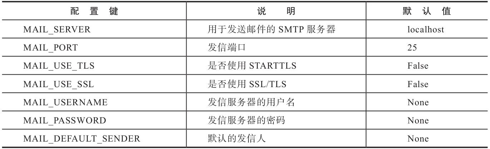
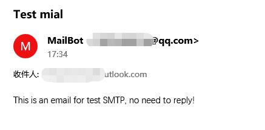

# 第六章  电子邮件

## 1. 电子邮件的常用使用场景有哪些？

* 用户注册发送确认邮件
* 定期向用户推送热门内容
* 向用户发送促销信息
* 等

---

## 2. 电子邮件的组成部分有哪些？


标准的收信方和发信方字符串由`姓名和邮箱地址`两部分组成，`姓名 <emial地址>`, `二者由空格隔开`。其中姓名是可选的，收信方一般可以只写邮箱地址，如zorn@example.com。

电子邮件格式：https://datatracker.ietf.org/doc/html/rfc5322

SMTP协议：https://datatracker.ietf.org/doc/html/rfc5321

---

## 3.Flask发送邮件相关的库：

* Flask-Mail：https://github.com/mattupstate/flask-mail
  
  文档：https://pythonhosted.org/Flask-Mail/

* SendGrid-Python：https://github.com/sendgrid/sendgrid-python

  文档：https://github.com/sendgrid/sendgrid-python/blob/master/USAGE.md

---

## 6. Flask-Mail简介：

扩展Flask-mail实现了python标准库中的smtplib包，简化了其在Flask中的使用。

安装Flask-Mail：`pipenv install flask-mail`

Flask-Mail通过连接`SMTP（Simple Mail Transfer Protocol，简单邮件传输协议）`服务器来发送邮件。因此，在开始发送电子邮件前，我们需要配置SMTP服务器。如果你的电脑上已经设置好了SMTP服务器，默认的邮件服务器配置即为localhost，`端口为25`。在开发和测试阶段，我们可以使用邮件服务提供商的SMTP服务器（比如Gmail），这时需要对Flask-Mail根据服务提供者的文档进行配置。

实例化Flask-Mail的Mail类：
```python
from flask_mail import Mail

app = Flask(__name__)
...
mail = Mail(app)
```

---

## 5. 如何配置Flask-Mail发送邮件？

Flask-Mail常用配置：


对发送的邮件进行**加密**可以避免邮件在发送过程中被第三方截获和篡改。常用的电子邮件安全协议:
* `SSL（Security Socket Layer，安全套接字层）`
* `TLS（Transport Layer Security，传输层安全）`

TLS继承了SSL，并在SSL的基础上做了改进（TLS可看做SSL的后期版本）。大多数情况下，二者可以互换使用。他们通过将`MAIL_USE_SSL`设置为True来开启。

STARTTLS是另一种加密方式，他会对不安全的连接进行升级（使用SSL或TSL）。尽管其名字中带有TLS，但也可能使用SSL加密。

根据加密方式的不同，端口可要相应改变：

* SSL/TLS加密：

  MAIL_USE_SSL=True

  MAIL_PORT=465

* STARTTLS加密：
  
  MAIL_USE_TLS=True

  MAIL_PORT=587

* 当不对邮件进行加密时，端口使用默认的25

常用的电子邮件服务商提供的SMTP配置信息：


要使用这些邮箱服务，你需要访问对应的网站注册一个账户。然后在个人页面的设置中进行开启邮箱的SMTP服务和获取授权码等操作。

其中，163邮箱的SMTP服务器不支持STARTTLS，你需要使用SSL/TLS加密。具体来说，需要将MAIL_USE_SSL设为True，MAIL_PORT设为465。

这些服务称为`EPA(Email Service Provider)`，仅适用于个人业务，不适合用来发送事务邮件（Transactional Email）。对于需要发送大量邮件的事务性邮件任务，更好的选择是使用自己配置的SMTP服务器或使用类似SendGrid、Mailgun等事务邮件服务提供商（Transactional Email Service）。

综上，我们为app.config对象使用update方法加载配置：
```python
import os
from flask import Flask
from flask_mail import Mail

app = Flask(__name__)

app.config.update(
    ...
    MAIL_SERVER = os.getenv('MAIL_SERVER')
    MAIL_PORT = 587
    MAIL_USE_TLS = True
    MAIL_USERNAME = os.getenv('MAIL_USERNAME')
    MAIL_PASSWORD = os.getenv('MAIL_PASSWORD')
    MAIL_DEFAULT_SENDER = ('John', os.getenv('MAIL_USERNAME'))
)

mail = Mail(app)
```

**注意**：在实例化Mail类时，Flask-Mail会先获取配置以创建一个用于发信的对象，所以`要确保在实例化之前加载配置`。

包含敏感信息的配置项写入.env环境变量文件中进行加载。

* 发信人/收信人格式：

  默认发信人有一个二元组构成，即(姓名， 邮箱地址)：`MAIL_DEFAULT_SENDER = ('Your Name', 'your_name@example.com')`。
  
  需要注意，`使用邮件服务提供商提供的SMTP服务器发信时，发信人字符串中的邮件地址必须和邮箱地址相同`。你可以直接使用MAIL_USERNAME的值构建发信人地址：`MAIL_DEFAULT_SENDER = ('Your Name', os.getenv('MAIL_USERNAME'))`。
  
  Flask-Mail会将该元组转换为标砖格式，也可以直接使用这种方式制定发信人：`MAIL_DEFAULT_SENDER = 'Your Name <your_name@example.com>'`

---

## 6. 如何构建邮件内容数据？

Flask-Mail中使用`Message类`表示邮件，一封邮件至少需要包括`主题、收件人、正文、发信人`这几个要素。发信人可以使用在配置中指定的变量。其余内容通过Message类的构造参数传入, 常用参数有：
* subject：主题
* recipients：收件人电子邮件地址的列表,和发信人字符串类似，收信人字符串可以为两种形式：`'Zorn<zorn@example.com>'或'zorn@example.com'`
* body：纯文本格式的正文内容
* html：html格式的正文内容

```python
message = Message(subject='Hello, World!', 
                recipients=['Zorn <zorn@example.com>'], 
                body='Across the Great Wall we can reach every corner in the world.'
                )
```

完整参数参考官方文档：http://www.pythondoc.com/flask-mail/

---

## 7. 如何发送邮件？

使用Mial对象的`send()`方法，对Message对象进行发送。
```python
mail.send(message)
```

综上，我们将发送简单邮件包装为一个方法：
```python
from flask_mail import Mail, Message
...
mail = Mail(app)

def send_mail(subject, to, body):
    message = Message(subject, recipients=[to], body=body)
    mail.send(message)
```

---

## 8. 如何使用事务邮件服务SendGrid？

在生产环境中，除了可以自己安装邮件服务器外，更方便的做法是使用事务邮件提供商的服务，如Mailgun或Sendgrid。

以SendGrid为例，注册后，在页面上为项目创建一个API密钥，用于在程序中发送邮件是进行认证。复制密钥将其保存在.env中。其web页面还提供邮件监控功能、邮件模板、联系人管理、订阅退订管理等功能。

SendGrid提供两种转发方式：
* SMTP转发：
  
  这种方式和即上面所讲的发送方式，只需要修改配置，使用API密钥：
  ```
  MAIL_SERVER = 'smtp.sendgrid.net'
  MAIL_PORT = 587
  MAIL_USE_TLS = True
  MAIL_USERNAME = 'apikey'
  MAIL_PASSWORD = os.getenv('SENDGRID_API_KEY') # 从环境变量读取API密  钥
  ```

* Web API转发：
  
  使用Web API发送邮件更加安全和方便，只要向SendGrid提供的API结构发送POST请求即可。相关参数参考其[文档](https://docs.sendgrid.com/api-reference/how-to-use-the-sendgrid-v3-api/authentication).

  其中需要将其提供的密钥放入POST请求的header字段`Authorization`vs，报文使用JSON格式提供。
  ```
  POST https://api.sendgrid.com/v3/mail/send
  'Authorization: Bearer YOUR_API_KEY'
  'Content-Type: application/json'
  
  '{"personalizations": [{"to": [{"email": "zorn@example.com"}]}],  "from": {"email": "noreply@helloflask.com"},"subject": "Hello,   World!","content": [{"type": "text/plain", "value": " Across the   Great Wall we can reach every corner in the world."}]}'
  ```

  POST请求可以使用任意的curl一类的工具或python库发送，如requests。
  官方也提供了一个Python SDK-SendGrid-Python：`pipenv install sendgrid`供使用。

  1. 创建发信对象客户端：
   
     ```python
     from sendgrid import SendGridAPIClient
     sg = SendGridAPIClient(apikey=os.getenv('SENDGRID_API_KEY'))
     ```

  2. 构建邮件数据：

     使用`sendgrid.helper.mail模块`导入的三个辅助类构造数据：
     * Email：创建邮件地址，即发件地址和收件地址，接收email和name参数，传入值可以有三种形式：
       * Email地址、姓名
       * 仅传入邮箱地址
       * 传入标准收件人字符串，即“姓名 \<Email地址>”
     * Content：接收MIME类型(type_)和正文value作为参数
     * Mail: 创建邮件对象，参数为发信人from_emial、主题subject、收件人to_email和邮件正文content。最终调用其`get()`方法或直接打印可查看邮件的JSON预览值。
   
     ```python
     from sendgrid.helpers.mail import Email, Content, Mail

     from_email = Email('noreply@helloflask.com')
     to_email = Email('zorn@example.com')
     subject = 'Hello, World!'
     content = Content('text/plain', ' Across the Great Wall we      can reach every corner in the world.')

     mail = Mail(from_email, subject, to_email, content)
     ```
     邮件的JSON预览值：
     ```python
     mail.get()
     {
       "personalizations": [
         {
           "to": [
             {
               "email": "zorn@example.com"
             }
           ],
           "subject": "Hello, World!"
         },
       ],
       "from": {
         "email": "noreply@helloflask.com"
       },
       "content": [
         {
           "type": "text/html",
           "value": "Across the Great Wall we can reach every corner      in the world."
         }
       ],
     }
     ```

     如果不适用辅助类亦可以通过字典手动构造邮件数据。

  3. 发送邮件：

     对邮件客户端对象调用`sg.client.mail.send.post()`方法，并将JSON传入即可发送POST请求，请求发送后可返回响应：
     ```python
     response = sg.client.mail.send.post(request_body=mail.get())
     print(response.status_code)
     print(response.body)
     print(response.headers)
     ```

  综上，将代码包装为函数：
  ```python
  import sendgrid
  import os
  from sendgrid.helpers.mail import *
  
  def send_email(subject, to, body):
      sg = sendgrid.SendGridAPIClient(apikey=os.environ.get('SENDGRID_API_KEY'))
      from_email = Email('noreply@helloflask.com')
      to_email = Email(to)
      content = Content("text/plain", body)
      mail = Mail(from_email, subject, to_email, content)
      response = sg.client.mail.send.post(request_body=mail.get())
  ```

---

## 9. 如何使用HTML正文构建邮件？

邮件的正文除了使用纯文本（text/plain），也可以使用HTML格式（text/html）。一封邮件可以既包含纯文本正正文又包含HTML格式正文。其中`HTML格式会被优先读取`，当授信的邮件系统比较古老无法读取HTML时，则会继续读取纯文本格式的正文。

* HTML格式正文的“[最佳实践](https://www.mailup.com/resources-mailup/strategy/strategies-techniques-and-best-practices/creating-a-good-html-email-message/)”：
  * 使用Tabel布局，而不是Div布局。
  * 使用行内（inline, 将style设置在标签中）样式定义（不使用CSS），比如：`<span style="font-family:Arial, Helvetica, sans-serif; font-size:12px; color:#000000;">Hello, Email!</span>`
  * 尽量使用比较[基础的CSS属性](https://www.campaignmonitor.com/css/)，避免使用快捷属性（比如background）和定位属性（比如float、position）
  * 邮件正文的宽度不应超过600px
  * 避免使用JavaScript代码
  * 避免使用背景图片
  
1. 在Flask-Mail中使用HTML正文：
   
   在使用Message类构造邮件时，换纯文本类似，可以通过`html`参数指定内容或通过属性赋值：
   ```python
   # 构造函数指定
   message = Message(..., body='纯文本正文', html='<h1>HTML正文</h1>')
   # 属性赋值
   message = Message(...)
   message.body = '纯文本正文'
   message.html = '<h1>HTML正文</h1>'
   ```

2. 在SendGrid中使用HTML正文：

   在构造Content时，将第一个MIME参数`type_`指定为`text/html`。如果同时包含两种格式的正文，则传入一个包含两个Content类实例的雷彪作为正文content的参数值：
   ```python
   from sendgrid.helpers.mail import Email, Content,    Mail
   
   ...
   text_content = Content("text/plain", "纯文本正文")
   html_content = Content("text/html", "<h1>HTML正文</h1>")
   mail = Mail(from_email, subject, to_email, content=[text_content, html_content])
   ```

---

## 10. 如何使用Jinja2模板组织邮件正文？

大多数情况下我们都需要动态构建邮件正文，如订阅邮件中修改订阅者的用户名，但邮件的基本内容大致相同，因此很适合使用模板来组织邮件内容。

纯文本模板：
```HTML
Hello {{ name }},

Thank you for subscribing Flask Weekly!
Enjoy the reading :)

Visit this link to unsubscribe: {{ url_for('unsubscribe', _external=True) }}
```
为了同时支持纯文本格式和HTML格式的邮件正文，每一类邮件我们都需要分别创建HMTL和纯文本格式的模板：
```HTML
<div style="width: 580px; padding: 20px;">
    <h3>Hello {{ name }},</h3>
    <p>Thank you for subscribing Flask Weekly!</p>
    <p>Enjoy the reading :)</p>
    <small style="color: #868e96;">
        Click here to <a href="{{ url_for('unsubscribe', _external=True) }}">unsubscribe</a>.
    </small>
</div>
```
⭐**注意**：当邮件中需要加入URL时（比如链接和图片），注意要生成`完整的外部URL`，而不是内部URL。这可以通过在`url_for()`函数中将关键字参数`_external设为True`实现。


在视图函数中发送邮件时传入相应的变量：
```python
from flask import render_template
from flask_mail import Message

def send_subscribe_mail(subject, to, **kwargs):
    message = Message(subject, recipients=[to], sender='Flask Weekly <%s>' % os.getenv('MAIL_USERNAME'))
    message.body = render_template('emails/subscribe.txt', **kwargs)
    message.html = render_template('emails/subscribe.html', **kwargs)
    mail.send(message)
```
为了支持在调用函数时传入模板中需要的关键字参数，我们在send_mail（）中接收可变长关键字参数（**kwargs）并传入render_template（）函数。

---

## 11. 如何异步发送邮件？

当使用SMTP的方式发送电子邮件时，如果手动使用浏览器测试程序的注册功能，你可能会注意到，在提交注册表单后，浏览器会有几秒钟的不响应。因为这时候程序正在发送电子邮件，发信的操作阻断了请求——响应循环，直到发信的send_mail（）函数调用结束后，视图函数才会返回响应。为了避免这个延迟，我们可以将发信函数放入后台线程异步执行。

```python
from threading import Thread
...
def _send_async_mail(app, message):
    # 手动激活上下文
    with app.app_context():
        mail.send(message)

def send_mail(subject, to, body):
    message = Message(subject, recipients=[to], body=body)
    thr = Thread(target=_send_async_mail, args=[app, message])
    thr.start()
    return thr
```
因为Flask-Mail的`send（）方法`内部的调用逻辑中使用了`current_app变量`，而这个变量只在激活的程序上下文中才存在，这里在后台线程调用发信函数，但是后台线程并没有程序上下文存在。为了正常实现发信功能，我们传入程序实例app作为参数，并`调用app.app_context（）手动激活程序上下文`。

在生产环境中，应该使用`异步任务队列处理工具`来处理这类任务，如使用[Celery](https://docs.celeryproject.org/en/stable/)。

---

## 12. 如何使用QQ邮箱的STMP服务发送邮件？

1. 获取授权码：
   
   网页登录QQ邮箱，在“设置”--“账户”--“POP3/IMAP/SMTP/Exchange/CardDAV/CalDAV服务”中`开启`“IMAP/SMTP服务”，并根据提示进行短信验证，最后获得`授权码`，将授权码复制保存，以便后续进行配置。

2. 配置Flask-Mail环境变量：
   
   在.env文件中配置环境变量，相关配置有：
   ```
   MAIL_SERVER=smtp.qq.com
   MAIL_PORT=465
   MAIL_USERNAME=[使用的QQ邮箱]
   MAIL_PASSWORD=[刚刚获得的授权码]
   ...
   ```
   使用参考：[https://service.mail.qq.com/cgi-bin/help?subtype=1&&id=28&&no=331](https://service.mail.qq.com/cgi-bin/help?subtype=1&&id=28&&no=331)。
   
   注意：文档中写的配置中密码是QQ邮箱密码，但是测试发现发送邮件时认证失败，使用授权码则可以成功认证。

3. 使用Flask-Mail发送邮件：
   
   在程序中读取环境变量，配置mial，发送邮件即可：
   ```python
   ...
   app.config.update(
       MAIL_SERVER=os.getenv('MAIL_SERVER'),
       MAIL_PORT=os.getenv('MAIL_PORT'),
       MAIL_USE_SSL=True,
       MAIL_USERNAME=os.getenv('MAIL_USERNAME'),
       MAIL_PASSWORD=os.getenv('MAIL_PASSWORD'),
       MAIL_DEFAULT_SENDER=('MailBot', os.getenv   ('MAIL_USERNAME'))
   )
   
   mail = Mail(app)

   # send over SMTP
   def send_smtp_mail(subject, to, body):
       message = Message(subject, recipients=[to],    body=body)
       mail.send(message)
   ```
   调用`send_smtp_mail`方法即可发送邮件，不过邮件接收后可能在垃圾邮件中。

   
