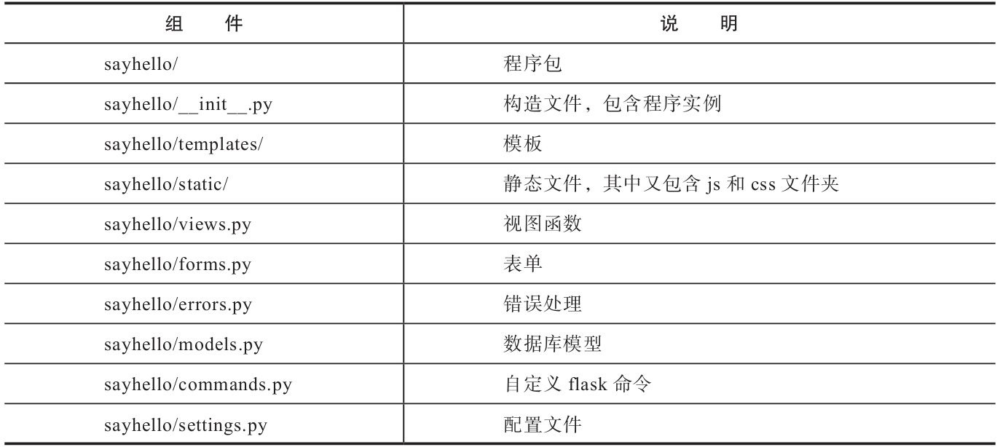
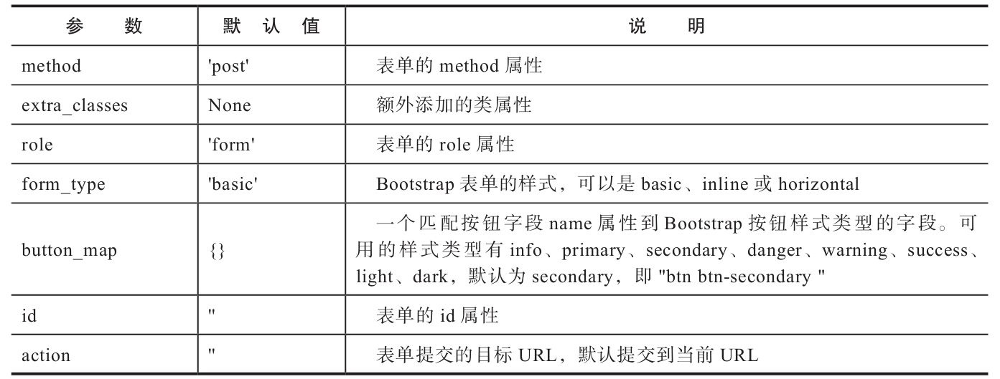
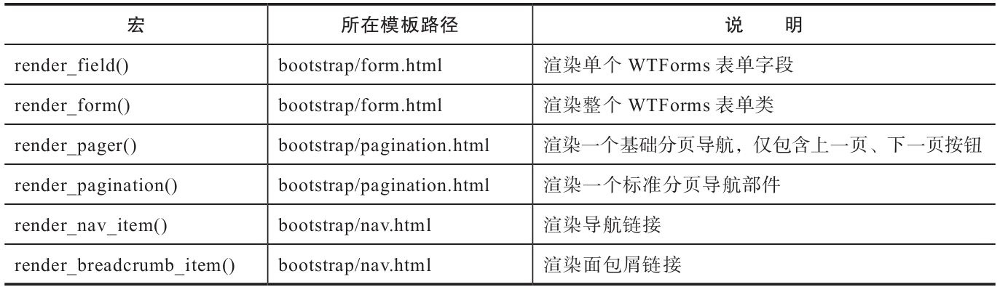
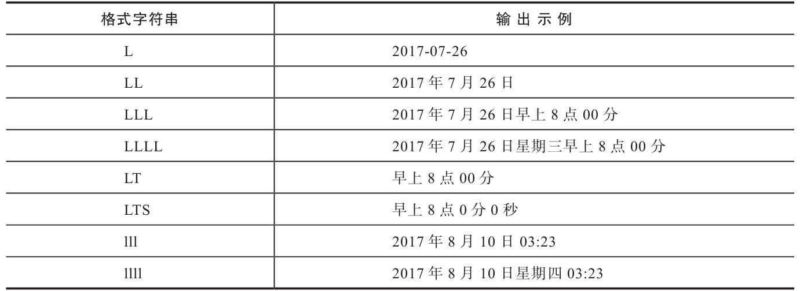
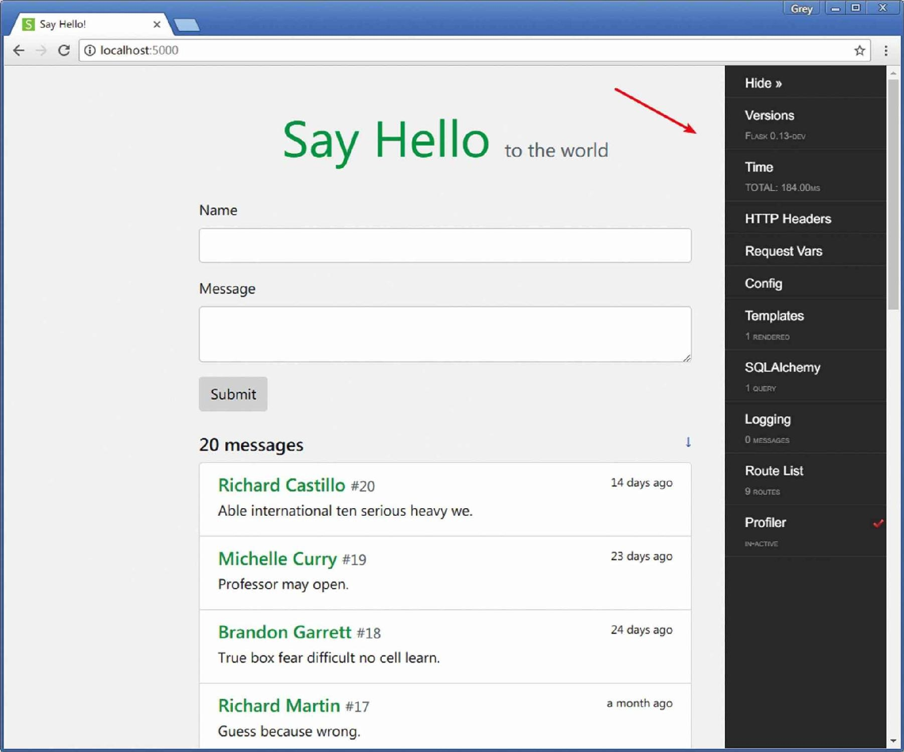

# 第七章 留言板

## 1. 如何使用git submodule管理子项目？

我们将留言板项目作为一个独立的子项目进行版本控制，在github中新建仓库：
[sayhello](git@github.com:MingruiWang2017/sayhello.git)
然后将其作为父项目的子模块来集成。

git submodule命令使用：
1. 添加：`git submodule add <url> <path>`
   * url：替换为自己要引入的子模块仓库地址
   * path：要存放的本地路径

   执行添加命令成功后，可以在当前路径中看到一个`.gitsubmodules文件`，里面的内容就是我们刚刚add的内容

   如果在添加子模块的时候想要指定分支，可以利用 -b 参数
   
   如：`git submodule add git@github.com:MingruiWang2017/sayhello.git helloflask/sayhello`
   命令执行后，git会将sayhello项目clone到helloflask/sayhello目录下，.gitmodules中的内容为：
   ```
   [submodule "helloflask/sayhello"]
	   path = helloflask/sayhello
	   url = git@github.com:MingruiWang2017/sayhello.git
   ```

2. 使用：

   当使用add命令后，如果目录下没有任何内容，可以使用如下命令拉取代码：`git submodule update --init --recursive`

   这是以下两条命令的合并版本：
   
   `git submodule init`

   `git submodule update`


3. 更新：

   子模块是一个独立于父项目的独立仓库，进入子模块目录后可以正常使用git命令执行操作。
   
   如子模块仓库的代码有其他人提交的commit，可以进入子模块目录使用`git pull`命令同步到本地。使用`git merge`合并更改。

   在父仓库中，使用`git submodule update`更新项目内子模块到最新版本；使用`git submodule update --remote`更新子模块为远程项目最新版本。

4. 删除：
   
   1. 删除子模块目录及源码：`rm -rf 子模块目录`
   2. 删除.gitmodules中的对应子模块内容: `vi .gitmodules`
   3. 删除.git/config配置中的对应子模块内容: `vi .git/config`
   4. 删除.git/modules/下对应子模块目录: `rm -rf .git/modules/子模块目录`
   5. 删除git索引中的对应子模块: `git rm --cached 子模块目录`

参考：

* https://support.huaweicloud.com/usermanual-codehub/codehub_ug_1001.html
* https://www.jianshu.com/p/9000cd49822c

---

## 2. 本章内容使用的第三方库：

* Bootstrap-Flask（0.1.0）:

  主页：https://github.com/greyli/bootstrap-flask

  文档：https://bootstrap-flask.readthedocs.io

* Flask-Moment（0.6.0）

  主页：https://github.com/miguelgrinberg/Flask-Moment

* Faker（0.8.13）

  主页：https://github.com/joke2k/faker

  文档：http://faker.readthedocs.io

* Flask-DebugToolbar（0.10.1）

  主页：https://github.com/mgood/flask-debugtoolbar

  文档：https://flask-debugtoolbar.readthedocs.io

书中项目的github地址：https://github.com/greyli/sayhello

项目使用tag来标识不同的版本，使用`git tag -n`可查看所有标签。`git checkout <tag>`切换到对应标签。

**注意**：使用`git push`推送代码时，tag并不会跟随发送到远程仓库，需要显式地调用命令推送tag：如果想要推送某一个tag，使用`git push origin [tagnaem]`; 如果想推送所有tag，使用`git push --tags`.


---

## 3. 如何使用包来组织代码？

之前我们的代码都是放在一个脚本中，随着项目的扩大，把所有代码放在app.py中会导致可读性降低，不方便管理。

更好的处理方式是将单一的模块升级为包package，把不同部分的代码分模块存放。

> 在python中，每一个有效的python文件（.py）都是模块。
>
> 每一个包含`__init__.py`文件的目录都被称为包。包可以让用户使用文件夹来组织模块。`__init__.py`文件通常称为`构造文件`。文件可以是空的，也可以用来放置包的初始化代码。当包或包内的模块被导入时，构造文件将会被自动执行。

SayHello程序的核心组件都放到一个包中，这个包称为程序包，包的名称通常使用程序名称，即sayhello，有时为了方便管理也会使用app作为包名称。除了程序代码，一个基本的Flask项目还包括其他必要的组件，本项目的组件如下：


其中的模块不是固定的，可以根据需要添加或删除。

---

## 4. 如何从python文件中导入Flask配置？

在之前的Flask程序中，我们的配置是直接通过`app.config`对象写入的。

在本项目中我们将配置移动到单独的文件中，命名为`settings.py`或`config.py`。文件中的内容直接使用`键值对`方式写入，和保存环境变量的.flaskenv很相似。

sayhello/settings.py
```python
import os

from sayhello import app

dev_db = 'sqlite:///' + os.path.join(os.path.dirname(app.root_path), 'data.db')

SECRET_KEY = os.getenv('SECRET_KEY', 'secret string')
SQLALCHEMY_TRACK_MODIFICATIONS = False
SQLALCHEMY_DATABASE_URI = os.getenv('DATABASE_URI', dev_db)
```
其中，由于配置文件被放到了程序包内，为了定位到位于项目根目录的数据库文件，使用`os.path.dirname(app.root_path)`获取`上层目录`，app.root_path属性存储程序实例所在的路径。数据库URL和密钥都会首先从环境变量获取。

加载配置：

在创建程序示例后，使用config对象的`from_pyfile()`方法即可加载配置，传入配置模块的名称作为参数：
```python
...
app = Flask(__name__)
app.config.from_pyfile('settings.py)
```

除了从Python脚本导入配置，Flask还提供了其他方式，比如使用`from_json（）方法从JSON文件中导入`，或是使用`from_object（）方法从Python对象导入`，详情见[http://flask.pocoo.org/docs/latest/config/](http://flask.pocoo.org/docs/latest/config/) 。

---

## 5. 如何在构造文件中创建程序示例？

使用包组织程序代码后，`创建程序实例、初始化扩展等操作`可以在程序包的构造文件`__init__.py`中实现:

```python
from flask import Flask
from flask_sqlalchemy import SQLAlchemy

app = Flask('sayhello')
app.config.from_pyfile('settings.py')
app.jinja_env.trim_blocks = True
app.jinja_env.lstrip_blocks = True

db = SQLAlchemy(app)

from sayhello import views, errors, commands
```

在单脚本中创建程序实例时，我们传入`__name__`变量作为Flask类构造方法的`import_name`参数值。因为Flask通过这个值来确认程序路径，当使用包组织代码时，为了确保其扩展或测试框架的获得正确的路径值，`最好使用硬编码的形式写出包名称作为程序名称`。当然也可以从`__name__`变量中获取包名：`app=Flask(__name__.split('.')[0])`。

**注意**：
    
    Flask会通过`Flask_APP`环境变量定义的模块中寻找程序实例，所以也需要在。falskenv中将其改为包名称：`FLASK_APP=sayhello`

程序启动及导入模块：

    当我们启动程序时，`首先被执行的是包含程序实例的脚本，即构造文件`。但注册在程序实例上的各种处理程序均存放在其他脚本中，比如视图函数存放在views.py中、错误处理函数则存放在errors.py中。如果不被执行，那么这些视图函数和错误处理函数就不会注册到程序上，那么程序也无法正常运行。为了让使用程序实例app注册的视图函数，错误处理函数，自定义命令函数等和程序实例关联起来，我们`需要在构造文件中导入这些模块`。因为这些模块也需要从构造文件中导入程序实例，所以为了避免循环依赖，这些`导入语句写在构造文件的末尾定义`。

从构造文件中导入变量：

    从构造文件中导入变量时不需要注明构造文件的路径，只需要从包名称导入，比如导入在构造文件中定义的程序实例app可以使用`from sayhello import app`。

---

## 6. 通用Web程序开发流程：

在实际的开发中，一个Web程序的开发过程要涉及多个角色，比如客户（提出需求）、项目经理（决定需求的实现方式）、开发者（实现需求）等，在这里我们假设是一个人全职开发。

一般来说，一个Web程序的开发流程如下所示：

    1）分析需求，列出功能清单或写需求说明书。
    2）设计程序功能，写功能规格书和技术规格书。
    3）进入开发与测试的迭代。
    4）调试和性能等专项测试。
    5）部署上线（deployment）。
    6）运行维护与营销等。

写好功能规格书后，我们就可以进行实际的代码编写。在具体的开发中，代码编写主要分为`前端页面（front end）`和`后端程序（back end）`。

* 前端开发的主要流程如下：

  1）根据功能规格书画页面草图（sketching）。

  2）根据草图做交互式原型图（prototyping）。
  
  3）根据原型图开发前端页面（HTML、CSS、JavaScript）。

* 后端开发的主要流程如下：

  1）数据库建模。
  
  2）编写表单类。
  
  3）编写视图函数和相关的处理函数。
  
  4）在页面中使用Jinja2替换虚拟数据。


采用这个流程并不是必须的，对于非常简单的程序可以根据情况来省略某些步骤。但是对于一个复杂的项目从一开始就遵循开发流程，可以让你很容易适应大型程序的开发。在大型程序里常常有着复杂的数据库关系，大量的页面和功能，如果没有规划会将大量时间都浪费在无意义的调试和删改中。前期考虑和规划越周全，在实际开发时就可以越高效和省力。

同时测试也是开发时的重要环节，这一部分会在之后讲解。在实际的开发中应该将测试融入整个开发流程：每编写一部分代码，应该立即写对应的测试。

---

## 7. 留言板项目的功能规格书：

* 概述：
  
  SayHello是一个类似于留言板的程序，用来让用户发表问候，对任何人任何事的问候。比如，用户A想问候这个世界，就可以在页面上发表一句“Hello，World！”。SayHello的使用流程非常简单，我们甚至不需要画流程图。用户输入问候信息和姓名，按下提交按钮，就可以将问候加入到页面的消息列表中。

* 主页：
  
  主页是SayHello唯一的页面，页面中包含创建留言的表单以及所有的问候消息。页面上方是程序的标题“SayHello”，使用大字号和鲜艳的颜色。页面底部包含程序的版权标志、编写者、源码等相关信息。

* 问候表单：

  这个表单包含姓名和问候消息两个字段，其中姓名字段是普通的文本字段`<input type="text">`，而消息字段是文本区域字段`<textarea></textarea>`。为了获得良好的样式效果，对这两个字段的输入值进行长度上的限制，姓名最长为20个字符，而问候消息最长为200个字符。

  用户提交发布表单后：

  1）如果验证出错，错误消息以红色小字的形式显示在字段下面；

  2）如果通过验证，则在程序标题下面显示一个提示消息，用户可以通过消息右侧的按钮关闭提示。

* ⭐问候消息列表：

  问候消息列表的上方`显示所有消息的数量`。每一条问候消息要包含的信息有`发布者姓名、消息正文、发布的时间、消息的编号`。消息发布时间要显示`相对时间`，比如“3分钟前”，当鼠标悬停在时间上时，弹出窗口显示`具体的时间值`。消息`根据时间先后排序`，最新发表的排在最上面。为了方便用户查询最早的消息，我们提供一个前往页面底部的按钮，同时提供一个回到页面顶部的按钮。

* 错误页面：
  
  错误页面包括404错误页面和500错误页面，和主页包含相同的部分——程序标题。程序标题下显示错误信息以及一个返回主页的“Go Back”链接。为了保持简单，错误页面不加入页脚信息。

---

## 8. 前端页面项目原型开发常用工具有哪些？

在项目流程中，我们首先使用工具设计出原型图，最后编写对应的HTML页面。

常用的的原型设计工具有[Axure RP](https://www.axure.com/)和[Mockplus](https://www.mockplus.cn/)。

在传统的Flask程序中，后端完成功能后会操作HTML代码，在其中添加Jinja2语句。比如，将页面中的临时URL替换为url_for（）函数调用，把虚拟数据换成通过视图函数传入模板的变量，或是使用模板继承等技术组织这些HTML文件。

---

## 9. 后端程序开发：

1. 数据库建模：
   
   根据功能规格书，确定需要使用哪些表来存储数据，表中需要创建哪些字段以及各个表之间的关系。对于复杂的数据库结构，可以使用建模工具(如PowerDesigner)来辅助建立数据库关系。

   在sayhello中，只有用于保存留言的Message模型：
   ```python
   from datetime import datetime
   from sayhello import db
   
   class Message(db.Model):
       id = db.Column(db.Integer, primary_key=True)
       body = db.Column(db.String(200))
       name = db.Column(db.String(20))
   　　timestamp = db.Column(db.DateTime, default=datetime.now, index=True)
   ```
   timestamp字段用来存储每一条留言的发表时间（时间戳），这个字段存储Python的datetime对象。在这个字段中，我们将`index设为True来开启索引`，并使用`default参数设置了字段默认值`。

   **注意**：timestamp字段的默认值是`datatime.now`而不是`datatime.now()`。前者是可调用的函数对象，而后者是函数调用返回值。SQLAlchemy会在创建新的数据库记录时（即用户提交表单实例化Message类时）`调用该对象`来设置默认值，这也是我们期待的效果。如果传入的不是方法对象，那么这个方法在加载模块时就会被执行，这将不是正确的时间戳。

2. 创建表单类：
   
   HelloForm，使用TextAreaField保存留言内容：
   ```python
   from flask_wtf import FlaskForm
   from wtforms import StringField, SubmitField, TextAreaField
   from wtforms.validators import DataRequired, Length
   
   class HelloForm(FlaskForm):
       name = StringField('Name', validators=[DataRequired(), Length(1, 20)])
       body = TextAreaField('Message', validators=[DataRequired(), Length(1,    200)])
       submit = SubmitField()
   ```
   其中使用Length验证器限制用户输入长度。

3. 编写视图函数：

   错误处理函数比较简单，我们重点介绍一下index视图。index视图有两个作用：

   1）处理GET请求，从数据库中查询所有的消息记录，返回渲染后的包含消息列表的主页模板index.html。

   2）处理POST请求，问候表单提交后，验证表单数据，通过验证后将数据保存到数据库中，使用flash（）函数显示一条提示，然后重定向到index视图，渲染页面。
   ```python
   from flask import flash, redirect, url_for, render_template
   
   from sayhello import app, db
   from sayhello.models import Message
   from sayhello.forms import HelloForm
   
   @app.route('/', methods=['GET', 'POST'])
   def index():
       # 加载所有的记录
       messages = Message.query.order_by(Message.timestamp.desc()).all()
       form = HelloForm()
       if form.validate_on_submit():
           name = form.name.data
           body = form.body.data
           message = Message(body=body, name=name)  # 实例化模型类，创建记录
           db.session.add(message)  # 添加记录到数据库会话
           db.session.commit()  # 提交会话
           flash('Your message have been sent to the world!')
           return redirect(url_for('index'))  # 重定向到index视图
       return render_template('index.html', form=form, messages=messages)
   ```
   在获取message记录时，我们使用`order_by（）过滤器对数据库记录进行排序`，参数是排序的规则。我们根据Message模型的timestamp字段值排序，字段上附加的排序方法为`desc（），代表降序（descending）`，同样还有一个`asc（）方法表示升序（ascending）`。

4. 编写模板：
   
   base.html
   ```HTML
   <!DOCTYPE html>
   <html lang="en">
   <head>
       <meta charset="utf-8">
       <meta name="viewport" content="width=device-width,    initial-scale=1, shrink-to-fit=no">
       <title>Say Hello!</title>
       <link rel="icon" href="{{ url_for('static', filename='favicon.   ico') }}">
       <link rel="stylesheet" href="{{ url_for('static', filename='css/   bootstrap.min.css') }}" type="text/css">
       <link rel="stylesheet" href="{{ url_for('static', filename='css/   style.css') }}" type="text/css">
   </head>
   <body>
   <main class="container">
       <header>
           <h1 class="text-center display-4">
               <a href="{{ url_for('index') }}"    class="text-success"><strong>Say Hello</strong></a>
               <small style="font-size: 24px" class="text-muted">to    the world</small>
           </h1>
       </header>
       
       <div class="alert alert-info">
           <button type="button" class="close" data-dismiss="alert">&   times;</button>
           {{ message }}
       </div>
       
       
       <footer class="text-center">
           
           ...
           <p><a id="bottom" href="#" title="Go Top">&uarr;</a></p>
           
       </footer>
   </main>
   
   <script type="text/javascript" src="{{ url_for('static',    filename='js/jquery-3.2.1.slim.min.js') }}"></script>
   <script type="text/javascript" src="{{ url_for('static',    filename='js/popper.min.js') }}"></script>
   <script type="text/javascript" src="{{ url_for('static',    filename='js/bootstrap.min.js') }}"></script>
   <script type="text/javascript" src="{{ url_for('static',    filename='js/script.js') }}"></script>
   </body>
   </html>
   ```
   在head标签和body标签内，我们引入了Bootstrap所需的CSS和JavaScript文件，   以及Bootstrap所依赖的jQuery和Popper.js。另外，我们还引入了自定义的   style.css和script.js文件，这两个文件分别用来存储自定义的CSS样式定义和   JavaScript代码。
   
   这里为消息应用了Bootstrap提供的`alert-info样式（蓝色背景）`，后面我们会   学习对flash消息添加`分类`，以便对不同类别的消息应用不同的样式。
   
   index.html
   ```HTML
   
   
   
   
   <div class="hello-form">
       <form method="post" action="{{request.full_path}}">
           {{ form.csrf_token }}
           <div class="form-group required">
               {{ form_field(form.name, class='form-control') }}
           </div>
           <div class="form-group required">
               {{ form_field(form.body, class='form-control') }}
           </div>
           {{ form.submit(class='btn btn-secondary') }}
       </form>
   </div>
   <h5>{{ messages|length }} messages
       <small class="float-right">
           <a href="#bottom" title="Go Bottom">&darr;</a>
       </small>
   </h5>
   <div class="list-group">
       
           <a class="list-group-item list-group-item-action    flex-column">
               <div class="d-flex w-100 justify-content-between">
                   <h5 class="mb-1 text-success">{{ message.name }}
                       <small class="text-muted"> #{{ loop.revindex }}   </small>
                   </h5>
                   <small>
                       {{ message.timestamp.strftime('%Y/%m/%d %H:%M')    }}
                   </small>
               </div>
               <p class="mb-1">{{ message.body }}</p>
           </a>
       
   </div>
   
   ```
   
   前面第四章提到过，页面中的表单默认提交到当前URL。如果用户单击了向下按钮，   会在URL中添加URL片段，比如“#bottom”，它指向页面底部的a元素（其id值为   bottom），所以会跳转到页面底部（关于URL片段我们会在第8章详细了解）。当表   单被提交后，页面加载时仍会跳转到URL片段对应的位置，为了避免这个行为，可以   显式地使用action属性指定表单提交的目标URL，使用request.full_path获取没有   URL片段的当前请求URL。
   
   渲染时间戳时，我们使用datetime.strftime（）方法将时间戳输出格式定义为：   “年/月/日时：分”，这显然不是我们设计功能时想要的时间，在后面我们借助其他工   具来获取相对时间并显示绝对时间弹窗。除了时间戳外，我们还渲染了loop.   revindex变量，用来表示留言的反向序号标记。

---

## 10. 使用Bootstrap-Flask简化页面编写：

扩展Bootstrap-Flask内置了可以快速渲染Bootstrap4样式HTML组件的宏，并提供了内置的Bootstrap资源。使用它可以简化在Web程序中集成Bootstrap的过程。

安装：`pipenv install bootstrap-flask`

使用：注意，Bootstrap-Flask提供的包名是`flask-bootstrap`，使用时需要实例化`Bootstrap`类：
```python
from flask import Flask
from flask_bootstrap import Bootstrap4

app = Flask(__name__)
bootstrap = Bootstrap4(app)
```

### 1. 加载资源文件：

Bootstrap-Flask在模板中提供一个bootstrap对象，这个对象提供了两个方法用来生成资源引用代码：
* bootstrap.load_css()：用来加载CSS资源
* bootstrap.load_js()：用来加载JavaScript文件，包括Bootstrap、jQuery、Popper.js。方法可以使用`with_jquery`和`with_popper`参数设置是否加载jQuery和Popper.js的JavaScript资源，默认为True，设为False可以关闭。

默认会从CDN加载资源，同时也可以提供内置的本地资源，如果使用本地资源，可以配置`BOOTSTRAP_SERVER_LOCAL`为True。另外，当FLASK_ENV为开发环境时，会自动从本地加载资源。

资源加载方法使用：
```jinja
<head>
    {{ bootstrap.load_css() }}
</head>
<body>
    ...
    {{ bootstrap.load_js() }}
</body>
```

### 2. 快捷渲染表单：

Bootstrap-Flask内置了两个用于渲染WTForms表单的宏：他们从`bootstrap/form.html`模板导入
* render_field()宏：渲染表单中的某个字段
* render_form()宏：快速渲染整个表单，包括自动渲染CSRF令牌字段form.csrf_token

这两个宏都会自动渲染错误信息和表单的验证状态样式。

```jinja




    <div class="hello-form">
        {{ render_form(form),action=request.full_path}}
    </div>

```

render_form()宏还支持许多参数来自定义表单，常用参数如下：



除了以上渲染表单的宏，Bootstrap-Flask还提供许多其他用途的宏，他们都从bootstrap目录下的模板导入：


完整的可用宏列表请访问Bootstrap-Flask文档的[宏页面](https://bootstrap-flask.readthedocs.io/en/stable/basic/#macros)查看

---

## 11. 使用Flask-Moment本地化日期和时间：

之前在Message类中，我们使用datetime.now()方法生成时间，他是一个`本地时间`，即它返回的是服务器（运行程序的计算机）设置的时区所对应的时间。这样会带来时区问题，当程序部署到其他时区的服务器时，访问页面将会看到对应时区的时间，而不是用户本地的时间。

### 1. 时间分类：

* 纯真时间（native time）：不包含时区信息的时间戳
* 细致时间（aware time）：包含时区的时间戳

datetime模块提供的`datetime.utctime()`方法用来生成当前的`UTC（Coordinated Universal Time，协调世界时间）`，UTC时间就是不包含时区信息的纯正时间。我们使用它来代替之前的now()方法。

### 2. 使用Flask-Moment集成Moment.js：

[Moment.js](https://momentjs.com/)是一个用于处理时间和日期的开源JavaScript库，它可以对时间和日期进行各种方式的处理。它会根据用户电脑中的时区设置在客户端使用JavaScript来渲染时间和日期，另外它还提供了丰富的时间渲染格式支持。


安装：`pipenv install flask-moment`

使用：实例化Moment类
```python
from flask_moment import Moment

app = Flask(__name__)
...
moment = Moment(app)
```
为了使用Moment.js，我们需要`在基模板中加载Moment.js资源`。Flask-Moment在模板中提供了`moment对象`，这个对象提供两个方法来加载资源：
* moment.include_moment（）方法用来加载Moment.js的Javascript资源；
* moment.include_jquery（）用来加载jQuery。
 
这两个方法默认从CDN加载资源，传入`local_js参数`可以指定本地资源URL。

在使用Bootstrap时已经加载了jQuery，这里只需要加载Moment.js的JavaScript文件。

集成Moment.js：

我们在程序中手动加载资源，从官网下载对应的资源文件放入static文件夹，然后在基模板中引入。因为`moment.include_moment（）`会用来生成执行时间渲染的JavaScript函数，所以我们必须调用它，可以通过`local_js参数`传入`本地资源的URL`，如果不传入这个参数则会从CDN加载资源：
```HTML
...
{{ moment.include_moment(local_js=url_for('static', filename='js/moment-with-locales.min.js')) }}
</body>
```

官网提供的文件中`moment.min.js`仅包含英文语言的时间日期字符，如果要使用其他语言，需要下载`moment-with-locales.min.js`。

Flask-Moment默认以英文显示时间，可以通过`locale()`方法传入区域字符串来更改显示语言，简体中文的地区字符串为`zh-cn`，中国香港繁体中文和中国台湾繁体中文，则分别使用为`zh-hk`和`zh-tw`。
```HTML
...
{{ moment.locale('zh-cn') }}
</body>
```

除了使用locale参数固定地区，`更合理的方式是根据用户浏览器或计算机的语言来设置语言，我们可以在locale（）方法中将auto_detect参数设为True`，这会自动探测客户端语言设置并选择合适的区域设置：
```HTML
...
{{ moment.locale(auto_detect=True) }}
</body>
```

### 3. 渲染时间日期

Moment.js提供了丰富、灵活的时间日期格式化方式。在模板中，可以通过对moment类调用`format()`方法来格式化日期和时间。moment的构造方法使用`utcnow()`方法创建的datetime对象作为参数，`format()`方法接收特定的格式字符串来渲染时间格式：`{{ moment(message.timestamp).format('格式字符串') }}`.

时间日期会在页面加载完成后执行JavaScript函数使用Moment.js渲染，所以时间日期的显示会有微小的延迟。

Moment.js提供了一些内置格式字符串，字符串及其对应的中文输出示例如下：


也可以通过Moment.js支持的`时间单位参数`自定义时间输出，比如使用格式字符串“YYYYMMMMDo，ah:mm:ss”将会得到输出：2017七月26日，早上8:00:00。

完整的参数及输出列表可以在这里看到：https://momentjs.com/docs/#/parsing/string-format/ 。

### 4. 相对时间

除了输出普通的时间日期，Moment.js还支持输出相对时间，如三分钟前、一个月前等

使用`fromNow()`方法实现：`<small>{{ moment(message.timestamp).fromNow(refresh=True) }}</small>`

其中`refresh参数`表示是否开启实时刷新。（默认为False）。他可以在不重载页面的情况下随时间变化刷新相对时间。

### 5. 其他方法

Flask-Moment实现了Moment.js的format（）、fromNow（）、fromTime（）、calendar（）、valueof（）和unix（）方法，具体的使用方法参见[Moment.js文档](https://momentjs.com/docs/)。

### 6.悬浮显示确切时间

当鼠标悬停在问候消息的时间日期上时，我们希望能够显示一个包含具体的绝对时间的弹出窗口（tooltip）。

为了能够在JavaScript中使用Moment.js渲染时间日期，我们需要在显示相对时间的HTML元素中创建一个data-timestamp属性存储原始的时间戳，以便在JavaScript中获取：
```HTML
<small data-toggle="tooltip" data-placement="top" data-delay="500"
data-timestamp="{{ message.timestamp.strftime('%Y-%m-%dT%H:%M:%SZ') }}">
    {{ moment(message.timestamp).fromNow(refresh=True) }}
</small>
```
为了让时间戳能够正常被Moment.js解析，我们需要使用`strftime（）方法`对原始的时间字符串按照`ISO 8601标准('%Y-%m-%dT%H:%M:%SZ')`进行格式化处理。

在script.js脚本中定义渲染时间弹窗的方法：
```js
$(function () {
    function render_time() {
        return moment($(this).data('timestamp')).format('lll')
    }
    $('[data-toggle="tooltip"]').tooltip(
        {title: render_time}
    );
});
```
在render_time()函数中，渲染时间日期使用的moment()函数有Moment.js提供（不是Flask-Moment传入模板的类）。`$(this).data('timestamp')`获取对应元素的data-timestamp属性值，特殊变量`this`表示当前触发时间的元素对象。

在Bootstrap中，Tooltip组件需要调用`tooltip（）方法`进行初始化。我们使用`data-toggle属性`作为`选择器`选择所有设置了tooltip的元素，对其调用tooltip（）方法。在调用这个方法时，可以传入一些选项，如title选项用来设置弹出的内容，可以是`字符串`也可以是`函数对象`。

现在，当鼠标悬停在时间戳上时，会弹出包含具体时间的小窗口。

提示：在Bootstrap中，Popover和Tooltip组件依赖于JavaScript包Popper.js（https://popper.js.org/ ），要使用这两个组件，需确保在基模板中加载了对应的JavaScript文件。作为替代，你也可以加载Bootstrap提供的合集包文件bootstrap.bundle.min.css。

---

## 12. 使用Faker生成虚拟数据：

流行的Python虚拟数据生成工具有[Mimesis](https://github.com/lk-geimfari/mimesis)和[Faker](https://github.com/joke2k/faker)。

Faker同时支持Python2和Python3，且文档提供丰富的示例。Faker内置了20多类虚拟数据，包括姓名、地址、网络账号、信用卡、时间、职位、公司名称、Python数据等。每次调用都会获得不同的随机结果。

安装：`pipenv install faker --dev`。--dev表示仅安装为开发依赖。

使用：
```python
>>> from faker import Faker
>>> fake = Faker()

>>> fake.name()
'Lucy Cechtelar'

>>> fake.address()
426 Jordy Lodge
Cartwrightshire, SC 88120-6700"

>>> fake.text()
Sint velit eveniet. Rerum atque repellat voluptatem quia rerum. Numquam excepturi
beatae sint laudantium consequatur. Magni occaecati itaque sint et sit tempore. Nesciunt.
```

可通过Faker官方文档的Providers一章（http://faker.readthedocs.io/en/master/providers.html）查看所有分类下可用的虚拟数据方法。

默认的虚拟数据语言为英文，如果你想获取其他语言的虚拟数据，可以在实例化Faker类时传入区域字符作为第一个参数（locale）来指定：`fake = Faker('zh_CN')`。

示例：使用Faker实现一个生成虚拟留言的命令函数forge
```python
@app.cli.command()
@click.option('--count', default=20, help='Quantity of messages, default is 20.')
def forge(count):
    """生成虚拟消息数据"""
    from faker import Faker

    db.drop_all()
    db.create_all()

    fake = Faker()
    click.echo('Working...')

    for i in range(count):
        message = Message(
            name=fake.name(),
            body=fake.sentence(),
            timestamp=fake.date_time_this_year()
        )
        db.session.add(message)

    db.session.commit()
    click.echo('Created %d fake messages.' % count)
```
分别调用fake对象的name（）、sentence（）、date_time_this_year（）方法生成虚拟的姓名、留言和时间戳。

选项--count用来指定生成的留言数量.

---

## 13. 使用Flask-DebugToolbar调试程序：

扩展Flask-DebugToolbar提供了一系列调试功能，可以用来查看请求的SQL语句、配置选项、资源加载情况等信息。这些信息在开发时会非常有用。

安装：`pipenv install flask-debugtoolbar`

使用：实例化`DebugToolbarExtension`类
```python
from flask import Flask
...
from flask_debugtoolbar import DebugToolbarExtension

app = Flask(__name__)
...
toolbar = DebugToolbarExtension(app)
```

开发时不需要也`不建议使用Flask-DebugToolbar`。Flask-DebugToolbar只在开启了`调试模式`时才会启动，所以我们要确保设置正确的`FLASK_ENV环境变量值：开发时设为development；部署时则设为production`。另外，Flask-DebugToolbar会`拦截重定向请求`，将DEBUG_TB_INTERCEPT_REDIRECTS配置变量设为False可以关闭这个特性：`DEBUG_TB_INTERCEPT_REDIRECTS = False`.

这时启动程序，就会发现页面右侧多了一个工具栏，单击“Hide”按钮可以隐藏为一个浮动按钮，如图所示。


在调试工具栏中，除了Flask版本以及页面的加载时间信息，右侧的功能选项分别为：`HTTP首部、请求相关变量、配置变量、模板渲染记录、数据库查询记录、日志、路由列表、性能分析器`。

---

## 14. Flask配置有哪几种组织形式？

在Flask中，开发和部署通常需要不同的配置。通常有两种方式来组织：
* 环境变量优先
* 实例文件夹覆盖
  
1. 环境变量优先：
   
12-Factor程序第三条（https://www.12factor.net/zh_cn/config ）建议通过环境变量来保存配置，以便将配置和程序分离开来，并且对不同场景下的配置进行分离。

之前我们就创建了.env和.flaskenv文件用来存储环境变量，对于包含敏感信息的配置，我们优先或仅从环境变量中读取，他们统一存放在.env文件中，从而实现敏感配置的分离。

需要在.gitignore中添加这个文件，不提交到git仓库中。

2. 实例文件夹覆盖：

实例文件夹（instance folder）是为了方便存储开发和部署时的各类文件而提供的。可以再项目根目录（程序包旁）中创建一个名为`instance`的文件夹。其中存储开发和部署时使用的配置文件，包含敏感信息的文件，或是临时创建的数据库文件等。

该文件夹也要加入.gitignore中，不要提交的git仓库中。

当使用实例文件夹存储配置时，一个方便的做法是把包含敏感数据的配置放到instance文件夹的配置文件中，外部只保留通用的公开配置。Flask允许`加载多次配置，重复的配置以最后定义的配置为准`，所以我们可以使用instance文件夹中的配置来覆盖通用配置：
```python
app = Flask(__name__, instance_relative_config=True)
app.config.from_object('config') # 通用配置
app.config.from_pyfile('config.py') # instance文件夹下的配置
```
其中`instance_relative_config`设为True表示配置文件路径时相对于实例文件夹的（默认是相对于程序实例根目录的）。

临时的数据库文件也可以放到实例文件夹中，`实例文件夹的路径可以通过app.instance_path属性获取`，所以你可以使用下面的方法构建数据库URI：
`SQLALCHEMY_DATABASE_URI = 'sqlite:///' + os.path.join(app.instance_path, 'data.db')`

Flask不会自动创建实例文件夹，所以你需要手动创建。在单脚本程序中，实例文件夹在脚本旁创建；在使用程序包的程序中，实例文件夹在程序包旁创建。

当我们使用flask shell命令时，输出的信息会给出实例文件夹的合适位置。