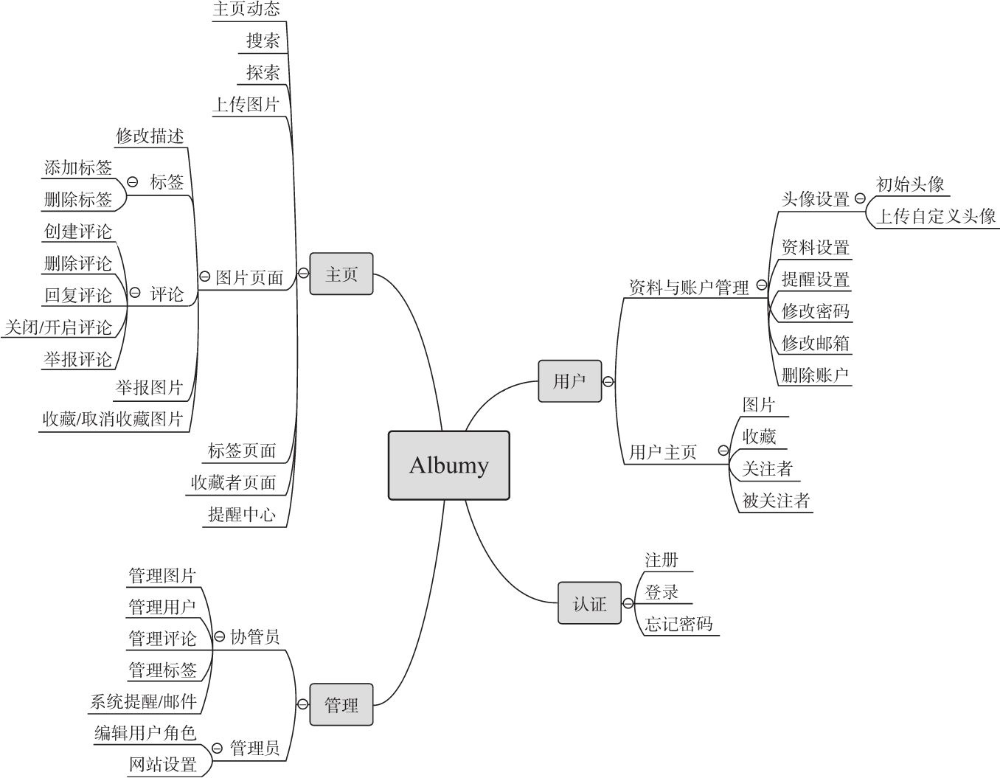
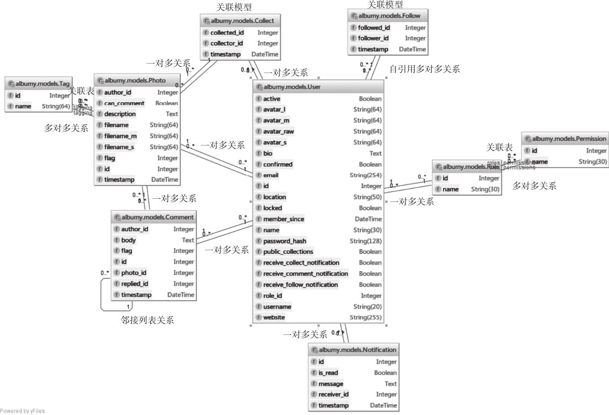

# 第九章 图片社交网站

## 1. 本章目标：

实现一个更加复杂的多用户图片社交网站，学习一些进阶技术：特殊数据库关系、用户注册、权限管理、高级数据库查询、全文搜索和实时推送

---

## 2. 涉及的新python库：

* Flask-Dropzone（1.5）：使用拖拽方式实现文件上传的便捷工具

  主页：https://github.com/greyli/flask-dropzone

  文档：https://flask-dropzone.readthedocs.io

* Pillow（5.1.0）：python Image Library，图像处理工具

  主页：https://python-pillow.org/

  源码：https://github.com/python-pillow/Pillow

  文档：https://pillow.readthedocs.io

* Flask-Avatars（0.2）：用户头像管理工具

  主页：https://github.com/greyli/flask-avatars

  文档：https://flask-avatars.readthedocs.io

* Whoosh（2.7.4）：数据库搜索工具

  主页：https://bitbucket.org/mchaput/whoosh

  文档：http://whoosh.readthedocs.org/

* Flask-Whooshee（0.6.0）：为Flask提供与SQLAlchemy结合的数据库搜索功能

  主页：https://github.com/bkabrda/flask-whooshee

  文档：https://flask-whooshee.readthedocs.io

---

## 3. 常用的项目组织架构：

1. 功能式架构
2. 分区式架构
3. 混合式架构

---

## 4. 项目程序骨架：

---

## 5. 项目数据库关系模型：

项目供用到9个数据库模型，分别为：用户、角色、权限、图片、标签、评论、收藏、关注和消息。

用户是关系模型的中心，其他模型与其大多建立一对多关系：

---

## 6. 什么是RBAC？

RBAC（Role-Based Access Control，基于角色的权限控制），在网站中对用户区分不同的角色，每种角色拥有不同的操作权限。