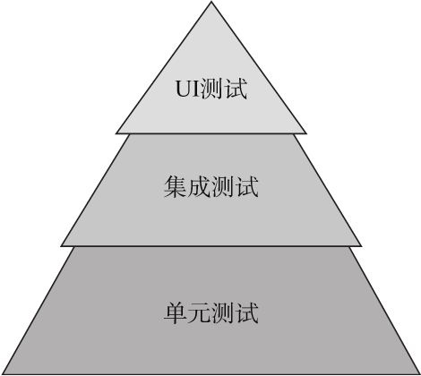
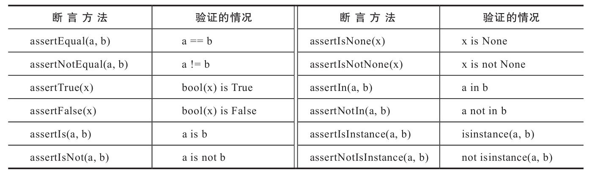
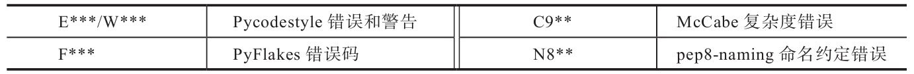

# 第十二章 自动化测试

## 1. 为什么需要进行自动化测试？

对于我们编写的功能代码，测试时必不可少的。在功能较少时，我们可以启动程序后在浏览器中点击测试功能是否正常。但随着程序规模的扩大，手动测试所有功能不太现实，因此需要编写代码来测试主要的程序功能，这样可以显著提高测试的效率和准确度。

---

## 2. 本章引入的新python包：

* Selenium（3.11.0）

  主页：https://www.seleniumhq.org/

  文档：https://docs.seleniumhq.org/

  源码：https://github.com/SeleniumHQ/selenium

* Flake8（3.5.0）

  主页：https://github.com/PyCQA/flake8

  文档：http://flake8.pycqa.org/en/latest/

* Coverage（4.5.1）

  主页：https://bitbucket.org/ned/coveragepy

  文档：https://coverage.readthedocs.io

---

## 3. 自动化测试应该合适进行？

开发时，每次添加新功能或功能修改后，都应该及时补充测试来确保代码按照预期工作。测试代码应该和程序开发同步进行。

在每次提交代码到代码仓库的主分支前，或是对线上的程序进行部署更新前，都要确保程序通过所有的测试。

> 测试驱动开发（Test-Driven Development，TDD）：测试优先于开发进行。要实现某个功能，首先编写测试，在写代码，不断完善代码知道通过测试。遵循KISS（Keep It simple & stupid）和YAGNI（You ain't Gonna Need It）原则。

----

## 4. 自动化测试的分类有哪几种？

1. 单元测试（unit test）：对单独的代码块（最小的单元）进行测试。是自动化测试的主要形式，也是最基本的测试方式。
2. 集成测试（integration test）：对代码单位之间的协同工作进行测试。在部署到云后，集成测试可以确保程序和云平台的各个接口正常协作。
3. 用户界面测试（user interface test）：也成端对端测试或全链路测试，需要启动服务器并调用浏览器来完成测试，所以耗时较长，适合用来测试复杂的页面交互。

这三类测试合理的结构比例为：单元测试 > 集成测试 > UI测试


---

## 5. 如何在测试中向Flask服务器发送测试请求？

在Web程序测试中，我们通常需要模拟“请求--响应”的处理过程。Flask通过`app.test_client()`方法提供了一个测试客户端client对象，他可以模拟一个Web服务器环境。对其调用`get()`和`post()`方法可以模拟客户端对服务器发送请求并获取响应数据。

* GET：
  
  ```python
  $ flask shell
  >>> client = app.test_client()  # 创建测试客户端对象
  >>> client.get('/')  # 发送GET请求
  <Response streamed [200 OK]>
  >>> response = client.get('/')
  >>> response.get_data()  # 获取字符字节串（bytestring）格式的响应主体
  '<!DOCTYPE html>\n<html lang="en">\n...
  >>> response.get_data(as_text=True)  # 获取解码为Unicode字符串后的响应主体
  u'<!DOCTYPE html>\n<html lang="en">\n...
  >>> b'Say Hello' in response.get_data()
  True
  >>> response.status_code  # 响应状态码
  200
  >>> response.status  # 响应状态字符串
  '200 OK'
  ```

  get()方法第一个参数是目标URL。
  
  对返回对象调用`get_data()`方法默认返回字节串（bytes）格式的响应主体。所以在判断内容时，需要在字符串前面加b将其转为bytes。为了方便中文等处理，可以使用参数`as_text=True`获取Unicode编码的响应主体。

  因为返回的内容包含完整的HTML响应，所以某些情况下可以使用正则表达式来匹配其中被空格和HTML标签分割的文本。

* POST：
  
  ```python
  >>> response = client.post('/', data={'name': 'Grey   Li', 'body': 'I am a test message.'},   follow_redirects=True)
  >>> 'Your message have been sent to the world!' in   response.get_data(as_text=True)
  True
  >>> 'I am a test message.' in response.get_data  (as_text=True)
  True
  ```

  在post()方法中，可以通过字典`data参数`的形式传递表单字段内容，字段的键对应表单的键。

  对于需要使用json数据的web api，则使用`json关键字参数`传入一个表示JSON数据的字典作为body，对应的，在从response中获取数据时，使用`get_json()`方法获取json数据。

  因为表单提交后会进行跳转，将`follow_redirects`参数设置为True可以跟随重定向，自动向重定向的页面发送GET请求。

  **注意**：因为在提交表单时没有加入csrf令牌，所以以会导致提交失败，提示“CSRF token is missing”。在测试时通常会在配置中将CSRF保护关闭：
  ```
  TESTING = True
  WTF_CSRF_ENABLED = False
  ```

---

## 6. 单元测试有哪些重要概念？

单元测试是对程序中最小的单元进行测试。Python内置了unittest单元测试框架，其中包含以下几个重要概念：

* 测试用例（test case）：unittest中最小的测试单元，它由继承`unittest.TestCase`的类表示。每个测试用例中包含多个测试方法。
* 测试固件（test fixture）：是执行测试所需的前期工作和后期清理工作。测试用例可以创建`setUp()`和`tearDown()`方法，他们分别在每一个测试方法别执行的前后执行，可以分别用来初始化测试环境、清除测试环境。此外，还有`setUpClass()`和`tearDownClass()`方法，这两个方法必须接收类本身作为唯一参数，并且附加`classmethod装饰器`，他们会在整个测试用例执行的前后执行。
* 测试集（test suite）：测试用例的合集，用来聚合所有测试以便执行。
* 测试运行器（test runner）：用来执行测试，收集测试结果并展示。

---

## 7. Flask程序的测试固件如何设置？

单元测试的文件名格式为`test_*.py`，unittest会自动识别该模式的文件。

在SayHello程序中，创建一个test_sayhello.py文件，其测试固件为：
```python
import unittest

from sayhello import app, db

class SayHelloTestCase(unittest.TestCase):

    def setUp(self):
        app.config.update(  # 更新测试环境配置
            TESTING=True,   # 开启测试模式
            WTF_CSRF_ENABLED=False,  # 关闭csrf保护
            SQLALCHEMY_DATABASE_URI='sqlite:///:memory:'
        )
        db.create_all()
        self.client = app.test_client()  # 创建client，方便发送请求

    def tearDown(self):
        db.session.remove()  # 手动清除数据库会话
        db.drop_all()
```
其中`TESTING=True`配置会开启测试模式，Flask会自动关闭处理请求时的错误捕捉，从而更容易得到错误报告。同时Flask-DebugToolbar会自动将`DEBUG_TB_ENABLED`设为False以关闭调试工具栏。

`WTF_CSRF_ENABLED=True`来关闭表单的csrf保护，方便在POST请求中提交表单。

在测试时会对数据库进行修改，为了不影响之前的数据，测试时需要使用单独的数据库。这里使用sqlite的内存型数据库，这不用生成新文件，而且会显著提高测试速度。

**注意**：

* 如果程序代码中使用了DBMS特定的代码，如MySQL或Postgresql提供的功能（from sqlalchemy.sql.expression import func），那么使用sqlite内存型数据库会出错。
* <span id="clean-session">Flask-SQLAlchemy为我们管理SQLAlchemy的数据库会话，在程序上下文被销毁时，他会调用`db.session.remove()`清除会话（通过注册teardown_appcontext回调函数实现），但是测试时**并没有激活上下文，所以需要手动调用来清除会话**。除非[显示的创建和推送上下文](#active-context)，否则都需要手动执行会话清除。</span>


在SayHello程序中，app程序对象是手动创建的，在测试时需要导入，并且更新大量的配置值。而在之后的其他程序中，我们使用了工厂函数来创建程序实例，并且使用Python类来组织配置，所以可以在测试程序的setUp()方法中直接导入工厂函数，传入测试用的配置类，创建专门用于测试的程序实例；
```python
class BaseTestCase(unittest.TestCase):

    def setUp(self):
        app = create_app('testing')  # 使用测试配置创建程序实例
        ...
    def tearDown(self):
        ... 
```

---

## 8. 如何编写测试用例？

测试用例中的测试方法均以`test_`开头，测试运行器会自动把这类方法识别为测试并调用。

```python
import unittest
from sayhello import app, db

class SayHelloTestCase(unittest.TestCase):

    ...
    def test_app_exsit(self):
        self.assertFalse(app is None)

    def test_app_is_testing(self):
        self.assertTrue(app.config['TESTING'])
```
在每个测试方法中，我们需要使用unittest提供的断言（assert）方法对各种情况进行验证，以判断程序的功能是否符合预期。

常用的断言方法如下：


使用测试客户端测试程序示例：
```python
import unittest

from app import app, db

class SayHelloTestCase(unittest.TestCase):
    ...
    def test_404_page(self):   # 测试400错误页面
        response = self.client.get('/nothing')  # 访问一个未定义的URL
        data = response.get_data(as_text=True)
        self.assertIn('404 Error', data)
        self.assertIn('Go Back', data)
        self.assertEqual(response.status_code, 404)

    def test_500_page(self):  # 测试500错误页面
        # 临时创建一个视图来生成500错误响应
        @app.route('/500')
        def internal_server_error_for_test():
            abort(500)

        response = self.client.get('/500')
        data = response.get_data(as_text=True)
        self.assertEqual(response.status_code, 500)
        self.assertIn('500 Error', data)
        self.assertIn('Go Back', data)

    def test_index_page(self):  # 测试主页
        response = self.client.get('/')
        data = response.get_data(as_text=True)
        self.assertIn('Say Hello', data)

    def test_create_message(self):  # 测试创建新消息
        response = self.client.post('/', data=dict(
            name='Peter',
            body='Hello, world.'
        ), follow_redirects=True)
        data = response.get_data(as_text=True)
        self.assertIn('Your message have been sent to the world!', data)
        self.assertIn('Hello, world.', data)

    def test_form_validation(self):  # 测试表单验证
        response = self.client.post('/', data=dict(
            name=' ',  # 填入空格作为名称
            body='Hello, world.'
        ), follow_redirects=True)
        data = response.get_data(as_text=True)
        self.assertIn('This field is required.', data)
```

---

### 8.1. 如何为程序创建上下文？

在执行测试时是没有Flask上下文的，但是有一些行为又依赖于程序上下文或请求上下文才能正确进行。如，Flask-SQLAlchemy中用来清理数据库会话的`db.session.remove()`调用通过teardown_appcontext装饰器注册，而这个函数只会在程序上下文销毁时才触发。

另外，当使用工厂函数创建程序时，使用`current_app`来操作程序实例，同时扩展中的代码也会使用`current_app`。比如Flask-SQLAlchemy需要从程序配置中获取配置信息：
* 当直接创建程序实例，并在实例化SQLAlchemy类时传入程序实例时，Flask-SQLAlchemy会直接从这个程序实例app对象获取配置信息。
* 但当使用工厂函数创建程序并使用init_app（）初始化程序后，Flask-SQLAlchemy则会从current_app对象来获取对应程序的配置信息。

但是，`current_app`变量**只有在程序上下文被激活后才可以使用**。所以为了能让数据库表顺利创建，我们需要<span id="active-context">`手动激活上下文`</span>，使用在第二章介绍的Flask提供的`app_context()获取程序上下文`和`test_request_context()获取请求上下文（自动激活程序上下文）`方法来执行：
```python
with app.app_context():
  db.create_all()
```
除了使用with语句，也可以对两个方法返回的上下文对象调用`push()`方法显示地推送上下文（放在setUp()中）。相应的，在tearDown()方法中调用`pop()`方法删除上下文。
```python
from bluelog import create_app

class BaseTestCase(unittest.TestCase):

    def setUp(self):
        app = create_app('testing')
        self.context = app.test_request_context()  # 创建上下文对象
        self.context.push()  # 推送上下文
        self.client = app.test_client()
        db.create_all()

    def tearDown(self):
       db.drop_all() 
       self.context.pop()  # 销毁上下文
```

**注意**：

* 因为我们经常需要在测试方法中使用`url_for（）`函数来构建URL，所以必须在setUp（）方法中推送请求上下文，通过`app.test_requeset_context（）`方法获取测试用的`请求上下文对象`。因为请求上下文被推送时，程序上下文也会一同被推送，所以我们也可以顺利执行依赖于current_app的操作，比如db.create_all（）。如果你不需要在测试方法中使用url_for（），那么推送`程序上下文（app.app_context（））`即可。
* 当显式地推送上下文后，我们不用再手动调用`db.session.remove（）`[清除数据库会话](#clean-session)。

使用`test_request_context（）`方法`只能构建一个全局的请求上下文环境`，对应的URL默认为根地址，你可以将自定义路径作为第一个参数（path）传入。如果你想使用特定请求的request、session等请求上下文全局变量，可以`使用with语句来调用test_client（）`，这会在with语句结束前创建一个测试用的请求上下文，对应当前请求，比如：
```python
>>> with app.test_client() as client:
...     client.get('/hello')
...     request.endpoint
...     request.url
...
<Response streamed [200 OK]>
'hello'
u'http://localhost/hello'
```

虽然在使用test_client（）发起请求时会附带激活和销毁请求上下文，从而调用Flask-SQLAlchemy注册的db.session.remove（）调用，但是**为了确保每一个测试方法执行后都清除了数据库会话，我们仍然需要手动调用，除非是使用前面介绍的方法显式推送了上下文**。

---

### 8.2. 如何测试Web API？

在Todoism中我们使用HTTPie测试了web api，除了手动测试，我们还需要为API提供单元测试。

因为资源端点接收JSON格式数据，在发送POST请求时，我们使用`json`参数传入一个表示JSON数据的字典,：
```python
>>> client = app.test_client()
>>> response = client.post('/api/items', json={
        'title': 'hello', 'body': 'world'
    })
>>> json_data = response.get_json()  # 获取JSON格式响应
>>> json_data['message']
'Item Created!'
```
同时使用`get_json()`方法获取响应数据，数据自动解析为Python字典。

todoism WebAPI测试示例：
```python
import unittest
from flask import url_for
from todoism import create_app, db
from todoism.models import User

class APITestCase(unittest.TestCase):

    def setUp(self):
        ...
        user = User(username='grey')  # 创建用于测试的用户记录
        user.set_password('123')
        db.session.add(user)
        db.session.commit()
    ...
    def get_oauth_token(self):  # 获取认证令牌
        response = self.client.post(url_for('api_v1.token'), data=dict(
            grant_type='password',
            username='grey',
            password='123'
        ))
        data = response.get_json()
        return data['access_token']

    def set_auth_headers(self, token):  # 设置认证首部
        return {
            'Authorization': 'Bearer ' + token,
            'Accept': 'application/json',
            'Content-Type': 'application/json'
        }
    
    def test_api_index(self):  # 测试API首页，首页不需要token即可访问
        response = self.client.get(url_for('api_v1.index'))
        data = response.get_json()
        self.assertEqual(data['api_version'], '1.0')

    def test_get_token(self):  # 测试获取认证令牌
        response = self.client.post(url_for('api_v1.token'), data=dict(
            grant_type='password',
            username='grey',
            password='123'
        ))
        data = response.get_json()
        self.assertEqual(response.status_code, 200)
        self.assertIn('access_token', data)
    def test_get_user(self):  # 测试获取用户资源
        token = self.get_oauth_token()  # 获取认证令牌
        response = self.client.get(url_for('api_v1.user'),
                                   headers=self.set_auth_headers(token))  # 添加token header
        data = response.get_json()
        self.assertEqual(response.status_code, 200)
        self.assertEqual(data['username'], 'grey')

    def test_new_item(self):  # 测试添加新条目
        token = self.get_oauth_token()
        response = self.client.post(url_for('api_v1.items'),
                                    json=dict(body='Buy milk'),
                                    headers=self.set_auth_headers(token))
        data = response.get_json()
        self.assertEqual(response.status_code, 201)
        self.assertEqual(data['body'], 'Buy milk')
```

在setUp()中，创建一个用于测试的用户。然后创建两个用于OAuth认证的辅助方法，方便在后面的测试方法中使用。

---

### 8.3. 如何测试Flask命令？

对于我们自定义的flask命令，Flask提供了`app.test_cli_runner()`方法用于在测试中调用命令函数、捕捉输出。

该方法返回一个`FlaskCliRunner对象`，其提供的`invoke()`方法可调用命令，并返回一个包含命令执行结果的`Result对象`，其`output`属性包含命令输出内容。

invoke用法：
* 用法一：invoke()的第一个参数传入命令函数对象，第二个参数（args参数）传入命令参数列表；
* 用法二：直接在args参数中传入命令及参数列表，这样可以不用导入命令函数对象。
* 对于命令中存在交互的部分，可以使用`input`参加输入操作值。


对SayHello中的forge命令进行测试：
```python
import unittest

from sayhello import app, db
from sayhello.models import Message
from sayhello.commands import forge

class SayHelloTestCase(unittest.TestCase):
    ...
    def setUp():
        …
        self.runner = app.test_cli_runner()  # 
     # 测试forge命令
    def test_forge_command(self):
        result = self.runner.invoke(forge)  # 触发对应的命令函数
        self.assertIn('Created 20 fake messages.', result.output)
        self.assertEqual(Message.query.count(), 20)

    # 测试添加--count选项的forge命令
    def test_forge_command_with_count(self):
        result = self.runner.invoke(forge, ['--count', '50'])
        self.assertIn('Created 50 fake messages.', result.output)
        self.assertEqual(Message.query.count(), 50)
    
    # 测试initdb命令
    def test_initdb_command(self):
        result = self.runner.invoke(initdb)
        self.assertIn('Initialized database.', result.output)
    
    # 测试添加--drop选项的initdb命令
    def test_initdb_command_with_drop(self):
        result = self.runner.invoke(initdb, ['--drop'], input='y\n')
        self.assertIn('This operation will delete the database, do you want to continue?', result.output)
        self.assertIn('Drop tables.', result.output)
```

更多用法参考文档：https://flask.palletsprojects.com/en/2.1.x/testing/#running-commands-with-the-cli-runner

---

## 9. 如何组织测试？

通常，我们会为每个模块创建对应的测试。如果程序比较简单，可以只创建一个脚本test_*.py存放测试代码；如果程序复杂，则需要创建一个test包来分模块组织测试代码，程序中每个模块/蓝本/功能对应一个测试脚本。

当使用包组织测试时，不同的测试模块常常需要类似的测试固件，可以创建一个基本测试用例，在其他模块中直接导入并继承这个测试用例。

如Bluelog中多个测试用例基本使用相同的setUp（）和tearDown（）方法，在测试后台管理功能时需要管理员权限进行操作，在setUp（）中创建一个管理员用户，创建用于登录和注销的方法：
```python
import unittest

from flask import current_app, url_for

from bluelog import create_app
from bluelog.extensions import db
from bluelog.models import User
    
class BaseTestCase(unittest.TestCase):

    def setUp(self):
        app = create_app('testing')
        self.context = app.test_request_context()
        self.context.push()
        self.client = app.test_client()
        self.runner = app.test_cli_runner()

        db.create_all()
        user = Admin(name='Grey Li', username='grey', about = 'I am test', blog_title = 'Testlog', blog_sub_title = 'a test')  # 创建测试用户记录
        user.set_password('123')
        db.session.add(user)
        db.session.commit()

    def tearDown(self):
        db.drop_all()
        self.context.pop()
    
    def login(self, username=None, password=None):
        if username is None and password is None:
            username = 'grey'
            password = '123'

        return self.client.post(url_for('auth.login'), data=dict(
            username=username,
            password=password
        ), follow_redirects=True)

    def logout(self):
        return self.client.get(url_for('auth.logout'), follow_redirects=True)
```

这样在其他测试用例中直接集成BaseTestCase就可以直接使用admin用户、login、logout方法了。

---

## 10. 如何运行测试？

测试用例编写完成后，需要运行一边查看哪些测试没有通过，然后尝试更新相应的代码。

有多种方式可以运行unittest测试：
1. unittest.main()：
   
   对于单脚本的测试文件来说，在文件中调用`unittest.main()`方法，然后直接运行脚本即可：
   ```python
   if __name__ == '__main__':
       unittest.main()
   ```
   在命令行中运行测试脚本。加入-v 选项可以获取更详细的测试输出信息。

2. 自动发现测试：

   unittest支持自动发现测试，使用`python -m unittest discover -v`命令，unittest默认会从当前目录开始寻找以test_*.py模式命名的模块，然后运行其中的测试。

   也可以通过其他可用选项来定义自动发现行为：https://docs.python.org/3/library/unittest.html 

3. 通过setuptools运行测试：
   
   通过在项目文件的`setup.py`文件中把setup()函数的`test_suite`参数设置为包含测试的模块名称或包名称，然后使用以下命令来执行测试：
   `python setup.py test`.
   它首先会对程序进行打包，然后执行测试。使用-q 选项可以简略测试输出信息。

   关于打包构建的具体内容，将在15章学习。

4. 编写Flask测试命令（不推荐）：
   
   编写一个自定义的Flask命令来运行测试：
   ```python
   import unittest
   import click
   from myapp import app
   
   @app.cli.command()
   def test():
       """Run unit tests."""
       test_suite = unittest.TestLoader().discover('tests')
       unittest.TextTestRunner(verbosity=2).run(test_suite)
   ```
   这部分代码实际上正是`python-m unittest discover`命令背后调用的代码。在这个test（）命令函数中，我们使用`TestLoader（）`加载测试集，在`discover（）`方法中传入测试所在的开始路径，比如test_sayhello或tests。然后我们使用`TextTestRunner（）`运行测试，`verbosity参数`控制测试输出信息的详细程度，默认为1。

   因为这种方式需要首先触发Flask的命令行系统，可能会导致一些潜在的Bug，因此不推荐使用这种方式来运行测试

5. 其他：

   除了使用unittest，Python还内置了一个doctest模块，它允许你通过在文档字符串中以交互式Python示例的形式编写测试。另外，你也可以尝试使用第三方测试框架，比如nose（https://github.com/nose-devs/nose ）和pytest（http://pytest.org/ ）。

---

## 11. 如何进行用户界面UI测试？

Flask内置的测试客户端只能用来测试视图函数，但实际的用户界面中按钮是否渲染成功、js代码是否正常工作无法判断。这是我们可以使用selenium通过python代码操控浏览器完成填写表单、单击按钮、获取页面内容等各种功能。

安装：`pipenv install selenium --dev`

安装浏览器驱动：UI测试需要使用真正的浏览器，所以要安装浏览器。同时还要安装浏览器相应的Web驱动接口程序，即WebDriver，它是selenium与浏览器交互的通道。
selenium常用的WebDriver可从这里下载，下载时注意浏览器与驱动的版本要对应：https://www.selenium.dev/documentation/webdriver/getting_started/install_drivers/#quick-reference
<table><thead><tr><th>Browser</th><th>Supported OS</th><th>Maintained by</th><th>Download</th><th>Issue Tracker</th></tr></thead><tbody><tr><td>Chromium/Chrome</td><td>Windows/macOS/Linux</td><td>Google</td><td><a href="//chromedriver.storage.googleapis.com/index.html">Downloads</a></td><td><a href="//bugs.chromium.org/p/chromedriver/issues/list">Issues</a></td></tr><tr><td>Firefox</td><td>Windows/macOS/Linux</td><td>Mozilla</td><td><a href="//github.com/mozilla/geckodriver/releases">Downloads</a></td><td><a href="//github.com/mozilla/geckodriver/issues">Issues</a></td></tr><tr><td>Edge</td><td>Windows/macOS</td><td>Microsoft</td><td><a href="//developer.microsoft.com/en-us/microsoft-edge/tools/webdriver/">Downloads</a></td><td><a href="https://github.com/MicrosoftDocs/edge-developer/issues">Issues</a></td></tr><tr><td>Internet Explorer</td><td>Windows</td><td>Selenium Project</td><td><a href="/downloads">Downloads</a></td><td><a href="//github.com/SeleniumHQ/selenium/labels/D-IE">Issues</a></td></tr><tr><td>Safari</td><td>macOS High Sierra and newer</td><td>Apple</td><td>Built in</td><td><a href="//bugreport.apple.com/logon">Issues</a></td></tr></tbody></table>

将WebDriver添加到系统变量：下载驱动程序后，还要把驱动程序的路径添加到系统的PATH环境变量，这样selenium才能执行对应的驱动程序。最简单的方式是将驱动放到Python解释器所在的目录下。

selenium的基本用法：以firefox浏览器为例

```python
>>> from selenium import webdriver  # 导入驱动对象
>>> from selenium.webdriver.common.keys import Keys  # 导入键盘按键对象
>>> driver = webdriver.Firefox()  # 加载驱动程序，如果使用Chrome，则调用webdriver.Chrome()
>>> driver.get('https://pypi.org')  # 访问对应的URL
>>> elem = driver.find_element_by_name('q')  # 定位搜索输入框元素（name为q）
>>> elem.click()  # 单击输入框
>>> elem.send_keys('Flask')  # 输入字符
>>> elem.send_keys(Keys.RETURN)  # 按下Enter键
>>> 'A simple framework for building complex web applications.' in driver.page_source  
    # driver.page_source可以获取页面源码
True
>>> elem = driver.find_element_by_link_text('Flask')  # 定位Flask项目链接
>>> elem.click()  # 单击链接
>>> 'Project Description' in driver.page_source
True
>>> driver.get_screenshot_as_file('main-page.png')  # 截屏保存图片
>>> driver.quit()  # 退出驱动程序
```
selenium提供多种方法来定位元素，如find_element_by_id()可以通过id来定位，find_element_by_class()可以通过class来定位。

具体可以查看
* 官方文档：https://www.selenium.dev/selenium/docs/api/py/index.html
* 中文文档：https://selenium-python-zh.readthedocs.io/en/latest/

最后，驱动使用完后，需要使用`quit()`方法退出，释放资源。
---

## 12. 如何使用selenium进行UI测试？

1. 首先准备测试环境：

   因为要操控浏览器，所以我们需要让程序运行在真实的服务器中。要在测试的同时运行开发服务器，通常有下面这些方法：

   1）最直接的做法是新建一个脚本，创建一个app实例，并为测试做一些基础配置操作（初始化数据库等），然后在单独的命令行窗口启动服务器，再在新的命令行窗口运行测试。测试完成后，手动关闭服务器。

   2）另一种更优雅的方法是直接在测试中通过新建后台线程来运行Flask开发服务器。测试完成后，通过Werkzeug提供的接口来关闭服务器，不过这种实现稍显复杂。

   3）最后，使用扩展也可以完成这个任务，[Flask-Testing](https://github.com/jarus/flask-testing)提供了一些测试辅助功能，其中就提供了一个集成unittest.TestCase类的`LiveServerTestCase类`，继承这个类的测试用例在执行测试方法前（setup）会自动启动一个开发服务器，在测试方法执行后自动关闭（teardown），类似Django中的LiveServerTestCase。遗憾的是，目前`这个类无法在Windows上正常使用`。


   我们选择使用第一种方式，以Todoism为例，在项目根目录创建一个test_app.py脚本，存储一个加载测试配置的程序实例：
   ```python
   from todoism import create_app, db
   from todoism.models import User, Item
   
   app = create_app('testing')  # 以测试配置创建程序实例
   
   with app.app_context():  # 在程序上下文中对数据库进行初始化操作
       db.create_all()
   
       user = User(username='grey')
       user.set_password('123')
       db.session.add(user)
   
       item1 = Item(body='test item 1')
       item2 = Item(body='test item 2')
       item3 = Item(body='test item 3')
       user.items = [item1, item2, item3]
   
       db.session.commit()
   ```
   创建程序实例后，在新的命令行窗口中运行程序：
   ```
   $ export FLASK_APP=test_app.py  # Windows下使用set
   $ flask run
   ```


2. 编写运行测试代码：

   在Todoism项目根目录下的test包内创建一个test_ui.py脚本，并编写一个UserInterfaceTestCase测试用例。

* 测试用例固件：
   ```python
   class UserInterfaceTestCase(unittest.TestCase):
       
       def setUp(self):
           os.environ['MOZ_HEADLESS'] = '1'  # 开启headless模式
           self.client = webdriver.Firefox()
   
           if not self.client:
               self.skipTest('Web browser not available.')
   
       def tearDown(self):
           if self.client:
               self.client.quit()
   ```
   在setUP()中，首先与浏览器建立连接。环境变量`MOZ_HEADLESS`设为1，表示开启浏览器的headless模式，即没有图形界面，直接在后台执行所有操作。除此之外也可以使用设置options的方式：
   ```python
   options = webdriver.FirefoxOptions()  # 使用Chrome则为wwebdriver.ChromeOptions()
   options.add_argument('headless')
   self.client = webdriver.Firefox(options=options)  # webdriver.Chrome(options=options)
   ```

   > headless浏览器即没有图形界面的浏览器，还有很多纯headless浏览器，比如Phantom-JS、HtmlUnit、Splash等。

   如果建立连接失败，就使用`skipTest()`方法跳过测试。

   在tearDown（）方法中使用quit()方法退出浏览器驱动。

* 测试方法：
  
  是在selenium编写测试时，需要考虑以下问题：

  1）`元素遮挡`问题：和我们手动操作相同，如果页面上的某个元素被另一个元素遮挡了，那么我们无法使用Selenium单击它。

  2）元素`引用失效`：当我们把指向某个元素的引用保存在Python变量中时，`这个变量仅仅在当前页面可用`。如果你这时跳转到新的页面，那么指向旧页面的引用也会随之失效。

  3）页面`加载时间`：和手动操作类似，页面加载需要时间。如果某个操作需要耗费较长的时间，那么你同时需要使用time.sleep（）来休眠程序进行等待，否则相应的操作可能会无法执行。


  使用selenium测试显示主页、用户登录、添加新条目、删除新条目
  ```python
  from selenium import webdriver
  from selenium.webdriver.common.keys import Keys
  from selenium.webdriver.common.action_chains import     ActionChains
  
  class UserInterfaceTestCase(unittest.TestCase):
      ...
      def login(self):  # 用于登录程序的辅助方法，非测试
          self.client.get('http://localhost:5000')  # 访问主页
          time.sleep(2)  # 等待页面加载
          # 访问登录页面
          self.client.find_element_by_link_text('Get Started').click()
          time.sleep(1)
          # 输入用户名
          self.client.find_element_by_name('username').send_keys('grey')
          # 输入密码
          self.client.find_element_by_name('password').send_keys('123')
          # 单击登录按钮
          self.client.find_element_by_id('login-btn').click()
          time.sleep(1)
  
      def test_index(self):  # 测试主页
          self.client.get('http://localhost:5000')
          time.sleep(2)
          self.assertIn('Todoism makes everything clear.', self.client.page_source)
  
      def test_login(self):  # 测试登录
          self.login()
          self.assertIn('What needs to be done?', self.client.page_source)
  
      def test_new_item(self):  # 测试创建新条目
          self.login()
          # 定位页面中的条目计数 
          all_item_count = self.client.find_element_by_id('all-count')
          # 获取全部条目的数量值
          before_count = int(all_item_count.text)
          # 定位输入按钮
          item_input = self.client.find_element_by_id('item-input')
          # 输入文本Hello, World
          item_input.send_keys('Hello, World')
          # 按下按钮
          item_input.send_keys(Keys.RETURN)
          time.sleep(1)
          # 再次获取全部条目的数量
          after_count = int(all_item_count.text)
          # 确保新创建的条目在页面中
          self.assertIn('Hello, World', self.client.page_source)
          # 确保全部条目计数增加1
          self.assertEqual(after_count, before_count + 1)
      
      def test_delete_item(self):
          self.login()
          all_item_count = self.client.find_element_by_id('all-count')
          before_count = int(all_item_count.text)
          # 定位页面中的第一个条目，通过XPath来根据元素文本定位
          item1 = self.client.find_element_by_xpath("//span[text()='test item 1']")
          # 通过ActionChains.move_to_element()方法来执行 悬停操作
          hover_item1 = ActionChains(self.client).move_to_element    (item1)
          hover_item1.perform()  # 执行操作
          # 定位悬停后出现的删除按钮，并单击
          delete_button = self.client.find_element_by_class_name('delete-btn')
          delete_button.click()
          # 再次获取条目计数，验证被删除条目不存在，条目计数减1
          after_count = int(all_item_count.text)
          self.assertNotIn('test item 1', self.client.    page_source)
          self.assertIn('test item 2', self.client.page_source)
          self.assertEqual(after_count, before_count - 1)
  ```
  在测试中，使用了find_element_by_xpath()方法通过XPath来定位元素。

  对于鼠标单击、移动、悬停、拖拽等底层操作，Selenium提供了ActionChains类，[参考文档](https://www.selenium.dev/selenium/docs/api/py/webdriver/selenium.webdriver.common.action_chains.html)。要想ActionChains类的动作生效，需要使用`perform()`方法执行。

---

## 13. 如何计算单元测试覆盖率？

> 测试覆盖率（test coverage）是指测试覆盖的代码站全部代码行数的百分比。是测试质量的重要指标。

测试覆盖率越高越好，100%是理想目标，对于大多数项目，应该尽量将测试覆盖率保持在90%左右。

我们使用[Coverage.py](https://coverage.readthedocs.io/en/stable/)来检查测试覆盖率。

安装：`pipenv install coverage --dev`

Coverage.py提供命令行支持：
* `coverage run`：
  
  执行脚本并计算覆盖率，命令后附加脚本名作为执行目标。执行后会在脚本目录下生成一个`.coverage`文件，保存运行的结果数据。

* `coverage report`：

  在命令行中输出覆盖率报告内容。使用`-m`参数可以显示为覆盖的行数。

* `coverage html`：

  生成输出HTML版本的覆盖率报告，这会在目录下生成一个`htmlcov`文件夹，使用浏览器打开其中的index.html文件即可查看覆盖率报告主页，也可以点击查看单个文件的详细覆盖信息。

* `coverage xml`：
  
  输出xml格式的覆盖率报告。

* `coverage erase`：
  
  清除生成的覆盖率数据，仅删除.coverage文件。

---

## 14. 如何获取Flask程序的测试覆盖率？

可以使用以下命令在运行测试的同时开启覆盖率检查：`coverage run --source=sayhello --branch -m unittest discover`.

其中，`--source`选项指定要检查的包或模块；`--branch`选项用来开启分支覆盖检查，这样会将if判断中未执行的elif或else子句也视为未覆盖。`-m unittest discover`和使用unittest运行自动发现测试相同。

如果不想每次指定参数选项，可以创建一个`.coveragerc`文件来保存配置，添加一个run节来为run命令定义配置：
```ini
[run]
source = sayhello
branch = true
```
这是只需要使用`coverage run -m unittest discover`命令即可。

coverage.py的配置可参考：https://coverage.readthedocs.io/en/stable/config.html

> 这个配置文件使用INI风格语法：每一个节（section）使用[foo]形式定义，其中每一行为键值对形式的参数（name=value），注释使用'#'或';'开头。

使用coverage可以在本地生成覆盖率报告。为了便于协作和管理覆盖率数据，我们可以使用[Coveralls](https://coveralls.io/)或[Codecov](https://codecov.io/)来生成在线分析。两者均对开源项目免费，并提供相应的Python库，对持续集成系统以及GitHub集成非常方便。

---

## 15. 如何检查代码质量？

良好的代码质量更易于项目的维护和二次开发，清晰良好的的结构、适当的注释都能让人更容易理解代码。

python代码风格应该遵循“python之禅（zen of python）”：`python -m this`查看。具体定义在PEP 20（https://www.python.org/dev/peps/pep-0020/ ）中。

具体来说，我们应该遵循[PEP8](https://peps.python.org/pep-0008/)中提出的代码约定。为了确保代码质量，我们需要借助`静态检查工具`。Python代码质量检查工具有很多，比如pycodestyle、Pyflake、Pylint、Flake8等，这里我们选用了`Flake8`（https://github.com/PyCQA/flake8 ）。

Flake8是目前最流行的Python代码质量检查工具，它包装了Pyflakes、Pycodestyle（原pep8）和McCabe，并且提供了自定义插件支持。使用它可以`检查代码是否符合PEP 8规范，是否包含语法错误或未使用的变量和导入，另外还可以检查代码的复杂度`。

安装：`pipenv install flake8 --dev`

使用：`flake8 包名/文件名`

输出格式：`文件路径:行号:列号:错误码错误描述`。 如`sayhello\__init__.py:18:1: E402 module level import not at top of file`.

错误码：Flake8常见错误码


配置定义：Flake8 支持定义检查配置，在项目的根目录下创建一个`.flake8`文件，写入配置：
```ini
[flake8]
exclude = .git,*migrations*
max-line-length = 110
```
exclude用来设置忽略检查的文件或目录; max-line-length用来设置最长的行长度，`默认的行长度为79`，我们通常需要更长的行长度以增强代码的可读性。

其他Flake8命令及选项参考：https://flake8.pycqa.org/en/latest/user/options.html

---

## 16. 如何解决代码静态检查的问题？

可以使用autopep8（https://github.com/hhatto/autopep8 ）来自动处理pep8相关的错误；

使用autoflake（https://github.com/myint/autoflake ）来自动处理Pyflake相关的错误。

有些问题（比如复杂度）需要根据具体情况手动处理。

---

## 17. 如何让Flake8的检查忽略部分代码？

有时候，我们因为某些原因不得不违反这些代码规范的约束，为了不报错，我们可以选择忽略对某些代码的检查。

* 要忽略某一行的代码检查，可以在这一行的后面添加注释“#noqa”（No Quality Assurance）：
  ```python
  example = lambda: 'example' # noqa
  ```
* 可以再noqa朱时候添加错误码，以忽略检查特定规范：
  ```python
  example = lambda: 'example'  # noqa: E731
  ```
* 使用`#flake8: noqa`忽略整个文件检查

在使用PyCharm时，可以使用快捷键Alt+Ctrl+Shift+L来按照PEP8的约定格式化代码。

---

## 18. 如何调整对于代码复杂度的检查？

除了编码风格，代码质量还取决于代码的复杂度，过于复杂的代码不易理解。

Flake8内置了检查代码复杂度的McCabe。在使用Flake8命令时，加入`--max-complexity`选项并附加最大复杂度的阈值：
`flake8 --max-complexity 5 sayhello`

这个值也可以在配置文件中使用`max-complexity=5`定义，默认值为-1，即`关闭`复杂度检查，阈值需要大于0时才会弃用复杂度检查，具体的值可根据需要自行设置。

一般来说，代码复杂度不应超过10。复杂度为1～5区间的代码比较容易理解，复杂度为6～10区间的代码稍微复杂。

McCabe对代码复杂度的检查基于Thomas J.McCabe，Sr创建的软件度量单位——循环复杂度（cyclomatic complexity）.

---

## 19. 除了本章介绍的测试形式，还有哪些测试？

还有对部署后的程序进行Web压力（负载）测试，前端页面的浏览器兼容性测试，或是进行Web漏洞扫描等。

对于多人协作开发和开源项目来说，我们可以为程序设置`持续集成（Continuous Integration，CI）服务器`来执行一系列测试，以便保证程序功能的正常迭代。

> 持续集成是指个人开发的部分向项目整体部分交付，频繁进行集成以便更快地发现其中的错误的过程。对于多人参与的团队项目或是开源项目来说，需要一个持续集成服务器更高效地完成这些测试和集成工作。当有人向项目主分支推送代码后，会自动触发持续集成服务器执行单元测试、代码质量检查、测试覆盖率检查等步骤，如果这些测试都通过了，则说明构建成功，推送的代码可以被合并。

开源的持续集成服务器有`Jenkins`（https://jenkins.io/ ）、Buildbot（http://buildbot.net/ ）等。另一方面，不用自己托管，云服务类型的CI服务越来越流行，比如Circle CI（https://circleci.com/ ）、Travis CI（https://travis-ci.org/ ）等，这些服务均对开源项目免费。

测试可以确保程序正常工作，但是除了能正常工作，我们还应该关注程序的性能。程序的性能决定了处理请求的响应速度，我们将在下一章介绍性能优化的主要方式。