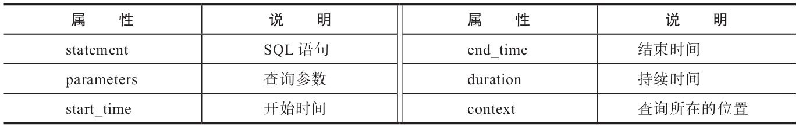
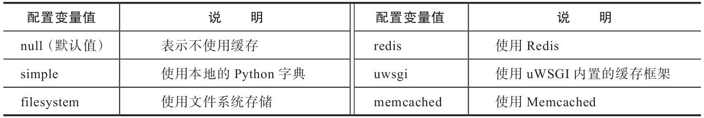
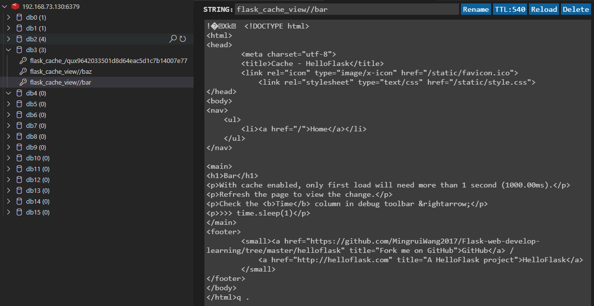

# 第十三章 性能优化

## 1. 影响Web程序响应速度的因素有哪些？

除了网络状况等外部因素外，在请求--响应处理流程中主要有以下几个影响因素：
* 函数执行速度
* 数据库查询速度
* 模板渲染速度
* 页面资源（js和CSS）加载速度

---

## 2. 本章涉及的新python库：

* Flask-Caching（1.4.0）

  主页：https://github.com/sh4nks/flask-caching

  文档：https://flask-caching.readthedocs.io/

* redis-py（2.10.6）

  主页：https://github.com/andymccurdy/redis-py

  文档：http://redis-py.readthedocs.io

* Flask-Assets（0.12）

  主页：https://github.com/miracle2k/flask-assets

  文档：https://flask-assets.readthedocs.io/

* webassets（0.12.1）

  主页：https://github.com/miracle2k/webassets

  文档：https://webassets.readthedocs.io/

* cssmin（0.2.0）

  主页：https://github.com/zacharyvoase/cssmin

* jsmin（2.2.2）

  主页：https://github.com/tikitu/jsmin/

这些工具使用时会更改程序的代码，从而破坏程序的易读性，所以我们将使用单独的示例程序来介绍缓存和静态资源管理的内容。

相关代码见./hellofalsk/demos/的cache和assets目录。

---

## 3. 如何查看网页加载性能？

程序的性能分析包括`函数性能分析`和`数据库查询分析`。

在第七章的SayHello中我们提到使用Flask-DebugToolbar可以查看请求的SQL语句、配置选项、资源加载情况等。

安装：`pipenv install flask-debugtoolbar`

使用：导入`DebugToolBarExtension类`（注意不是DebugToolbar类），使用app进行实例化
```python
from flask import Flask
...
from flask_debugtoolbar import DebugToolbarExtension

app = Flask(__name__)
...
toolbar = DebugToolbarExtension(app)
```
即使在开发时，也不建议开启DebugToolbar。Flask-DebugToolbar只在开启了调试模式时才会启动，所以我们要确保设置正确的FLASK_ENV环境变量值：开发时设为development；部署时则设为production。其中的代码分析器需要监控程序的运行流程，所以会增大性能开销，因此最好不要在生产环境中进行代码分析。这也是为什么Flask-DebugToolbar默认把性能分析器设为关闭状态。

另外，Flask-DebugToolbar会拦截重定向请求，将`DEBUG_TB_INTERCEPT_REDIRECTS`配置变量设为False可以关闭这个特性.

这时启动程序，在页面的右侧会多出一个工具栏，在调试工具栏中，除了Flask版本以及页面的加载时间信息，右侧的功能选项分别为：HTTP首部、请求相关变量、配置变量、模板渲染记录、数据库查询记录、日志、路由列表、性能分析器。借助该工具我们可以对程序进行性能优化。

其中，内置的`Profile性能分析器`默认是关闭的，需要点击工具栏中的Profile选项右上方的对号激活，激活后重新加载页面，打开性能分析页面，就可以看到当前页面的加载时间，以及所有函数的调用情况。

> Flask-DebugToolbar的性能分析功能使用`cProfile`库或`profile`库来实现，具体信息可以访问https://docs.python.org/3/library/profile.html 

在分析后，需要针对运行最慢的部分进行优化。除了在代码层面上进行优化外，对于高CPU消耗函数和耗时较长的任务（比如发送邮件），我们通常会使用`异步任务队列`把它们放到后台处理，这样可以避免阻塞请求响应的处理。常用的Python任务队列有[Celery](http://www.celeryproject.org/)和更轻量的[Redis-Queue](http://python-rq.org/)等，其中Celery还支持周期任务和定时任务。你可以通过阅读[Celery的入门教程](https://docs.celeryq.dev/en/stable/getting-started/first-steps-with-celery.html)学习。

---

## 4. 如何进行数据库查询分析？

在Flask-DebugToolbar提供的工具栏中，可以通过SQLAlchemy面板看查看当前页面所有数据库查询所用的时间和原生的SQL语句。以便从中找出占用时间过长的查询进行优化。

问题是，Flask-DebugToolbar只能在开发时使用，而研发环境不能模拟真实的生成情况。因此，我们需要在生成环境下监控数据库查询情况，当发生缓慢查询时，记录到日志中或发送邮件通知，以便及时进行优化和处理。

使用Flask-SQLAlchemy提供的`get_debug_queries()`函数，在每个请求结束时调用该函数可以获得该请求中所有数据库查询的信息，包括SQL语句、参数、时长等。

`get_debug_queries()`函数包含该请求的所有查询记录信息，是一个由包含查询记录信息的`命名元祖（named tuple）`组成的列表，每个命名元组提供以下属性：

其中`duration的时间单位为秒`。

在调试模式或测试模式中，Flask-SQLAlchemy会自动开启查询记录，也可以通过将配置`SQLALCHEMY_RECORD_QUERIES`设为True来显式地开启查询记录。

因为查询记录必须在请求结束后获取，所以需要使用`app.after_request`装饰器注册一个请求处理函数，在这个函数中调用get_debug_queries()函数获取查询记录。如果该函数在蓝本中定义，则可以使用`*_bp.after_app_request`装饰器来将其注册为全局的请求后处理函数。请求后处理函数会在视图函数执行后被调用，并传入生成的响应对象，以便需要对相应对象进行修改。在函数的结尾会返回修改后的响应对象或是原响应对象。

```python
def create_app(config_name=None):
    ...
    register_request_handlers(app)

def register_request_handlers(app):
    @app.after_request
    def query_profiler(response):
      for q in get_debug_queries():
          if q.duration >= current_app.config['BLUELOG_SLOW_QUERY_THRESHOLD']:
            current_app.logger.warning(
                'Slow query: Duration: %fs\n Context: %s\nQuery: %s\n '
                % (q.duration, q.context, q.statement)
            )
      return response
```
其中BLUELOG_SLOW_QUERY_THRESHOLD是我们设置的查询执行时间阈值，当查询时间大于该阈值时就视为慢查询。一般来说，以此合理的查询不应该超过1秒，所以我们把阈值设为1秒。

当查询的时长超过这个阈值时，我们就记录一条warning等级的日志，日志里加入这条查询的SQL语句、查询执行位置和持续时间，这三个值分别通过查询信息元组的statement、context以及duration属性获取。这时，可以在页面的Toolbar中的logging栏中查看打印的日志信息。


当找出慢查询后，我们可以通过`增加索引、优化数据库查询语句和表结构等方式对其进行优化`。除了这些常规的数据库优化措施，我们还可以为程序设置缓存.

---

## 5. 如何为程序设置缓存？

> 缓存（cache）是数据交换的缓冲区。计算机中的CPU需要执行计算时，会先在CPU高速缓存区查找是否有需要的数据，如果没有再到内存中寻找数据，并把找到的数据存储到高速缓存区，下次需要同一份数据时会直接从高速缓存区读取，这会大大提高CPU的计算效率。

在Web程序中，加速程序响应的最简单和有效的方式就是使用缓存。
* 不使用缓存：用户每次访问同一个页面，服务器都要调用对应的视图函数、执行相应的数据库查询、函数计算和模板渲染。
* 使用缓存：用户第一次访问某个页面时，服务器会将视图函数的返回值缓存起来，当用户再次访问该页面时就会直接使用缓存的页面数据，而不必在重新执行查询计算等工作。

我们使用[Flask-Caching](https://flask-caching.readthedocs.io/en/latest/#flask-caching)扩展来为Flask程序集成缓存工具.

安装： `pipenv install flask-caching`

实例化： 使用Cache类创建缓存对象
```python
from flask import Flask
from flask_caching import Cache

app = Flask(__name__)
cache = Cache(app)
```

---

## 6. 如何为Flask-Caching配置不同的缓存类型？

使用`CACHE_TYPE`配置变量设置不同的缓存后端，常用的缓存后端有：

其中部分类型已弃用，如redis，[最新的缓存后端类型](https://flask-caching.readthedocs.io/en/latest/#configuring-flask-caching)如下：
* NullCache (default; old name is null)
* SimpleCache (old name is simple)
* FileSystemCache (old name is filesystem)
* RedisCache (redis required; old name is redis)
* RedisSentinelCache (redis required; old name is redissentinel)
* RedisClusterCache (redis and rediscluster required; old name is rediscluster)
* UWSGICache (uwsgi required; old name is uwsgi)
* MemcachedCache (pylibmc or memcache required; old name is memcached or gaememcached)
* SASLMemcachedCache (pylibmc required; old name is saslmemcached)
* SpreadSASLMemcachedCache (pylibmc required; old name is spreadsaslmemcached)

默认情况为NullCache，即不使用缓存。在较小的程序中，可以使用SimpleCache或FileSystemCache类型，前者会把缓存的数据直接存储在内存的一个python字典中，后者则存储在文件系统中；对于大型程序，需要使用RedisCache、MemcachedCache等性能更高的存储后端（需要安装对应的工具和python交互库）。

另外要想同时使用不同类型的缓存后端，可以创建多个Cache类对象，然后在Cache类的构造方法或init_app()方法中使用`config`关键字传入一个包含配置键值对的字典。

因为开发时经常需要对视图函数进行修改，所以不建议（也不需要）设置缓存，除非你想要测试缓存是否正常工作。当使用Python类组织配置时，你可以`仅在生产环境下加载的配置类中设置CACHE_TYPE配置变量`，而在开发时加载的配置类不设置CACHE_TYPE键，这会使用默认值NullCache，即不启用缓存。当缓存类型为NullCache时，Flask-Caching会在命令行输出提示信息，你可以通过将配置变量`CACHE_NO_NULL_WARNING`设为True来关闭警告信息。

---

## 7. 哪些视图函数需要添加缓存？

一般来说，调用频繁、涉及大量数据库查询和计算任务的视图函数应该被优先考虑。

不过，被缓存的数据应该是不常变动的，至少在设置的缓存有效期内应是固定不变的。因为，缓存一旦生成，在过期前，用户的查询结果都会直接返回该缓存值，即使实际内容已经变动。

---

## 8. 如何为视图函数添加缓存？

在示例程序中，我们通过time.sleep()方法让程序休眠模拟复杂耗时的计算。

在视图函数前添加`cache.cached()`装饰器即可为视图函数开启缓存，当视图函数第一次被执行后会将返回值临时存储起来，在过期时间前，对这个视图函数的调用都将直接使用被缓存值。

```python
@app.route('/bar')
@cache.cached(timeout=10 * 60)
def bar():
    time.sleep(1)
    return render_template('bar.html')
```

注意：route装饰器必须是视图函数第一个装饰器。

其中timeout参数用来设置缓存数据的过期时间，单位为秒，默认值为300。这个值要根据不同的视图函数的数据更新频率进行合适的调整。

被缓存的数据会以`键值对`的形式存储起来，当下次处理请求时会先查找是否存在对应键的数据，所以我们`要确保被缓存的不同值的键是唯一的`。当缓存视图函数返回值时，它使用`当前请求的request.path值`来构建缓存数据的键，即`view/%(request.path)s`。

也就是说，`如果URL中包含查询字符串的话，这部分内容会被忽略掉`。比如我们的posts视图接收查询参数page来指定分页的页数，而缓存的键不包含查询参数，这就会导致不论访问哪一页都会返回被缓存的第一页数据。

因此，对于包含查询参数的URL，可以将cache.cached()函数的`query_string`参数设为True。，这会将排序后的查询参数散列值作为键。
```python
@app.route('/qux')
@cache.cached(query_string=True)
def qux():
    time.sleep(1)
    page = request.args.get('page', 1)
    return render_template('qux.html', page=page)
```

---

## 9. 如何为其他函数添加缓存？

我们不仅可以缓存视图函数的返回值，也可以缓存其他函数。同样可以使用`cache.cached()`方法设置。不过，此时必须使用`key_prefix`参数为缓存设置一个缓存键（如果没有设置，会使用当前请求的path值，导致缓存覆盖）。

以一个简单函数作为示例：
```python
@cache.cached(key_prefix='add')
def add(a, b):
    time.sleep(2)
    return a + b
```
对其进行调用：
```python
>>> from app import add
>>> add(1, 1)  # 第一次调用的返回值会被缓存，计算耗时2秒多
2
>>> add(2, 2)  # 因为被缓存，所以返回值仍然是2，耗时小到忽略不计
2
>>> add(5, 5)  # 返回值仍然相同，直到缓存过期，耗时小到忽略不计
2
```
可以发现，使用不同的参数，返回的都是同一个缓存值。这明显不是我们的预期结果。

针对将参数纳入缓存考虑的方法，我们可以使用`cache.memorize()`装饰器，其用法和cached()相同，不过同时将传入函数的参数作为考量，只有发生`传入同样参数`的调用才会使用缓存。
```python
@cache.memoize()
def add_pro(a, b):
    time.sleep(2)
    return a + b

# 调用
>>> from app import add_pro
>>> add_pro(1, 1)  # 调用函数，返回值被缓存，耗时2秒多
2
>>> add_pro(1, 1)  # 直接使用缓存，耗时小到忽略不计
2
>>> add_pro(3, 4)  # 参数不同，再次调用函数，返回值被缓存，耗时2秒多
7
>>> add_pro(3, 4)  # 直接使用缓存，耗时小到忽略不计
7
```

---

## 10. Flask-Caching 还能为哪些操作提供缓存支持？

Flask-Caching还支持使用`cache标签`在Jinja2模板中设置缓存，具体请访问[Flask-Caching文档](https://flask-caching.readthedocs.io/en/latest/#caching-jinja2-snippets)查看。

---

## 11. 如何更新缓存内容？

当因为数据改动，需要更新当前页面的缓存时，可以使用`cache.delete()`方法传入对应的键删除相应缓存。

示例：为bar视图函数设置一个update_bar视图函数用来清理其缓存
```python
@app.route('/update/bar')
def update_bar():
    cache.delete('view/%s' % url_for('bar'))
    flash('Cached data for bar have been deleted.')
    return redirect(url_for('index'))
```
视图函数缓存的键默认为`view/<请求路径request.path>`，这里我们使用url_for（）函数构建缓存的键，删除对应的缓存。如果是为非视图函数清理缓存，则应该传入设置的`key_prefix`值。

对于使用`cache.memoize()`装饰器设置的缓存，可使用`cache.delete_memoized()`方法删除缓存。

使用`cache.clear()`方法可以清除程序中的所有缓存：
```python
# 清除所有缓存
@app.route('/update/all')
def update_all():
    cache.clear()
    flash('All cached data deleted.')
    return redirect(url_for('index'))

# 删除为add_pro()函数设置的缓存
def del_pro_cache():
    cache.delete_memoized(add_pro)
```
某些缓存后端不支持清除所有缓存。另外，如果没有为缓存数据设置缓存键，Redis会清空整个数据库。一般情况下，我们不需要清除所有缓存。

---

## 12. 如何在某些情况下跳过使用缓存？

在`cached()`装饰器中使用`unless`参数来设置跳过缓存，该参数接收一个可调用对象，如果可调用对象返回True则不使用缓存。

如，创建一个is_login()函数，赋值给unless，即cached(unless=is_login)，这个函数会返回current_user.is_authenticated的值。这样当用户登录后就会取消缓存。

---

## 13. 如何使用Redis作为缓存后端？

在大型程序中，因为要缓存的数据量比较大，对存取速度的要求比较高，我们需要一个更可靠，性能更好的存储后端。[Redis](https://redis.io/)是一个开源的内存型数据结构键值对NoSQL数据库。它的存取速度非常快，支持丰富的数据类型，因此非常适合作为缓存的存储后端。

* 首先，我们需要下载和安装Redis服务器（Redis官方只支持Linux，windows移植版本可以参考https://github.com/MicrosoftArchive/redis项目release的msi包）。
* 然后，安装Reids的Python接口库，Flask-Caching会使用它来和redis服务器交互：`pipenv install redis`。
* 最后，将`CACHE_TYPE`配置的值设为`RedisCache`即可。

如果，对Reids服务器修改了配置，则需要使用[额外的配置键设置](https://flask-caching.readthedocs.io/en/latest/#rediscache)：
```
CACHE_REDIS_HOST = 'localhost'
CACHE_REDIS_PORT = '6379'
CACHE_REDIS_PASSWORD = 'your password'
CACHE_REDIS_DB = '0'
```
也可以直接使用`CACHE_REDIS_URL`连接Redis：`redis://user:password@ip:port/0`，最后的0表示使用Reids的那个数据库，redis默认有16个数据库：0-15.


连接后存入reids的缓存键值对：


附记：关于如何解决连接Reids时报错redis处于保护模式的问题？
<details>
`Redis is running in protected mode because protected mode is enabled, no bind address was specified, no authentication password is requested to clients. In this mode connections are only accepted from the lookback interface. If you want to connect from external computers to Redis you may adopt one of the following solutions: 1) Just disable protected mode sending the command 'CONFIG SET protected-mode no' from the loopback interface by connecting to Redis from the same host the server is running, however MAKE SURE Redis is not publicly accessible from internet if you do so. Use CONFIG REWRITE to make this change permanent. 2) Alternatively you can just disable the protected mode by editing the Redis configuration file, and setting the protected mode option to 'no', and then restarting the server. 3) If you started the server manually just for testing, restart it with the --portected-mode no option. 4) Setup a bind address or an authentication password. NOTE: You only need to do one of the above things in order for the server to start accepting connections from the outside.`
提示中已经提供了对应的4种解决方案，只要使用其中已经中即可：
`Redis在保护模式下运行，因为启用了保护模式，未指定绑定地址，未向客户端请求身份验证密码。在此模式下，仅从回溯接口接受连接。如果要从外部计算机连接到Redis，则可以采用以下解决方案之一：

1）只需禁用受保护模式，方法是通过从服务器的同一主机连接到Redis，从回送接口发送命令“ CONFIG SET protected-mode no”。正在运行，但是请确保不能从Internet公开访问Redis。使用CONFIG REWRITE使更改永久生效。

2）或者，您可以通过编辑Redis配置文件，并将保护模式选项设置为“ no”，然后重新启动服务器来禁用保护模式。

3）如果仅出于测试目的手动启动服务器，请使用--portected-mode no选项重新启动服务器。

4）设置绑定地址或身份验证密码。注意：您只需执行上述操作之一，服务器就可以开始接受来自外部的连接。`
</details>

如果仅做测试使用，可以修改`/etc/redis/redis.conf`文件中的`protected-mode`选项，设为no，然后重启redis服务即可。

如果想更安全一点，可以先使用redis-cli客户端进入服务，使用`config set requirepass <password>`命令为redis设置密码；然后将配置文件中的`protected-mode`设为yes，同时将`bind`选项配置为redis服务器的网卡地址，然后重启服务。之后使用redis-cli时先使用`auth <password>`命令登录，使用url连接时，使用`redis://:<password>@ip:port/<database>`进行连接。

---

## 14. 对于大型项目还有哪些存储缓存的方式？

对于大型程序，除了在程序服务器本地存储缓存外，还会使用CDN、分布式缓存服务器等方式来存储缓存。

---

## 15. 如何实现对静态资源的加载优化？

在服务器端，我们通过加入缓存系统来提升程序的响应速度。

在客户端，当页面被加载时，除了页面本身还有许多页面中被引用的文件要被同时加载，每一个文件都都会触发一个HTTP请求。我们可以在程序启动会的日志中看到这些记录，除了HTML页面和Favicon，还包括js文件和css文件，同时下载大量文件必然后带来性能问题。

在部署时，我们一般采取`租用CDN服务`（开源的js库和css库各大CDN提供商会免费提供）或是`设立单独的静态资源服务器`的方式进行优化。

在此之前，而我们可以在程序中对他们进行预处理：
* 对css和js文件进行压缩，去除换行、空白和注释，提高资源的加载速度
* 分别合并多个css文件和js文件，减少页面加载的请求数量

再次提示，为了便于管理，除非是从CND加载的资源，其他的扩展内置提供的资源文件建议你手动下载并保存到static目录下，这样可以统一处理，在部署时也会更加方便。

---

## 16. 如何使用Flask-Assets对静态资源进行预处理优化？

Flask-Assets扩展集成了提供web资源管理功能的webassets包来为Flask程序提供资源优化功能。

安装：`pipenv install flask-assets`

实例化：对`Environment类`进行实例化
```python
from flask import Flask
from flask_assets import Environment, Bundle

app = Flask(__name__)

assets = Environment(app)
```

实例化后，我们需要将静态资源注册为资源集，然后生成资源集文件，最后在模板中加载资源集，来优化页面加载速度。

### 16.1 注册资源集

> 注册资源，就是定义哪些文件需要被压缩并打包成单个文件。

通过实例化`Bundle类`，并传入资源的路径作为参数，来定义资源集：
```python
from flask import Flask
from flask_assets import Environment, Bundle
...
css = Bundle('css/bootstrap.min.css',
             'css/bootstrap.css',
             'css/dropzone.min.css',
             'css/jquery.Jcrop.min.css',
             'css/style.css',
             filters='cssmin', output='gen/packed.css')

js = Bundle('js/jquery.min.js',
            'js/popper.min.js',
            'js/bootstrap.min.js',
            'js/bootstrap.js',
            'js/moment-with-locales.min.js',
            'js/dropzone.min.js',
            'js/jquery.Jcrop.min.js',
            filters='jsmin', output='gen/packed.js')

assets.register('js_all', js)
assets.register('css_all', css)
```
在Flask-assets中，资源集使用Bundle类实例表示，其构造方法接收任意数量的`文件路径（所有的路径都是相对于程序包中或蓝本的静态文件夹而言的）`作为非关键字参数。

`filters`参数用来定义对文件编译时使用的处理工具。[webassets提供了多种过滤器](https://webassets.readthedocs.io/en/latest/builtin_filters.html)。这里我们分别使用了cssmin和jsmin来压缩css文件和js文件，为了在程序中使用他们，需要**额外安装**：`pipenv install jsmin cssmin`。

`output`参数用来指定被压缩、合并后的文件路径（同样是相对于static文件夹的路径）。

`assets.register()`方法用来注册创建的资源集，第一个参数用来指定资源集名称；第二个参数为表示资源及的Bundle对象。

tips：

* 扩展内置的资源也通过蓝本提供，因此也可以通过添加蓝本前缀来获取蓝本中的资源，比如bootstrap/css/bootstrap.min.css，不过并不推荐使用扩展内置资源。
* 某些依赖`本地静态文件（比如CSS文件、图标、字体文件）`的JavaScript或CSS文件不能直接打包，否则`在生成的文件中调用将会无法正确获取对应的静态文件`，比如Iconic图标或是CKEditor。对于CSS文件，你可以使用内置的[cssrewrite过滤器](https://webassets.readthedocs.io/en/latest/builtin_filters.html#filters-cssrewrite)对打包后的CSS文件中的相对路径进行修正。

**注意**：对于不是全局依赖的静态资源（如仅用来在编辑页面使用的Flask-CKEditor扩展和上传页面使用的Flask-Dropzone扩展），他们仅需要在特定页面才需要加载，所以没有必要打包进资源集。

### 16.2 生成资源集文件

当模板被第一次渲染时，Flask-Assets会自动处理注册的资源集并生成文件，构建优化后的资源文件会占用一定时间，所以一般在部署上线前会使用以下命令提前手动生成文件：
```bash
$ flask assets build
Building bundle: gen/packed.css
Building bundle: gen/packed.js
```
当资源被修改后，发起新的请求时，Flask-Assets会自动重新更新压缩文件。当我们需要对部署后的程序进行更新时，可以在远程服务器上手动执行上面的命令并重新打包。另外，Flask-Assets会自动记录资源的版本，在资源更新后的请求后面更新文件MD5散列值，以便让用户的浏览器忽略缓存，重新请求更新后的文件，即`Cache Busting`。

在开发环境中，因为要经常修改js和css文件，所以没有必要使用Flask-Assets进行资源优化。

### 16.3 在模板中加载资源集

在模板中加载我们注册的资源，首先在模板中使用`assets`标签创建一个资源块并传入注册的资源集名称，再使用`endassets`标签关闭；在这个块中，使用`ASSET_URL`变量来获取指向处理后的资源集文件的URL。

```jinja

    
        <link rel="stylesheet" href="{{ ASSET_URL }}">
    

...

    
        <script type="text/javascript" src="{{ ASSET_URL }}"></script>
    

```
这里我们把assets块定义在基模板中的styles块和scripts块中，因为这些资源集中包含所有要在基模板中加载的JavaScript和CSS文件，所以我们不用再使用扩展提供的资源加载函数。

当在实际的程序中使用时，我们可以把上面的styles块和scripts块直接定义在基模板中的相应位置，替换掉被打包的资源引用语句。

---

## 17. 还有哪些方法可以用来优化静态资源的加载？

1. 压缩优化HTML页面：
   
   除了JavaScript和CSS文件外，HTML响应也可以进行优化处理（去除空行、空白和注释），你可以通过其他Flask扩展或Jinja2扩展实现。
   
   不过，因为HTML页面每次都要动态生成，那么每个HTML响应都要进行优化，这么做会增加服务器端的压力，除非你需要应对非常大的访问量，否则一般不需要这么做。
   
   对于HTML、JavaScript、CSS和字体文件等静态资源，我们一般会`在部署后通过Web服务器来使用Gzip或Brotli（简称br）等压缩算法对数据进行压缩传输`，这样可以减小文件在传输过程中的体积（最高可以达到80%左右的压缩率），提高传输速度。

2. 压缩优化图片文件：
   
   如果页面中使用了大量图片，你可以使用工具`对这些图片进行压缩优化`以减少体积。
   
   `多个小图片则可以使用工具拼接成单个图片文件，在使用时通过CSS获取`，这种技术被称为`CSS Sprite`。

---