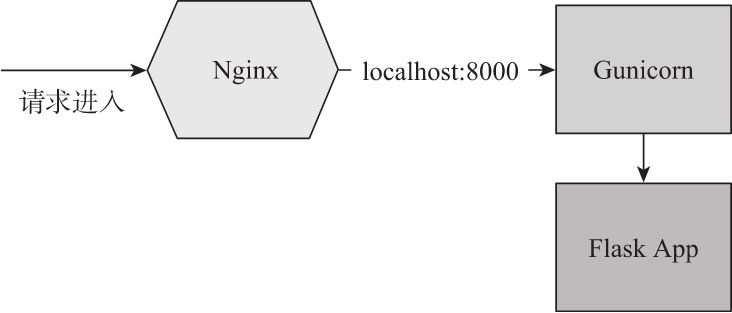

# 第十四章 部署上线

## 1. 部署上线：

> 部署（Deployment）指的是把程序托管到拥有`公网IP`的远程服务器（计算机）上，这样程序才可以被互联网上的所有人通过IP或映射到IP的域名访问到。

---

## 2. 本章设计的新python包：

* Flask-SSLify（0.1.5）：用于对使用SSL的程序将HTTP请求转发到HTTPS

  主页：https://github.com/kennethreitz/flask-sslify

* Gunicorn（19.8.1）：WSGI服务器，用来为web程序提供更强健的HTTP请求响应能力。

  主页：http://www.gunicorn.org/

  文档：http://docs.gunicorn.org

  源码：https://github.com/benoitc/gunicorn

* Psycopg2：PostgreSQL的python接口库

---

## 3. 传统部署与云部署的区别是什么？

* 传统部署：
  
  > 传统部署指自己购买/租用远程服务器，然后把程序安装到服务器上的过程。通常选择使用虚拟主机服务商提供的IaaS（Infrastracture as a Service，设施即服务）来租用。

  主流的选择有Amazon EC2、Google Compute Engine、Microsoft Azure、DigitalOcean、Linode以及国内的阿里云ECS等，其中[DigitalOcean](https://www.digitalocean.com/)、[Linode](https://www.linode.com/)提供了每月5美元的经济型主机，包含1GB内存，20/25GB SSD硬盘，非常适合入门使用。

  传统部署比较灵活，一切都由你自己来掌控，不过同时也需要耗费较多的精力去进行环境搭设和维护，所以大型网站通常会有专门的服务器运维人员来负责服务器的管理和维护。

* 云部署：
  
  > 云部署即PaaS（Paltform as a Service，平台即服务）。简单来说，云部署服务提供了一个完善的平台，提供了所有底层基础设施，我们只需要推送程序代码即可。使用云部署可以省去配置服务器、设置数据库、配置网络服务器以及设置防火墙等步骤。使用简单的方式即可集成第三方工具、添加数据库、设置邮件服务等，使用起来非常灵活。当然，云部署的价格一般要比传统部署要高。

  比较流行的PaaS有Heroku、Google App Engine、AWS Elastic Beanstalk、PythonAnywhere、Webfaction以及国内的Sina App Engine等。对于大型程序/商业项目，我们需要综合各方面的信息来做选择。作为起步来说，我建议使用[Heroku](https://heroku.com/)或[PythonAnywhere](https://pythonanywhere.com)，因为这两者的自由度较大，免费用户可用的资源限额也较多。

本章将介绍在传统的Linux服务器和Heroku、PythonAnyWhere云平台上部署Flask程序（以Bluelog为例）。

---

## 4. 除了传统部署和云部署，还有其他的部署方式吗？

除了传统部署和云部署，还有一种常见的部署方式：`静态部署`。

> 静态部署是先借助工具将程序静态化处理，比如使用扩展[Frozen-Flask](http://github.com/SimonSapin/Frozen-Flask/)，静态处理就是把程序中的所有动态页面全部转换成对应的HTML文件，分目录放置。
 
静态处理后的程序部署成本非常低，而且有大量免费的静态部署服务，比如[GitHub Pages]https://pages.github.com)、[Netlify](https://www.netlify.com/)等。

当然，不是所有的程序都适合静态处理，这种方式一般`适用于不需要接收用户输入、不产生动态输出的程序`，比如个人博客。

---

## 5. 部署时和开发时，我们的项目和环境有什么基本差异？

部署时所使用的工具和开发时会有所不同：

* 开发时我们使用Flask内置的开发服务器来运行程序，并使用flask run启动这个服务器，同时会使用FLASK_APP环境变量来给出程序实例的位置；
* 部署时我们将使用更加完善的WSGI服务器来运行程序，这时启动服务器的方法依使用的库而定，而且我们需要手动给出程序实例所在的模块和实例名称。
* 另外，对于使用类组织配置的程序，在开发时我们使用名称为development的配置，而部署时则使用production配置。

Flask官方推荐将程序像Python包那样添加一个`setup.py文件`，然后通过`打包构建`生成分发包，将分发包上传到服务器并安装到虚拟环境中。实际上，这种方式引入了不必要的复杂度。

对于程序来说，`通过Git来推送代码`的方式更加简单。你可以按照你的喜好选择部署方式，如果你更倾向于Flask官方推荐的做法，那么需要在项目根目录创建setup.py文件，并通过`MANIFEST.in文件`来指定包数据，将在第15章进行介绍。

---

## 6. 如何将项目代码推送到服务器、以及如何推送更新？

无论是传统部署还是云部署，首先要考虑的就是如何在服务器上获得代码以及代码更新。

使用Git部署项目的过程比较简单，大致流程为：
1. 在本地执行测试。
2. 将文件添加到Git仓库并提交（git add&git commit）。
3. 在本地将代码推送到代码托管平台（git push）。
4. 在远程主机上从代码托管平台复制程序仓库（git clone）。
5. 创建虚拟环境并安装依赖。
6. 创建实例文件夹，`添加部署特定的配置文件或是创建.env文件存储环境变量并导入`。
7. 初始化程序和数据库，`创建迁移环境`。
8. 使用Web服务器运行程序。


除了使用在线的代码托管平台，我们也可以在远程服务器设置一个`私有的Git服务器`，具体可参考：[服务器上的 Git - 配置服务器](https://git-scm.com/book/zh/v2/%E6%9C%8D%E5%8A%A1%E5%99%A8%E4%B8%8A%E7%9A%84-Git-%E9%85%8D%E7%BD%AE%E6%9C%8D%E5%8A%A1%E5%99%A8)。

更新程序的基本步骤：

1. 在本地执行测试。
2. 将文件添加到Git仓库并提交（git add&git commit）。
3. 在本地将代码推送到代码托管平台（git push）。
4. 在远程主机上从代码托管平台拉取程序仓库（git pull）。
5. 如果有依赖变动，或是数据库表结构变动，那么执行依赖安装和数据库迁移操作。
6. 重启Web服务器。

---

## 7. 对于项目有哪些方便实现自动化变更的方式？

* 借助Git提供的`服务器端钩子（Server-Side Hooks）`，比如post-revive钩子，我们可以实现部署操作的自动化。通过定义钩子触发的脚本，我们可以让远程主机的Git服务器在接收到本地的代码推送后`自动执行相应的更新和重启Web服务器等操作`。如果是使用在线代码托管平台，比如GitHub和BitBucket，需要在项目设置中进行对应的设置。具体可以参考https://gist.github.com/oodavid/1809044 。

* 在实际的部署中，对于大型程序，或多人协作开发的程序，我们通常会为程序设置`持续集成(CI)系统`，通过`设置Git钩子`，当有人向远程主机的主分支推送代码后会自动触发CI系统进行构建测试，测试通过后才会将改动集成到程序中。

---
## 8. 除了使用以上方式部署，还有哪些方式可以用来部署程序？

目前非常流行的方式是使用`容器技术`进行部署。借助容器管理系统，比如[Docker](https://www.docker.com/)，我们可以在本地开发时就把程序以及包括操作系统在内的所有依赖封装成镜像，这样可以直接运行在各种服务器环境中，省去了重复的调试和部署操作。

---

## 9. 部署前需要进行哪些准备工作？

* [更新程序在生产环境下的配置](#10-如何为程序更新在生产环境下的配置)
* [创建专门用于生产环境的程序实例](#11-如何创建生产环境专用的程序实例)
* [设置数据库迁移工具和目录](#12-如何设置数据库迁移工具和目录)
* [为程序添加日志系统](#13-如何为程序添加日志系统)
* [手动导入环境变量](#14-如何手动导入环境变量)
* [为使用SSL整数的程序添加HTTPS转发](#15-如何为程序添加https转发功能)

---

## 10. 如何为程序更新在生产环境下的配置？

生产环境下需要不同的配置，我们在开发时已经通过使用Python类对生产配置进行了分离，并且对某些包含敏感信息的配置变量优先从环境变量读取，比如`数据库URL、Email服务器配置信息等`。在部署到远程主机上后，我们仍然通过将环境变量写到.env文件来设置关键配置。

现在，我们的任务是将这些信息提前写到本地的.env文件中：

1. 为保存程序密钥的`SECRET_KEY`变量生成一个随机字符串：
   
   随机生成密钥的方式有很多，比如：
    * 使用`os模块`的`urandom()`方法，参数为要生成密钥的字节长度；
    * python3.6及以上版本中，可以使用`secret模块`的`token_bytes()`、`token_hex()`和`token_urlsafe()`方法，其参数均为要生产的字符串字节长度；
    * 使用`uuid模块`生成随机字符串，如`uuid.uuid4().hex`。

2. 设置正确的`FLASK_APP`环境变量：

   在生产环境下我们仍需要执行某些flask命令，而执行flask命令需要正确设置`FLASK_APP`环境变量。不过这个变量以及随项目的.flaskenv文件上传到了git，所以不需要重复写入.env文件中了。

3. 设置正确的`FLASK_ENV`和`FLASK_CONFIG`环境变量：

   我们需要将`FLASK_ENV`设置为production（覆盖.flaskenv文件中的配置），来确保命令执行时处于正确的环境设置。

   在使用工厂函数生成程序实例时，我们需要设置`FLASK_CONFIG`环境变量为production，以便其加载生产环境的配置。

   我们可以在远程主机上创建.env文件后在手动写入这两个变量。

4. 其他相关环境变量配置：
   
   在PythonAnywhere部署程序时，因为PythonAnywhere使用的数据库服务会在5分钟（300秒）断开连接，我们需要将Flask-SQLAlchemy提供`SQLALCHEMY_POOL_RECYCLE`配置变量的值设为300以下，它用来设置数据库连接池的回收时间。


**注意**：.env文件包含敏感信息，不能提交进Git仓库。你可以考虑在远程主机上重新创建这个文件，将本地内容复制过去。或者，你也可以使用`SCP`或`SFCP`将这个文件上传到远程主机。
> SCP指Secure Copy Protocol，SFTP指SSH File Transfer Protocol，两者都是基于SSH实现的在主机之间安全传输文件的协议，同时也指代实现这个协议的程序。如果你使用Windows系统，可以使用[WinSCP](https://winscp.net/)来实现同样的效果。

---

## 11. 如何创建生产环境专用的程序实例？

为了在生产环境下加载生产配置，我们需要在项目根目录下创建一个`wsgi.py`文件（这里的命名时一般约定，也可以使用其他名称），在其中使用`create_app()`工厂函数创建一个程序实例，传入生产环境的配置名production：
```python
from bluelog import create_app

app = create_app('production')
```
这个程序实例专用于部署时运行。在生产环境下，我们需要使用生产服务器运行实例，这时就可以从这个文件中导入这个程序实例，比如：
```python
from foo_server import serve
from wsgi import app

serve(app, '0.0.0.0:80')
```

---

## 12. 如何设置数据库迁移工具和目录？

除非是用于部署测试，否则`设置迁移工具这一步必不可少`，这可以让你在保留原数据的同时对数据库结构进行更新。

我们安装并使用之前介绍的集成了Alembic的Flask-Migrate扩展来设置迁移工具.
```bash
$ pipenv install flask-migrate
```
在extensions.py脚本中实例化`Migrate类`，在工厂函数中对该实例调用init_app()方法，传入app和db对象进行初始化。

如果需要，我们最好可以提前在本地生成迁移文件夹并执行一次初始迁移，将其提交到git中：
```bash
$ flask db init
$ flask db migrate -m "Initial migration"
```

**注意**：对于要部署到`Heroku`的程序来说，生成迁移文件夹和创建迁移脚本的操作`必须在本地进行`。

---

## 13. 如何为程序添加日志系统？

虽然我们的程序已经进行了一些测试，但是仍有可能在某些地方发生错误或环境异常，如：服务器超载、数据库写入异常、受到恶意攻击、各种库之间出现不兼容等。

之前，我们通过app.errorhandler装饰器为几种常见的错误类型注册了错误处理器。在生产环境下，当程序出错时，用户会看到错误页面，但是开发和运维人员却不知道发生了什么。这是把错误信息记录下来会有助于调试和修复。

在开发时，我们可以通过Werkzeug内置的调试器来查看错误堆栈，或在命令行输出中查看日志，但是以上方法无法在生产环境中获取日志，这是就需要记录日志。

对于python的日志系统logging模块不太熟悉的话，可以先参考[Logging模块的入门教程](https://docs.python.org/zh-cn/3/howto/logging.html)。

### 13.1. flask默认的日志记录器：

Flask通过python标准库的logging模块提供了一个名为`flask.app`的日志记录器（logger），可以通过app.logger属性来获取它。对其调用debug()、info()、warning()、error()、exception()和critical()方法就可以触发对应等级（level）的日志事件。

如`app.logger.warning('A warning message.')`

默认的有效等级（effective level）为WARNING；

如果开启了调试模式，那么日志记录器（logger）的等级会被设为DEBUG；

如果没有配置日志处理器（log handler），Flask会添加一个默认的处理器，类型为`StreamHandler`，它会把日志输出到stderr（显示在命令行窗口）。

下面我们介绍两种常用的日志处理器，分别是将日志存储到文件的`RotatingFileHandler处理器`和通过Email发送日志的`SMTPHandler处理器`。

### 13.2. 将日志写入文件中：

我们在程序中创建一个register_logger()函数用来为程序实例注册日志记录器，并在工厂函数中调用该函数。
```python
import logging
from logging.handlers import RotatingFileHandler

def create_app(config_name=None):
    ...
    register_logger(app)

def register_logger():
    app.logger.setLevel(logging.INFO)  # 设置日志级别，记录INFO及以上等级日志
    
    formatter = logging.Formatter('%(asctime)s - %(name)s - %(levelname)s - %(message)s')  # 定义格式

    file_handler = RotatingFileHandler('logs/bluelog.log', maxBytes=10 * 1024 *1024, backupCount=10)  # 创建日志处理器，用来将日志循环记录到文件中
    file_handler.setFormatter(formatter)
    file_handler.setLevel(logging.INFO)

    if not app.debug:
        app.logger.addHandler(file_handler)
```
为了让日志记录器记录INFO等级的日志事件，我们首先将app.logger的等级设为INFO。

然后我们创建一个`logging.Formatter对象`设置日志的输出格式。

为了避免日积月累产生一个巨大的日志文件，我们使用`RotatingFileHandler类`（从logging.handlers模块导入）创建一个轮转文件类型的日志处理器，实例化这个类`传入日志文件的目标路径`、`最大文件尺寸`和`备份数量`。当日志文件的大小超过实例化时传入的maxBytes参数设定的值时（单位为字节byte，我们这里设为10MB），它会循环覆盖之前的记录；将backupCount参数设为10会依次创建10个日志文件，10个文件全部存满10MB后会开始覆盖之前的文件。

**注意**：

    这里传入logs/bluelog.log作为日志文件路径，为了让日志文件顺利创建，我们`需要在项目根目录下提前创建一个logs文件夹`。
    
    不过日志文件并`不需要添加到Git仓库中`，你可以在logs目录下创建一个.gitkeep文件，并在.gitignore中写入一个*.log规则，这会确保将logs目录添加到Git仓库，但是忽略所有以.log结尾的日志文件。

使用`setFormatter（）方法`设置处理器输出的日志格式，使用`setLevel（）方法`将文件日志处理器的接收日志等级设为INFO。

最后，我们对app.logger调用`addHandler（）方法`将处理器注册到logger对象中。

同时，当程序处于调试模式时，不需要开启日志记录写入文件中。其中，`app.debug属性`存储用来判断程序是否开启了调试模式的布尔值。当FLASK_ENV环境变量的值为development时，app.debug会返回True，否则返回False。在程序中，你可以通过`app.env属性`获取FLASK_ENV的设置值。

tips：

    还有一个TimedRotatingFileHandler类，它会根据设定的时间间隔（通过实例化时传入的参数设定）来定期覆盖日志数据。

    当部署到生产环境时，对于使用UNIX系统的传统部署方式来说，除了使用文件存储日志，也可以把日志输出到系统守护进程syslog中，这通过SysLogHandler类实现；类似地，Windows系统则可以使用NTEventLogHandler类将日志写入系统事件日志。


### 13.3. 云部署平台的日志：

本章将使用的两个云部署平台都会`从stdout（标准输出）和stderr（标准错误输出）中收集日志`。如果将程序部署到这两个平台，我们需要在程序中创建一个`StreamHandler`处理器（默认日志处理器）替代上面的RotatingFileHandler。

Flask内置的日志处理器即为StreamHandler类型，所以我们可以直接使用这个处理器（`flask.logging.default_handler`）。这个处理器只会在没有添加日志处理器时才会被添加，所以我们可以手动导入并添加到日志记录器对象上：
```python
import logging
from flask.logging import default_handler

def register_logger():
    ...
    default_handler.setLevel(logging.INFO)
    if not app.debug:
        ...
        app.logger.addHandler(default_handler)
```

### 13.4. 将日志通过邮件发送：

在生产环境中，低等级的日志记录到日志文件中，而关键信息（如ERROR等及以上）则需要通过邮件发送给管理员，以便及时修复问题。

在ERROR等及以上的关键日志中，我们需要添加触发这个日志的请求信息来更详细的查看出错情况，我们继承`logging.Formatter类`创建一个自定义的RequestFormatter类，重写其`format()`方法添加几个自定义字段来插入请求信息：
```python
import logging

def register_logger():
    class RequestFormatter(logging.Formatter):
        def format(self, record):
            record.url = request.url
            record.remote_addr = request.remote_addr
            return super(RequestFormatter, self).format(record)

    request_formatter = RequestFormatter(
        '[%(asctime)s] %(remote_addr)s requested %(url)s\n'
        '%(levelname)s in %(module)s: %(message)s'
    )
```

使用`SMTPHandler类`可以创建一个SMTP处理器，传入的参数大多从相应的Flask-Mail配置变量获取。我们将这个邮件日志处理器的等级设为logging.ERROR，当发生ERROR等级及以上的日志事件时会将日志通过邮件发送给管理员：
```python
import os
import logging
from logging.handlers import SMTPHandler

def register_logger():
    ...
    mail_handler = SMTPHandler(
        mailhost=os.getenv('MAIL_SERVER'),
        fromaddr=os.getenv('MAIL_USERNAME'),
        toaddrs=os.getenv('BLUELOG_ADMIN_EMAIL'),
        subject='Application Error',
        credentials=(os.getenv('MAIL_USERNAME'), os.getenv('MAIL_PASSWORD')))
    mail_handler.setLevel(logging.ERROR)
    mail_handler.setFormatter(request_formatter)

    if not app.debug:
        ...
        app.logger.addHandler(mail_handler)
```

### 13.4 第三方错误追踪工具：

除了使用传统的日志记录，我们还可以使用第三方错误追踪工具来处理程序中的错误。流行的选择是[Sentry](http://sentry.io)，当在程序中集成Sentry后，它可以在程序出现异常时通过我们设置的各种方式发送提醒（除了邮件，还可以集成Slack、Whatsapp、IRC等第三方工具）。更重要的是，我们可以在Sentry的控制面板中查看关于这个异常的相关代码、上下文变量的值、函数调用堆栈，以及异常触发的次数、涉及的客户端信息等一系列数据，这能够帮助我们及时找出问题的根源并解决问题。另外，使用Sentry还可以方便地为程序添加一个用户反馈功能。

---

## 14. 如何手动导入环境变量？

在开发时，因为安装了python-dotenv，使用flask run命令启动开发服务器时Flask会自动导入存储在.flaskenv或.env文件中的环境变量。

在生产环境下，我们需要使用性能更高的生产服务器，所以不能在使用flask run命令启动程序了。

这时我们需要`手动导入环境变量`。且需要`尽可能提前`的导入，这样才能保证程序中获取环境变量的代码正常工作。

`最佳的导入位置是在wsgi.py脚本中，其次是在程序包的构造文件顶部`。

在wsgi.py脚本中，我们使用python-dotenv提供的`load_dotenv()`方法手动导入.env文件中设置的环境变量：
```python
from dotenv import load_dotenv

dotenv_path = os.path.join(os.path.dirname(__file__), '.env')
if os.path.exists(dotenv_path):
    load_dotenv(dotenv_path)

from bluelog import create_app
app = create_app('production')
```

---

## 15. 如何为程序添加HTTPS转发功能？

一个可选但强烈推荐的步骤是`为网站购买SSL证书`，以实现对HTTP的`加密传输`。如果你不想购买商业SSL证书，可以尝试使用免费的证书服务，比如[Let’s Encrypt](https://letsencrypt.org/)、[ZeroSSL](https://zerossl.com/)等，根据其各自的文档来查看证书的申请和安装流程。

对于部署在云平台的程序，如果不设置自定义域名，那么可以直接使用Heroku和PythonAnyWhere提供的SSL证书。

设置好证书后，需要`强制所有发送到程序的请求通过HTTPS`，具体的方法是`拦截不安全的请求并重定向到HTTPS`。

可以使用Flask-SSLify扩展进行处理：

安装：`pipenv install falsk-sslify`

使用：实例化`SSLify`类
```python
from flask_sslify import SSLify

sslify = SSLify()
...
sslify.init_app(app)
```

Flask-SSLify会自动为我们的程序处理请求。我们可以通过配置键`SSL_DISABLED`来设置关闭SSL转发功能。因为只有当程序在生产环境下设置SSL证书后才可用，所以我们需要`在配置基类中将其设为True，而在生产配置中设为False以开启SSL转发`。

---

## 16. 传统部署：将程序部署到Linux服务器前需要进行哪些准备和配置工作？

传统部署需要我们自己搭建服务器环境，在此之前，我们需要进行以下准备：

1. 租用一个Linux远程主机。获取其公网IP和root密码。这里使用ubuntu系统；
2. （可选）购买一个域名。`域名`作为互联网中的唯一标识，其他人可以通过该域名访问我们的网站，而不是通过一串无意义的IP来访问。流行的域名购买服务有Godaddy、NameCheap等；
3. （可选）域名解析，即把域名指向服务器所在的IP。域名提供商通常会免费提供该功能。为了稳定也可以使用国内的第三方域名解析服务，如[DNSPod](https://www.dnspod.cn/)。

获得服务器IP和root密码后，我们需要进行以下操作和配置：

### 16.1 使用OpenSSH登录远程主机

`ssh root@server_ip`

> SSH（https://www.ssh.com/ssh/ ）是一种用于远程连接Linux主机的加密协议，也是系统管理员最基本的工具之一。这里的OpenSSH（http://www.openssh.com/ ）是基于SSH协议实现的开源程序，Linux一般内置了这个软件。在windows系统中可以使用PuTTY、MobaXterm、XShell等工具连接。

### 16.2 安装基本工具和库：

连接到远程主机后，首先更新可安装的包列表。对可升级的包进行升级：
```
$ apt update
$ apt upgrade
```
使用Root用户部署代码或运行Web服务器容易带来风险，我们可以创建一个新用户，并为其赋予root权限：
```
$ adduser deployer
$ usermod -aG sudo deployer
$ password deployer  # 设置密码
```
切换到新用户`su - deployer`

接着安装必备的包和开发工具：
```
$ sudo apt install python3-dev python3-pip
$ sudo -H pip3 install pipenv
```
如果不想全局安装，可以添加--user选项执行用户安装（即`pip3 install--user pipenv`），并手动将用户基础二进制目录添加到`PATH环境变量`中，具体可参考https://docs.pipenv.org/install/#installing-pipenv 

此外我们还需要安装额外的程序：
* 数据库服务器，如MySQL、Postgre、Redis或MongoDB等
* 如果想要发送邮件，还要安装MTA（Mail Transport Agent，邮件传输代理），如Sendmail或Postfix等。也可以使用第三方邮件服务如sendgrid、Mailgun等
* 如果程序使用了celery还要安装Redis或RabbitMQ等

### 16.3 安全防护措施

使用SSH密钥替换密码：
使用`$ ssh-keygen`生成密钥。密钥默认名称为id_rsa，默认位置为当前用户home目录`~/.ssh/`目录下:
* id_rsa.pub：保存你的公钥（public key），可以用来提供给第三方作为你的认证凭据。
* id_rsa：保存你的私钥（private key），用来在认证时进行配对，不要公开这个文件。

将公钥内容复制并添加到远程主机的用户目录下的`~/.ssh/authorized_keys文件`中。或是使用`ssh-copy-id deployer@server_ip`命令传输。

然后，在远程主机中为相应的目录设置合适的权限（否则可能登录不成功）：
```
$ chmod go-u ~/
$ chmod 700 ~/.ssh
$ chmod 600 ~/.ssh/authorized_keys
```
然后测试deployer用户使用密码能否登陆成功。

之后在opensshd的配置文件`/etc/ssh/sshd_config`中关闭密码登陆，禁止root用户登录：
```
# Change to no to disable tunnelled clear text passwords
PasswordAuthentication no
...
PermitRootLogin no
```
保存文件，然后重启sshd服务：`systemctl restart ssh`。

最后，在防火墙ufw（[UNcomplicated Firewall](https://wiki.ubuntu.com/UncomplicatedFirewall)）中设置我们需要使用的端口：
```
$ sudo ufw allow 22  # ssh端口
$ sudo ufw allow 80  # http端口
$ sudo ufw allow 443 # https端口
$ sudo ufw enable  # 开启防火墙
$ sudo ufw status  # 查看防火墙状态
```
如果使用了SMTP服务发送邮件，那么还要放开SMTP使用的端口，如25、465或587.

### 16.4 推送代码并初始化程序环境

我们的代码托管在GitH收上，安装git后，使用clone命令将远程仓库复制到远程主机。
```
apt install -y git
cd ~
git clone <github_repo>
```
以前GitHub的免费账户只能创建公开仓库（现在可以创建私有仓库了），为此你可以考虑使用[BitBucket](https://bitbucket.org)，它提供不限数量的免费私有仓库。另外，你也可以自己创建一个Git服务器，只需要创建一个git用户，设置SSH密钥认证，创建对应的空白仓库，并在本地与远程仓库建立连接即可，具体可以访问https://git-scm.com/book/en/v2/Git-on-the-Server-Setting-Up-the-Server 了解。

切换进仓库目录，使用pipenv创建虚拟环境并安装依赖：
```
$ cd bluelog
$ pipenv install
$ pipenv shell
$ pipenv install <需要的库>
```
创建保存环境变量的.env文件，并将本地开发设置的环境变量复制进去。其中`FLASK_ENV`和`FLASK_CONFIG`要正确设置为`production`.

如果项目装包含了pipenv的Pipfile和Pipfile.lock，那么程序的依赖库将自动安装，如果没有这两个文件，执行以下命令安装依赖：`pipenv install flask click bootstrap-flask pymysql cryptography email_validator faker flask-ckeditor flask-debugtoolbar flask-login flask-mail flask-migrate flask-moment flask-sqlalchemy flask-sslify flask-wtf wtforms jinja2 python-dotenv unidecode watchdog`。

之后执行数据库初始化操作`flask initdb`, 如果使用了Flask-migrate扩展来设置迁移环境，还可以更新数据库：`flask db upgrade`。程序初始化后，创建博客管理员账户`flask init`。

---

现在我们的环境就准备好了，接下来就可以部署web程序了。

---

## 17. ⭐如何使用Gunicorn来运行web程序？

> 开发时，我们使用flask run命令启动的开发服务器是由Werkzeug提供的。细分的话，Werkzeug提供的这个开发服务器应该被称为`WSGI服务器`，而不是单纯意义上的Web服务器。

> 在生产环境中，我们需要一个更强健、性能更高的`WSGI服务器`。这些WSGI服务器也被称为`独立WSGI容器（Standalone WSGI Container）`，因为它们可以承载我们编写的WSGI程序，然后处理HTTP请求和响应。
> 
> 这通常有很多选择，比如[Gunicorn](http://gunicorn.org/ )、[uWSGI](http://uwsgi-docs.readthedocs.io/en/latest/ )、[Gevent](http://www.gevent.org/)、[Waitress](https://docs.pylonsproject.org/projects/waitress/en/latest/)等。通常我们会根据程序的特点来选择，比如，对于一个小型的个人博客，使用Gevent就足够了。`主流的选择是使用Gunicorn和uWSGI`。在这里我们将使用Gunicorn（意为Green Unicorn），它使用起来相对简单，容易配置，而且性能优秀。

安装：`pipenv install gunicorn`.

为了方便测试，我们临时设置防火墙的8000端口允许访问：`sudo ufw allow 8000`。

Gunicorn使用下面的命令模式来运行一个WSGI程序：
```
$ gunicorn [OPTIONS] 模块名:变量名
```
其中，`变量名`就是要运行的WSGI可调用对象（app），也就是我们使用Flask创建的程序实例；`模块名`即包含程序实例的模块。

我们在项目的根目录已经为生产环境准备了程序实例wsgi.py模块，所以可以使用以下命令运行程序：
`$ gunicorn --workers=4 wsgi:app`.

> 使用--workers选项来定义worker（即工作线程）的数量。这里的数量并不是越多越好，事实上，Gunicorn只需要4～12个worker进程就可以每秒处理成百上千个请求。通常来说，worker的数量建议为（2×CPU核心数）+1。

> 默认的worker类型为`同步worker`，作为替代，你也可以使用`异步worker`。
> 
> 要使用异步worker，你首先要安装其他异步处理库（比如gevent、eventlet、tornado），然后在命令中通过`-k选项`设置对应的worker类，比如`gunicorn -k gevent`。
> 
> 通常情况下，有两种情况需要使用异步worker：
> * 第一，单独使用Gunicorn运行程序时，你的程序`需要处理大量并发请求`。
> * 第二，当使用Web服务器(如Nginx)作为代理运行在Gunicorn前面时，这时的并发数量并不是关键，使用同步worker即可，除非你`有大量的耗时计算需要处理`。


Gunicorn默认监听本地的`8000`端口，为了能够从外部访问，我们使用`--bind`选项来设置程序运行时的主机地址和端口：
`$ gunicorn --workers=4 --bind=0.0.0.0:8000 wsgi:app`。

**注意**：如果你设置了SSL证书，那么可以通过以下方式启动：`$ gunicorn --certfile=<证书文件路径> --keyfile=<证书密钥文件路径> --bind 0.0.0.0:443 test:app`


现在通过server_IP:8000地址或者使用 域名:8000 即可访问程序。测试可以访问后，我们停止程序，删除刚刚创建的ufw临时规则：`sudo ufw delete allow 8000`。

通过HTTP访问程序时，80端口是服务器的默认端口，http://helloflask.com 和http://helloflask.com:80 是相同的。这里测试时我们没有指定为80端口，因为1024以下的端口需要超级用户权限，我们将使用Web服务器来监听80端口，具体后面会介绍。

---

## 18. ⭐如何使用Nginx提供反向代理？

Gunicorn这类WSGI服务器内置了web服务器，所以我们可以不需要web服务器也可以与客户端交互数据，处理请求和响应。

但是内置的web服务器不够强健，虽然程序已经可以运行，但是`更流行的部署方式是使用一个常规的web服务器运行在前端，为WSGI服务器提供反向代理`。

流行的开源web服务器有[Nginx](http://nginx.org/)、[Apache](https://www.apache.org/)等。这里我们选择与Gunicorn集成良好的Nginx：

安装: `sudo apt install -y nginx`



使用`反向代理模式`时，`Nginx作为代理服务器，监听来自外部的80端口请求`；而`Gunicorn负责监听本地的8000端口的请求`。`Nginx会把来自外部的请求转发给Gunicorn处理，接收到响应后再返回给客户端`。

### 18.1 使用反向代理的好处：

* 提高处理静态文件的效率。Nginx处理静态文件的速度非常快，而且可以对静态文件设置缓存。
* 提高安全系数。使用它可以避免直接暴露WSGI服务器，而且可以作为防火墙来防御网络攻击。
* 提高程序处理能力。设置反向代理可以缓冲请求，对请求进行预处理，交给WSGI服务器一个完整的HTTP请求。还可以设置负载均衡，优化请求处理效率。

当使用Nginx反向代理服务器后，Gunicorn不再需要监听外部请求，而是直接监听本地的端口，我们使用其默认的8000端口即可。

### 18.2 配置Nginx服务：

我们可以再Nginx的默认配置文件`/etc/nginx/nginx.conf`中写入程序配置。但是通常为了便于组织，我们可以再`/etc/nginx/site-enabled/` 或者`/etc/nginx/conf.d/`目录下为我们的Flask程序创建`单独的Nginx配置文件`。目录下的default文件中存储了默认的测试页面配置，也是作为一个配置文件示例，我们可以修改它来作为程序配置。

Nginx使用指令来组织配置。直接写在配置文件中的是`全局指令`，定义了Nginx的一些通用设置。其他的指令通常写在使用`块指令`定义的块中，`块使用花括号{}包围，每一行指令以“；”结尾；以“#”开头的是注释`。

Nginx配置的常用指令有：


在`/etc/nginx/site-enabled/`目录下的配置文件可以直接定义server块，or不必添加http父块，因为这个文件的内容会被自动插入到全局配置文件（`/etc/nginx/nginx.conf`）的http快中。

为了更直观的了解Nginx配置，我们删除`/etc/nginx/site-enabled/default`文件，直接创建并编辑一个配置文件：
```nginx
server {
    listen 80 default_server; 
    server_name _;  # 如果你映射了域名，那么可以写在这里
    access_log  /var/log/nginx/access.log;
    error_log  /var/log/nginx/error.log;
    
    location / {
        proxy_pass http://127.0.0.1:8000;  # 转发的地址，即Gunicorn运行的地址
        proxy_redirect     off;

        proxy_set_header   Host                 $host;
        proxy_set_header   X-Real-IP            $remote_addr;
        proxy_set_header   X-Forwarded-For      $proxy_add_x_forwarded_for;
        proxy_set_header   X-Forwarded-Proto    $scheme;
    }

    location /static {  # 处理静态文件夹中的静态文件
        alias /path/to/bluelog/bluelog/static/;
        expires 30d;  # 设置缓存过期时间
    }
}
```

在这个server块中。`listen指令`设置监听80端口，然后使用`server_name`设置被转发请求的IP或域名，这里使用'_'作为通配符。如果注册使用了域名并设置了域名解析，那么这两行写为：
```nginx
server {
    listen 80; 
    server_name example.com;
    ...
}
```
在server块中我们设置了两个location块：
* 第一个location块为HTTP规则'/'设置转发，`proxy_pass`指令设置转发的目标位置，即本机的8000端口，之后我们会让Gunicorn服务监听这个地址；`proxy_set_header`指令用来重写一些请求header，以便让程序正常工作；
* 第二个location块用来将发往'/static'路径下的请求发送给Nginx处理，并使用`alias指令`设置这个URL对应文件系统中的路径。`expires 30d`设置缓存时间为30天。**当客户端发来静态文件的请求时会有Nginx直接从静态文件目录中获取**，这比使用Flask获取快得多。
  * 这是需要考虑到`扩展提供的静态文件问题`，因为扩展内置的静态文件目录`在虚拟环境的扩展包目录下`，我们需要匹配到正确的路径，这也是我们不推荐使用扩展内置资源的原因之一。

Nginx还有许多可用的配置选项，如使用它来设置Gzip压缩等，更多配置参考: http://nginx.org/en/docs/

对于HTTPS转发，除了使用Flask-SSLify扩展，也可以使用Nginx实现：在我们的配置文件中新建一个server块监听443端口，并为80端口设置转发。

更新配置文件后，我们可以通过下面的命令来测试语法的正确性：
```
$ sudo nginx -t
nginx: the configuration file /etc/nginx/nginx.conf syntax is ok
nginx: configuration file /etc/nginx/nginx.conf test is successful
```
如果测试通过，name就可以重启Nginx服务让配置生效：
```
$ sudo systemctl restart nginx
```

使用Nginx反向代理后，Gunicorn不再需要监听外部请求，而是直接监听本地的某个端口，我们可以直接使用默认值8000。最后我们启动Gunicorn监听localhost：8000端口即可：`gunicorn -w 4 wsgi:app`。

现在通过浏览器使用HTTP访问server_ip就可以看到程序主页了。

---

## 19. 如何使用Supervisor管理进程？

之前我们直接通过命令来启动Gunicorn，这并不十分可靠，我们需要一个工具在后台来自动运行它，同时监控它的运行状况，并在系统出错或是重启后自动重启应用程序。

最终的部署框架如图：


虽然可以通过创建`systemd服务文件`来让ubuntu的引导系统自动启动相关服务，但更方便的是使用类似[Supervisor](http://supervisord.org/)的进程管理工具。

> Supervisor是一个使用python编写的UNIX-like系统进程管理工具，他可以管理个某个项目相关的所有服务。

安装：`sudo apt install supervisor`

配置文件：`/etc/supervisor/supervisor.conf`其中包含其全局配置，使用INI语法风格来定义进程相关的命令等信息。我们也可以再起`conf.d/`子目录中创建单独的配置文件，全局配置默认会将该目录下的配置包含进去。

/etc/supervisor/conf.d/bluelog.conf
```ini
[program:bluelog]
command=pipenv run gunicorn -w 4 wsgi:app
directory=/home/deployer/bluelog
user=deployer
autostart=true
autorestart=true
stopasgroup=true
killasgroup=true
```
他的用法和Tox很相似，通过预定义每个进程的启动命令、目录和用户等信息，来简化启动的步骤。

通过`[program]`定义一个bluelog程序，其中用`command`定义启动命令，我们在命令前添加pipenv run以便在虚拟环境中执行命令；`directory`和`user`则分别用来设置执行命令的工作目录和用户；通过将`autostart`和`autorestart`设为true开启自动启动和自动重启；将`stopasgroup`和`killasgroup`设为true则会确保在关闭程序时停止所有相关的子进程。

**注意** ：我们在command参数定义的命令中调用了pipenv run命令，而Pipenv内部使用Click调用命令，为了让Click在Unix及Python3环境下正确处理编码问题，我们需要将环境变量`LC_ALL`和`LANG`设为`C.UTF-8`或者`en_US.UTF-8`。可以在supervisor.conf配置文件的[supervisord]节中添加写入这两个环境变量：
```ini
[supervisord]
...
environment=LC_ALL='en_US.UTF-8',LANG='en_US.UTF-8'
```
然后重启supervisor服务使配置生效：`syetmctl restart supervisor`

---

## 20. 如何使用supervisor管理服务进程？

可以使用supervisorctl命令行工具和其web客户端来管理服务进程。

1. supervisor提供了一个用于查看和操作相关程序的命令行工具`supervisorctl`:

   使用`supervisorctl`命令可以查看当前管理的进程：
   ```
   $ sudo supervisorctl
   bluelog                 RUNNING   pid 6853, uptime 0:22:30
   supervisor > stop bluelog  # 停止bluelog
   supervisor > start bluelog  # 启动bluelog
   supervisor > tail bluelog stderr  # 查看错误日志
   ...
   supervisor > help  # 查看所有可用的命令
   default commands (type help <topic>):
   =====================================
   add    exit      open  reload  restart   start   tail   
   avail  fg        pid   remove  shutdown  status  update 
   clear  maintail  quit  reread  signal    stop    version
   ```
   
   除了在supervisorctl提供的shell中输入命令，也可以直接为supervisorctl命令添加参数执行相关命令：
   ```
   $ sudo supervisorctl reread  # 重新读取配置
   $ sudo supervisorctl update  # 更新以便让配置生效
   $ sudo supervisorctl bluelog stop  # 停止bluelog
   $ sudo supervisorctl bluelog start  # 启动bluelog
   ```

2. supervisor提供了一个web客户端，可以通过在`/etc/supervisor/supervisord.conf`配置中写入以下内容来开启：
   ```
   [inet_http_server]
   port=*:9001
   username=your_username  # 设置一个用户名
   password=your_password  # 设置一个密码
   ```
   在防火墙放开9001端口后，就可以访问其管理页面，输入配置的用户名密码就可以查看和管理服务进程了。

   更多详细的配置选项参考官方文档：http://supervisord.org/configuration.html

---

## 21. 如何更新部署否的程序？

更新一次程序的大致流程如下：

1. 在本地更新代码。
2. 通过生成虚拟数据在浏览器中手动调试。
3. 调试满意后执行一系列测试。
4. 测试通过后将代码推送到代码托管平台，触发持续集成服务器进行测试（可选）。
5. 登录远程主机，使用git pull命令拉取更新。
6. 执行必要的操作，比如`更新数据库结构，安装新的依赖等`。
7. 重新启动Gunicorn。
   
其中在远程主机上5-7步的命令如下：
```
$ git pull  # 拉取更新
$ sudo supervisorctl stop bluelog  # 关闭bluelog程序
$ flask db upgrade  # 更新数据库，更新依赖等可选的操作
$ sudo supervisorctl start bluelog  # 启动bluelog程序
```

因为程序比较简单，我们手动完成了整个部署和更新流程，如果你需要将程序部署到多个服务器中，可以考虑使用[Fabric](http://www.fabfile.org/)来实现部署的自动化。Fabric的作用类似能够实现测试自动化的Tox，通过将部署时需要执行的一系列命令预定义在命令函数中，并预先写入单个或多个服务器的主机地址和密码，直接执行本地命令就可以在多个主机上进行部署操作。

如果你有非常多的服务器需要管理，那么可以考虑使用[SaltStack](https://saltstack.com/)或[Ansible](https://www.ansible.com/)。

当使用自动化部署工具时，我们可以`在项目仓库内预先创建好所有的配置文件`，比如Nginx和Supervisor的配置文件。在部署时直接执行复制操作（cp）将这些文件复制到对应的目录下。另一方面，将配置文件放到项目文件夹中可以添加到Git仓库，更便于管理和控制。

---

## 22. 如何将程序部署到PythonAnyWhere？

PythonAnyWhere只提供对Python程序的支持，他支持在线编辑脚本、执行shell命令，提供固定的硬盘存储空间（免费账户为512M），可看做一个集成开发环境。

他会使用我们注册时的用户名useranme来作为linux用户名称，同时也是我们的域名: https://<username>/pythonanywhere.com。

### 22.1 反向代理设置：

由于部署在云平台中，所以我们没有权限修改反向代理服务器的配置文件，因此可以使用Werkzerg提供的中间件`ProxyFix`来对反向代理转发请求进行必要的修正。在工厂函数中的程序实例创建后，将wsgi_app属性更新为ProxyFix类型：
```python
from werkzeug.contrib.fixers import ProxyFix

app.wsgi_app = ProxyFix(app.wsgi_app)
```

### 22.2 创建程序：

在页面的web栏中'add a new web app', 为了使用新版flask，我们选择手动进行环境配置。

### 22.3 推送代码并初始化环境

PythonAnyWhere默认以及为我们完成了创建Linux用户、安装WSGI服务器和Web服务器等操作。

在Console栏中，我们可以创建各种类型的命令行会话：各个版本的Python和IPython、Bash、MySQL等。

我们创建一个Bash会话来执行系统命令，从GitHub上复制代码。然后在项目的根目录创建一个.env
文件，写入我们的环境变量。

### 22.4 创建数据库

PythonAnyWhere提供了MySQL和PostgreSQL两种数据库，MySQL可以免费试用，我们创建一个MySQL数据库并设置用户名和密码。得到用于SQLALCHEMY连接的URI。

**注意**：其提供的数据库默认会加一个用户名前缀，如\<username\>$\<database\>, 所以连接的URI格式类似：`mysql://<username>:<password>@<url>/<username>$<database>`。

### 22.5 设置虚拟环境

安装pipenv： `pip3 install --user pipenv`。因为我们没有sudo权限，除了在虚拟环境中执行安装外，在使用pip安装Python包时，需要添加`--user选项`。

然后在安装各种依赖包`pipenv install flask click bootstrap-flask pymysql cryptography email_validator faker flask-ckeditor flask-debugtoolbar flask-login flask-mail flask-migrate flask-moment flask-sqlalchemy flask-sslify flask-wtf wtforms jinja2 python-dotenv unidecode watchdog`。

最后使用flask initdb命令初始化数据库，使用flask init创建管理员用户。

在创建虚拟环境后，需要在web栏中设置虚拟环境的路径，其查看命令为`pipenv --venv`。

### 22.6 静态文件：

在web栏中的static file部分添加URL和静态文件的路径。

### 22.7 运行和更新程序：

在运行之前，我们需要修改器提供的wsgi文件，导入我们的程序实例，并将其命令为`application`。WSGI服务器会读取这个文件，获取这个变量对应的WSGI可调用对象。

在web栏的Code部分，点击'WSGI configuration file'对应的连接进行编辑：
```python
import sys

path = '/home/helloflask/bluelog'
if path not in sys.path:
    sys.path.append(path)

from wsgi import app as application
```
因为这个WSGI文件并不在我们项目的根目录中，而是在var/www/目录下，我们需要`先将项目所在的路径添加到系统路径（sys.path）中`，这样我们可以直接从项目根目录下的wsgi.py模块中导入app实例并重命名为application。如果程序没有实现提供wsgi.py文件，也可以从bluelog包中导入create_app()来创建实例，命名为application。

设置完成后，先重载程序，点击web栏中的'Reload \<your application url\>'即可。

这时通过其提供的url访问就可以看到程序的主页了。

### 22.8 注意事项：

1. 在PythonAnywhere部署程序时，因为PythonAnywhere使用的数据库服务会在5分钟（300秒）断开连接，我们需要将Flask-SQLAlchemy提供`SQLALCHEMY_POOL_RECYCLE`配置变量的值设为300以下，它用来设置数据库连接池的回收时间，比如：`SQLALCHEMY_POOL_RECYCLE = 280`。
2. 免费账户需要每`三个月`单击一次Web标签下的“Run until 3 months from today”按钮来激活程序。
3. 当需要更新程序时，与在Linux部署部分介绍的内容相同。我们在本地更新了程序后，首先需要将改动提交进本地Git仓库（git add&git commit），然后将改动推送到代码托管平台。在远程主机上，我们使用git pull命令拉取代码，然后执行数据库更新等必要的操作，最后单击Reload按钮重启程序即可完成更新。
4. 免费账户`不能建立SMTP连接`（发往Gmail服务器除外），也就是说，除了使用Gmail的外部SMTP服务器，我们`只能使用事务邮件服务（SendGrid、Mailgun等）的Web API来发送邮件`（通过HTTP/HTTPS）。

---

## 23. 如何在Heroku中部署程序？

HeroKu是一个成熟、完善的Paas，支持多种编程语言，而且提供丰富的第三方服务（Addons）。HeroKu提供了多种部署方式，如使用Git部署、容器部署、通过连接到Github仓库或Dropbox部署。

我们这里使用[HeroKu Git部署](#24-通过heroku-git部署)和[从Github连接部署](#25-使用github部署)。

首先，我们需要在项目的根目录下添加一个`Profile`文件，来指定运行程序的命令，其格式为`<process type>: <command>`，这会用来定义一个进程，每行进程一行。最基本的是web进程类型，用来执行启动web服务器的命令，我们这里指定Gunicorn的运行命令：
```
web: gunicorn wsgi:app --log-file -
```
因为HeroKu从stdout和stderr收集日志，所以这里将`--log-out`选项设置为'-'以便让Gunicorn的日志输出到stdout。

## 24. 通过HeroKu Git部署：

HeroKu提供了用于在本地操作的[HeroKu CLI](https://devcenter.heroku.com/articles/heroku-cli)命令行工具，我们可以登录后来完成相关操作。

* linux Ubuntu系统安装：`snap install heroku`
* windows系统安装需要下载[安装包](https://devcenter.heroku.com/articles/heroku-cli#install-the-heroku-cli)安装。

安装是否成功可以在命令行通过`keroku --version`命令查看。安装成功后，我们通过`keroku login -i`命令交互式地使用注册邮箱和密码登录后执行接下来的部署工作。

问题：国内无法登录成功
* 如果直接使用`herku login`登录会跳转到网页进行登陆，但是因为使用了vpn，则会显示IP地址不匹配而无法登陆。
* 如果使用`keroku login -i`在输入后则报错：`Error: Your account has MFA enabled; API requests using basic authentication with email and password are not supported. Please generate an authorization token for API access.`。这是因为账户开启了 multi-factor authentication 导致的无法使用-i选项登陆问题。

~~  ### 24.1 创建HeroKu程序：  ~~


~~  ## 25. 使用GitHub部署：  ~~

如果使用Github部署，我们需要确保仓库中包含Profile文件，并且Pipfile中包含Gunicorn和Psycopg2，Pipfile.lock也保持同步，同时含有.env环境变量，所以最好使用私有仓库进行部署。

进入[HeroKu的web页面](https://dashboard.heroku.com/apps)，Create new APP, 输入程序名称等即可创建，创建后在deploy标签中选择Github选项，然后Connect to Github，在github的授权页面授权其访问我们的仓库。

---

## 26. 部署上线后，下一步做什么？

1. 首先，我们要考虑`SEO (Search Engine Optimization, 搜索引擎优化) `，即如何让搜索引擎更快更全面的收录我们的网站，以便让我们的网站在相关关键字的搜索结果中靠前。

   下面是最基础的工作：
   1. 在HTML页面中添加必要的meta标签，如keyword，description等；
   2. 在Google和Baidu等搜索引擎主动提交网站，申请收录（这通常会设计验证网站所有权等步骤）；
   3. 添加一个`sitemap.xml文件，即网站地图`，在文件中列出程序所有可能访问的URL列表。可以参考~~[snippet]()~~创建，或是使用[Flask-SiteMap](https://flask-sitemap.readthedocs.io/en/latest/)扩展.搜索引擎的爬虫会解析这个文件，也可以手动提交；
   4. 添加一个[robots.txt](http://www.robotstxt.org/)文件，和sitemap.xml的作用相反，这个文件用来告诉爬虫不要收录哪些内容。如，我们的后台管理页面：
      ```
      User-agent: *
      Disallow: /admin
      Disallow: /upload
      ```
   5. 和robots.txt相关联的还有一个[humans.txt](http://humanstxt.org/)，他的动机是为了注明网站/程序的作者，算是网站的Credits部分。可以访问https://www.google.com/humans.txt 查看Google的hunmans.txt文件。
   
   我们可以把robots.txt、humans.txt以及sitemap.xml等文件放到程序static文件夹的根目录。不过，`这些文件都需要直接通过网站域名根目录访问到`，比如http://example.com/robot.txt ，而我们程序默认的静态文件URL为`/static`，所以我们需要单独创建一个视图来提供（serve）这些文件，比如：
   ```python
   @app.route('/robots.txt')
   @app.route('/sitemap.xml')
   def static_from_root():
       return send_from_directory(app.static_folder, request.path[1:])
   ```

2. 除了SEO，还可以考虑UEO（User Experience Optimization，用户体验优化）。UEO的方式有很多，随着移动设备越来越多，最基本也要对程序进行`移动端优化`。你可以使用Google提供的[LightHouse](https://developers.google.com/web/tools/lighthouse/)对页面性能进行分析。

3. 另外，一般的IaaS和PaaS服务提供商都会提供`Web监控数据`，用来查看CPU、硬盘、网络、系统负载等数据。如果想自己搭建监控系统，可以考虑使用开源的[Icinga2](https://www.icinga.com/products/icinga-2/)、[Nagios](https://www.nagios.org/)，或是在线监控服务[DataDog](www.datadoghq.com)等。
   
4. 最后，还需要`收集用户数据（流量统计与分析）`，这通常会使用第三方服务，比如[Google Analytics](https://analytics.google.com/)、[百度统计](https://tongji.baidu.com)等。通过以用户的视角分析使用程序的方式，可以`有针对性地调整程序的功能`。日志包含用户访问的数据，也是研究用户行为以改进网站和程序的重要资料，你可以使用`日志分析服务`来进行分析，比如[Splunk](https://www.splunk.com/)。

网站优化通常不是一步到位的，正确的做法是在网站上线后根据需要来逐渐进行有针对性的优化。事实上，把程序部署上线只是一个开始。关于服务器的架构设计和维护包含大量知识和技巧，需要阅读其他书籍来进一步学习。我们在13章介绍的缓存、静态资源以及数据库等方面也可以在部署后通过各种方式进行优化。