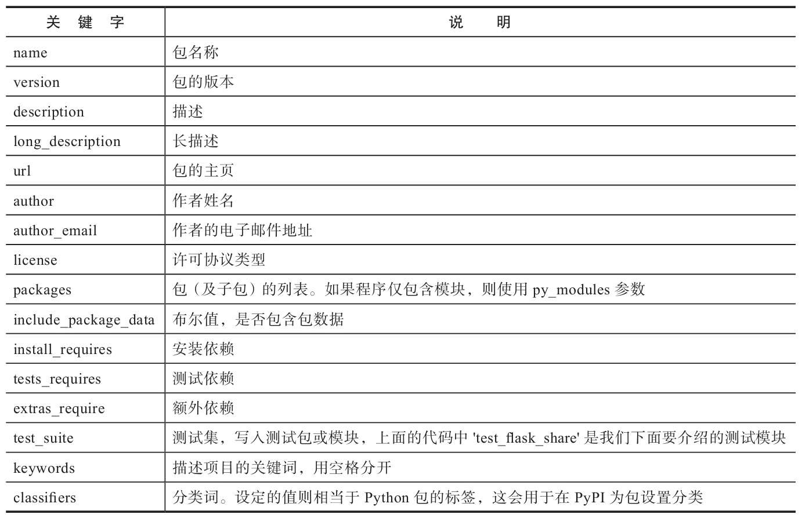
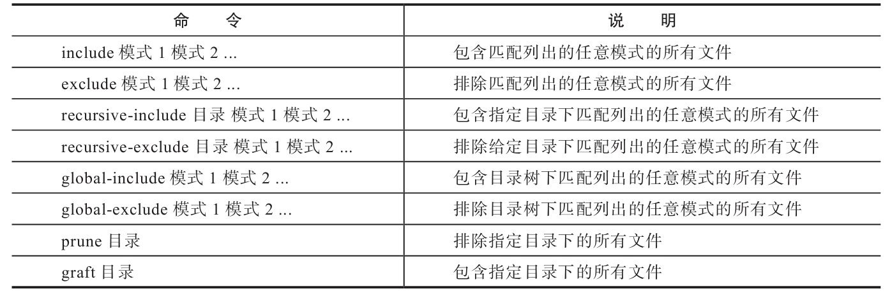

# 第十五章：Flask扩展开发

扩展和我们编写的程序很相似。事实上，Flask扩展就是Python库，只不过它可以使用Flask提供的诸多功能：他可以创建蓝本、获取配置、加载静态文件、使用上下午全局变量等。

Flask扩展通常分为两类：
* 一类是纯功能的实现，如提供用户认证功能的Flask-Login；
* 另一类是对已有的库和工具的包装，如Flask-SQLAlchemy对SQLAlchemy的包装。这种扩展可以理解为“胶水”或“适配器”，他让python库或js库与Flask程序更方便结合，简化了操作。

本章我们的目标是创建一个包装类型的扩展。

## 1. 本章设计的新包：

* setuptools（39.0.1）

  主页：https://github.com/pypa/setuptools

  文档：https://setuptools.readthedocs.io/en/latest/

* wheel（0.31.0）

  主页：https://github.com/pypa/wheel

  文档：https://wheel.readthedocs.io

* twine（1.11.0）

  主页：https://github.com/pypa/twine

  文档：http://twine.readthedocs.io

* readme_renderer（20.0）

  主页：https://github.com/pypa/readme_renderer

---

## 2. 扩展的命名规则是什么？

编写扩展的第一步是为扩展起个好名字。一般来说对于集成第三方库的扩展会使用第三方库名称来命名。

按照既成的约定：
* 扩展的命令格式为：`Flask-<功能/第三方库名>`或`<功能/第三方库名>-Flask`；
* 扩展中包的名称则使用小写加下划线的格式，而且必须是`flask_<名称>`，包名称就是我们在python代码中导入的名称。

如，本章我们要编写将js库[share.js](https://github.com/overtrue/share.js)包装起来的扩展，其作用是允许我们在模板中创建社交分享组件。那么我们可以将扩展命名为`Flask-Share`，包名为`flask_share`。

因为扩展需要注册并上传到PyPI后才可以使用pip或Pipenv等工具安装，所以`起名字前最好确保所选的名字没有被注册`。我们可以事先在https://pypi.org 上进行搜索，已经被注册的名称无法被再次注册。

---

## 3. 扩展项目的结构如何组织？

一个扩展，在项目层面就是一个Python开源项目。对于一个最小项目来说，必需的只有程序脚本和setup.py。

但是为了便于开发和协作，其他文件也是必不可少的，一般，扩展项目由以下文件组成：
* 存储扩展代码的程序包或模块（必需）
* setup.py（必需）
* 示例程序
* 文档
* 测试脚本或包
* README（说明文档）：包含项目的介绍、使用方法示例、作者信息等内容
* LISCENCE（许可证文件）
* CHANGES（版本变更记录）
* .gitignore
* 如果扩展需要静态文件或模板，那么还有static和templates文件夹
* ...

完整的开源项目应该包含开源许可证。开源许可证（license）是开源项目的授权许可协议，`规定了对于项目可以做和不可以做的事情`。Flask社区`建议扩展使用BSD、MIT等相对宽松的协议`，关于各个协议的比较可以在这个网站上了解：https://choosealicense.com/ 。许可证文件一般无后缀名，但也可添加.txt等后缀。

对于开源项目如何创建和参与，可以参考：https://opensource.guide/zh-hans/

如果你想快速创建一个新的扩展，那么可以使用[PyPA提供的示例项目](https://github.com/pypa/sampleproject)，它包含一个python项目的基本结构。

> PyPA指[Python Packaging Authority](https://www.pypa.io/)，是一个`维护众多和Python打包相关的项目的工作组`。我们在前面使用的pip、Pipfile、virtualenv、Setuptools以及下面要介绍的readme_render、twine等项目都是由该小组创建并维护的，具体项目列表可参考Github上的账户主页：https://github.com/pypa 。

---

## 4. 编写扩展类：如何为扩展创建构造函数并注册到app？

大多数情况下，`扩展都需要提供一个类来实现集成机制`，并通过实例化这个类获得扩展的对象，来提供主要的功能接口。即对应我们使用扩展时传入程序实例app来实例化扩展类进行初始化。所谓的`初始化就是进行一些基本设置`，如获取程序的配置、配置Jinja2环境，向模板上下文中添加变量或注册处理函数等，这些操作无一例外都要获取程序事例。

**如果扩展不需要进行初始化操作，那么扩展也可以不创建扩展类。**


* 创建扩展类：
  
  在扩展类的构造方法中，我们接收程序实例app作为参数。为了支持`工厂模式`（使用工厂函数创建程序实例），我们要创建一个`init_app()方法`，它同样接收app作为参数。
  
  `在构造方法中，我们将app参数默认值设为None，而且不会直接执行初始化操作，而是调用init_app()方法，并传入app`。这样无论是实例化时传入程序实例，还是在工厂函数中对扩展类实例调用init_app()方法传入程序实例，最终执行的操作都会保持一致"
  ```python
  class Share(object):
      def __init__(self, app=None):
          if app is not None:
              self.init_app(app)
  
      def init_app(self, app):
        pass  # 初始化操作
  ```

* init_app的首要操作：`注册扩展到app.extensions字典`
  
  在init_app()方法中，我们通常`第一个执行的初始化操作是将扩展添加到app.extensions属性中`。
  
  从0.7版本开始，Flask在程序实例上提供了一个`app.extensions字典`，可以用来`存储扩展特定的状态`，比如数据库引擎、发信服务器配置的对象等。当某个扩展A依赖于另一个扩展B时，在扩展A中也可以通过这个字典来判断是否已经完成了扩展B的初始化。
  
  `app.extensions字典的键必须是扩展名后一部分的小写形式`，比如“flask_share”扩展的键必须是“share”。为了支持0.7以前的版本，需要在设置字典前检查是否存在这个属性，如果不存在就先创建.
  ```python
  class Share(object):
      ...
      def init_app(app):
          ...
          if not hasattr(app, 'extensions'):  # 判断是否存在extensions属性
              app.extensions = {}
          app.extensions['share'] = self
  ```
  在其他地方需要获取状态信息时，就可以使用current_app.extensions['share']获取。

  **和扩展类一样，将扩展类添加到app.extensions字典也不是必须的。**

* 将扩展类添加到模板上下文（非必需）：
  
  对于需要在模板中使用的方法，需要在init_app()方法中将扩展类添加到模板上下文中，用于提供生成HTML代码的方法。
  
  我们这里的Share社交组件就在模板中创建，并在模板中调用方法生成HTML代码，所以需要加入模板上下文：
  ```python
  class Share(object):
      ...
      def init_app(self, app):
          ...
          app.jinja_env.globals['share'] = self
  ```
  这里使用`app.jinja_env.globals字典`将扩展类设置为模板全局对象share。

  根据我们在第3章介绍的创建模板全局变量/上下文变量的多种方法，你也可以`单独创建一个方法，然后附加app.context_processor装饰器`。更简单的做法是`直接作为方法并搭配lambda使用：app.context_processor(lambda：{'share'：self})`。

在Flask-Share中我们`把扩展类同时作为实现主要功能的类`。此外，为了更好地`解耦扩展功能`，你也可以把实际的程序功能使用另一个类实现。比如，我们使用Share作为实现扩展主要机制的类。另外再创建一个ShareComponent类，用来`实现创建社交分享组件的功能`，并把它添加到模板上下文中。

---

## 5. 如何为扩展添加配置？

一般会在扩展的配置变量名前加入包含扩展名称的前缀，来避免与其他扩展或用户自定义的配置发生冲突。

在Flask-Share中我们创建4个变量：SHARE_SERVE_LOCAL、SHARE_SITES、SHARE_MOBILE_SITES和SHARE_HIDE_ON_MOBILE，均使用SHARE作为前缀。

配置变量在init_app()方法中设置默认值，当扩展类被实例化或init_app()方法被调用时，这些配置就会被设置默认值，并`添加到app.config字典中`。

```python
class Share(object):
    ...
    def init_app(app):
        ...
        app.config.setdefault('SHARE_SERVE_LOCAL', False)
        app.config.setdefault('SHARE_SITES', 'weibo, wechat, douban, facebook, twitter, google, linkedin, qq, qzone')
        app.config.setdefault('SHARE_MOBILE_SITES', 'weibo, douban, qq, qzone')
        app.config.setdefault('SHARE_HIDE_ON_MOBILE', False)
```
Python字典的`setdefault方法`和get方法很相似，都可以获取一个键的值，并且提供第二个参数作为默认值。但和get（）不同的是，`如果字典中没有对应的键（即用户没有自行设置这个配置变量），setfault（）会使用第二个参数的默认值作为值来把这个键值对添加到字典中`。

---

## 6. 实现Flask-Share扩展功能：

单纯使用share.js时，需要进行下面的两步在页面上加入一个社交分享组件：

1. 加载JavaScript和CSS文件。

2. 在页面HTML文件中添加一个`div元素`，将class属性设置为`social-share`，并通过`data-*属性`来进行配置。

为了让它在Flask程序中更方便使用，我们将通过扩展Flask-Share提供下面这些功能：

1. 在模板中提供load()方法资源。

2. 在模板中提供create()方法创建社交分享组件。

3. 提供各种配置变量来对社交分享组件进行自定义。

另外，为了优化在移动设备上的体验，我们还要提供在移动设备上隐藏社交组件的设置。

### 6.1 加载静态资源：

对于要集成的对象：
* 如果是Python库，那么只需要在setup.py中将其列为安装依赖，然后再代码中引用；
* 如果是js库，则需要在模板中加载资源。

对于js库，如果不需要额外的配置，那么`加载资源的操作最好交由开发者自己实现`（在模板中自己加载）。为了方便开发, 可以创建一个附加的load()方法，用来在模板中生成加载资源的代码：
```python
class Share(object):
    ... 
    @staticmethod
    def load(css_url=None, js_url=None):
        if css_url is None:
            css_url = 'https://cdn.bootcss.com/social-share.js/1.0.16/css/share.min.css'
        if js_url is None:
            js_url = 'https://cdn.bootcss.com/social-share.js/1.0.16/js/social-share.min.js'
        return Markup('''<link rel="stylesheet" href="%s" type="text/css">\n
            <script src="%s"></script>''' % (css_url, js_url))
```
方法会返回包含CSS文件URL的\<link\>标签和JS文件URL的\<script\>标签。使用`Markup类`将返回的字符串标记为安全字符，避免被Jinja2转义。

默认资源从CDN加载。用户也可以在使用时通过参数css_url和js_url来指定资源URL。更进一步，也可以定义一个version参数来设置资源版本。

为了便于开发，我们也`可以在扩展中提供静态资源`，在程序包flask_share目录下创建一个`static`文件夹，存放对应的js和css资源。然后在init_app()方法中创建一个提供资源的蓝本：
```python
class Share(object):
    def __init__(self, app=None):
        if app is not None:
            self.init_app(app)

    def init_app(self, app):
        ...
        blueprint = Blueprint('share', __name__, static_folder='static' ,
            static_url_path='/share' + app.static_url_path))
        app.register_blueprint(blueprint)
```
创建一个名为share的蓝本，使用`static_url_path`关键字指定静态文件的URL规则，因此这些文件的路径将以`/share/static`开头。

因为用户`通过实例化Flask类时传入static_url_path参数可以自定义静态文件路径`，为了和用户设置保持一致，所以使用`app.static_url_path`属性拼接，即`/share + app.static_url_apth`。

最后将蓝本注册到app上。

为了支持用户设置是否使用内置资源，我们提供了一个配置变量：`SHARE_SERVER_LOCAL`，默认为False：`app.config.setdefault('SHARE_SERVE_LOCAL', False)`。

在load()中判断用户是否加载本地资源：
```python
@staticmethod
def load(css_url=None, js_url=None):
    if current_app.config['SHARE_SERVE_LOCAL']:
        css_url = url_for('share.static', filename='css/share.min.css')
        js_url = url_for('share.static', filename='js/share.min.js')
    ...
```
获取蓝本下的资源要在端点前添加蓝本名称，即`share.static`。

**注意**：`为了能够支持多个程序实例（app），我们通常使用全局对象current_app获取程序的各种属性和方法`, 如current_app.config，而不是在init_app（）中创建一个self.app属性。


### 6.2 创建分享组件：

创建社交分享组件的`实质就是在HTML模板中添加一段HTML代码`, 并根据配置值对这段代码进行相应的调整。

我们创建一个create()方法：
```python
class Share(object):
    ...
    @staticmethod
    def create(title='', sites=None, mobile_sites=None, align='left', addition_class=''): 
        if sites is None:
            sites = current_app.config['SHARE_SITES']
        if mobile_sites is None:
            mobile_sites = current_app.config['SHARE_MOBILE_SITES']
        return Markup('''<div class="social-share %s" data-sites="%s" data-mobile-sites="%s" align="%s">%s</div>
        ''' % (addition_class, sites, mobile_sites, align, title))
```
方法接收sites和mobile_sites参数来设置显示的分享站点以及在移动设备上显示的分享站点，如果用户未提供则使用默认值。

title、align和addition_class参数分别用于设置分享组件左侧的文字内容、分享组件的对齐方式、附加的样式类。使用示例：`{{ share.create(title='分享到：') }}`。

### 6.3 在移动设备上隐藏组件：

这些分享按钮在移动设备上的使用体验并不是很好。以Twitter为例，因为这些按钮调用了Web端的分享API，在移动设备的浏览器中`单击它会跳转到Twitter的网站，而不是手机中安装的Twitter客户端`。`share.js本身并没有提供在移动设备上隐藏分享组件的功能`，我们可以在扩展中添加这个功能。

要判断一个请求是否来自于移动设备，可以`通过请求报文中的User Agent信息来判断`。Flask（Werkzeug）将User Agent的值解析在`request.user_agent`属性中，通过读取`request.user_agent.platform`属性则可以查看请求哭护短的平台信息。

我们通过一个包含所有移动设备平台名称的正则表达式与platform值进行匹配，如果匹配成功，则说明其来源于移动设备。

```python
class Share(object):
    ...
    @staticmethod
    def create(title='', sites=None, mobile_sites=None, align='left', addition_class=None):
        if current_app.config['SHARE_HIDE_ON_MOBILE']:
            platform = request.user_agent.platform
            mobile_pattern = re.compile('android|fennec|iemobile|iphone|opera (?:mini|mobi)')
            m = re.match(mobile_pattern, platform)
            if m is not None:
                return ''
        ...
```
移动设备隐藏通过配置变量`SHARE_HIDE_ON_MOBILE`控制，一旦这个配置设为True，并且当前请求的platform参数匹配成功，create（）方法就会返回空字符串，从而起到了隐藏分享组件的效果。

---

## 7. 开源发布前需要进行哪些准备？

作为一个开源项目，除了基本的功能代码，为了项目易于使用和维护，`注释、文档、示例`等基本元素也不可或缺。

### 7.1 添加文档字符串和注释：

`文档字符串`即写在代码文件、类或方法开头的多行注释（使用三个引号包围格式），用来说明改脚本的功能、作者及许可等信息。文档字符串一般使用了基于Sphinx的`reStructureText格式`，以便于使用Sphinx自动提取文档字符串生成格式良好的`API文档`。

注释用于说明部分代码的功能，在开发时和代码同步进行编写。

```python
"""
    Flask-Share
    ~~~~~~~~~~~~~~
    Create social share component in Jinja2 tempalte based on share.js.
    :copyright: (c) 2017 by Grey Li.
    :license: MIT, see LICENSE for more details.
"""
import re

from flask import current_app, url_for, Markup, Blueprint, request

class Share(object):
    def __init__(self, app=None):
        if app is not None:
            self.init_app(app)

    def init_app(self, app):
        blueprint = Blueprint('share', __name__)
        app.register_blueprint(blueprint)

        if not hasattr(app, 'extensions'):
            app.extensions = {}
        app.extensions['share'] = self

        # default settings
        app.config.setdefault('SHARE_SERVE_LOCAL', False)
        app.config.setdefault('SHARE_SITES', 'weibo, wechat, douban, facebook, twitter, google, linkedin, qq, qzone')
        app.config.setdefault('SHARE_MOBILE_SITES', 'weibo, douban, qq, qzone')
        app.config.setdefault('SHARE_HIDE_ON_MOBILE', True)

    @staticmethod
    def load(css_url=None, js_url=None, serve_local=False):
        """Load share.js resources.
        
        :param css_url: if set, will be used as css url.
        :param js_url: if set, will be used as js url.
        :param serve_local: if set to True, the local resource will be used.
        """
        ...

    @staticmethod
    def create(title='', sites=None, mobile_sites=None, align='left', addition_class=None):
        """Create a share component.

        :param title: the prompt dispalyed on the left of the share component.
        :param sites: a string that consist of sites, separate by comma.
                    supported site name: weibo, wechat, douban, facebook, twitter, google, linkedin, qq, qzone.
                      for example: `'weibo, wechat, qq'`.
        :param mobile_sites: the sites displayed on mobile.
        :param align: the align of the share component, default to `'left'`.
        :param addition_class: the style class added to the share component.
        """
        ...
```

### 7.2 编写README与文档：

关于README和文档的安排有两种情况：

* 当项目比较小时，如果在README中就可以概括所有必须的内容，那么可以不用提供单独的文档；
* 如果项目规模比较大/复杂，就需要编写详细的文档，最好分多个文档来阻止文档的内容。此时README中要给出文档等资源的链接地址。

对于Python项目，通常会使用`Sphinx + GitHub + Readthedocs`的工作流来编写和部署文档。

README应该尽量简单，只需要简明扼要地介绍一下项目，然后附上相关的链接。在GitHub中，根目录下的README文件的内容会显示在项目主页上，同时`支持Markdown(.md)和reStructureText(.rst)格式`。

除了README和文档，我们还可以添加其他可选的文件，比如`编写贡献注意事项的CONTRIBUTING`，`记录项目版本变化的CHANGES`，`记录贡献者的CONTRIBUTORS`，或是`记录待办事项的TODO`等。

### 7.3 为打包做准备：

为了便于分发程序，我们必须对项目进行打包（packaging），这可以让程序可以使用pip、Pipenv或其他工具从PyPI安装。Python包通常使用`setuptools`进行打包。

本节我们简单介绍打包的流程，关于python项目打包和分发的详细教程，参考[Python Packaging User Guide](https://packaging.python.org/en/latest/)。也可以到[setuptools的官方文档](https://setuptools.pypa.io/en/latest/)查看详细用法。

#### 7.3.1 创建setup.py：

在打包之前，需要在项目根目录下创建一个`setup.py`文件，大多数Python包都有一个setup.py文件，它`定义了python包的元数据`，如包的版本、名称、作者信息等。更重要的是，`通过它可以对打包安装等行为进行非常详细的配置`。

```python
"""
    Flask-Share
    ~~~~~~~~~~~~~~
    Create social share component in Jinja2 template based on share.js.
    :copyright: (c) 2017 by Grey Li. 
    :license: MIT, see LICENSE for more details.
"""
from os import path
from codecs import open
from setuptools import setup
basedir = path.abspath(path.dirname(__file__))

# Get the long description from the README file
with open(path.join(basedir, 'README.md'), encoding='utf-8') as f:
    long_description = f.read()

setup(
    name='Flask-Share',  # 包名称
    version='0.1.0',  # 版本
    url='https://github.com/greyli/flask-share',
    license='MIT',
    author='Grey Li',
    author_email='withlihui@gmail.com',
    description='Create social share component in Jinja2 template based on share.js.',
    long_description=long_description,
    long_description_content_type='text/markdown',  # 长描述内容类型
    platforms='any',
    packages=['flask_share'],  # 包含的包列表
    zip_safe=False,
    test_suite='test_flask_share',
    include_package_data=True,
    install_requires=[
        'Flask'
    ],
    keywords='flask extension development',
    classifiers=[
        'Development Status :: 3 - Alpha',
        'Environment :: Web Environment',
        'Intended Audience :: Developers',
        'License :: OSI Approved :: MIT License',
        'Programming Language :: Python',
        'Programming Language :: Python :: 2',
        'Programming Language :: Python :: 2.7',
        'Programming Language :: Python :: 3',
        'Programming Language :: Python :: 3.3',
        'Programming Language :: Python :: 3.4',
        'Programming Language :: Python :: 3.5',
        'Programming Language :: Python :: 3.6',
        'Topic :: Internet :: WWW/HTTP :: Dynamic Content',
        'Topic :: Software Development :: Libraries :: Python Modules'
    ]
)
```
首先需要从setuptools中导入`setup()`函数，然后使用一系列关键字参数来指定包的元数据和选项。


setup()函数的主要关键字参数及说明如下：

完整的可用参数列表：https://docs.python.org/zh-cn/3/distutils/apiref.html#distutils.core.setup 和 https://setuptools.pypa.io/en/stable/userguide/keywords.html 
完整可用的`分类词classifiers`列表：https://pypi.org/pypi?%3Aaction=list_classifiers

* `packages`参数是要安装的包的列表，包括子包。如果程序结构复杂，包含多个子包，可以使用setuptools提供的`find_packages()`函数来自动寻找包。即 from setuptools import find_packages 后，`packages=find_packages()`
* `install_requires`参数用来声明python包的安装依赖，虽然和Pipfile很相似，但并不是重复。
  * install_requires定义了python包的最小化的抽象依赖（abstract），不需要固定版本号，他通常被用于在各类工具库（library）中；
  * Pipfile/Pipfile.lock包含所有的具体依赖（concrete）和固定的版本号，可以用来复现完整可用的程序运行环境，通常被在特定程序中。
* 除了install_requires参数，我们还可以使用`test_requires`参数指定测试时的依赖，因为我们在`test_suite`参数中给出了我们的测试模块, 之后我们可以使用`python setup.py test`命令运行测试。
* `extra_requires`参数可以用来定义额外依赖。因为Pipenv的使用不够普及，如果想让使用传统方式的开发者也可以方便的参与开发，除了使用Pipenv生成requirements.txt文件外，可以`将开发依赖同时声明到extra_requires参数中`。
  该参数通过字典中的键来定义额外依赖的`组名称`和`对应的依赖列表`，如：
  ```python
  extras_require={
          'dev': [
              'coverage',
              'flake8',
              'tox',
          ],
   },
  ```
  安装时，只需要在包名称后面添加`[dev]`即可同时安装dev键对应的额外依赖列表：`pip install -e ".[dev]"`。这里的‘.’表示当前目录下的包，及我们开发的Flask-Share。直接从pypi安装时则需要写全包名。

我们可以使用`pip show`命令查看某个python包的信息，或是在python包的PypI页面看到的信息，他们就是在setup.py中定义的。

python包上传到PyPI后会拥有一个项目页面，我们在setup.py中填写的大部分信息会被解析并显示在项目页面上。页面的主题部分是我们定义的long_description参数值。如果要显示的内容比较少，可以`直接写在setup.py脚本的文档字符串中，然后将long_description参数指定为__doc__变量`。这里我们读取README.md文件的内容作为long_description参数的值。需要注意的是: `默认情况下，PyPI会将long_description的值作为reStructureText格式渲染，如果不支持则渲染为纯文本。如果使用Markdown格式则需要额外添加long_description_content_type参数， 设为text/markdown`。

另外，PyPI使用的reStructureText解析器并不是Sphinx，所以要使用标准的reStructureText语法。为了确保渲染为期望的效果，可以使用`readme_render包对reStructureText格式的README进行检查`：
```
pipenv install readme_renderer --dev
python setup.py check -r -s
```
如果没有错误输出，则一切正常。

> 开源项目版本规约：
> * 一种是常规的语义化格式：`主版本号.子版本号.修正版本号`，具体可参考[Semantic Versioning 2.0.0](https://semver.org/lang/zh-CN/)
> * 另一种使用日期来作为版本号，即CalVer（Calendar Versioning），如2021.4.12，具体可访问[https://calver.org/](https://calver.org/)了解。
   
#### 7.3.2 添加包数据：

除了程序脚本，还有一些其他文件我们希望一起打包，如模板文件和静态文件。

最简单的方式是创建一个`MANIFEST.in`文件来指定这些数据：
```
graft flask_share/static
include LICENSE test_flask_share.py
```
当使用MANIFEST.in文件指定包数据时，我们`需要在setup()方法中将参数include_package_data需要被设为True`。

当使用setuptools打包项目时，不用显式地声明加入README，因为在打包时它会`自动将README、setup.py、setup.cfg和MANIFEST.in添加`进去。

在manifest文件中，使用`命令 目录名/文件模式`的形式来声明一条规则，可用的命令如下：


### 7.4 编写示例程序：

为了方便用户快速了解扩展的用法并体验扩展的实际效果，有必要橙色一个简单的示例程序。示例程序通常在一开始是作为开发扩展是的调试程序，被`存储在程序包的example或examples文件夹`中。

示例程序`仅需要保存在Git仓库中，不需要被打包`，因此不写入MANIFEST.in文件中。

测试实例程序时需要导入扩展，因此可以先在本地安装扩展，创建好setup.py脚本后，使用`pipenv install <path>`命令即可在本地安装程序包, 因为我们的程序包是在当前目录下，可以使用“.”来表示当前目录：`pipenv install -e .`。 `-e`是--editable选项的简写，这个选项用来开启`开发模式`。开发模式是指`在安装包的同时允许对代码进行修改，而不用重复进行安装`。当安装程序时，通过install_requires参数指定的依赖包会同时被自动安装。

再激活虚拟环境的情况下，上面两个命令分别相当于`python setup.py install`和`python setup.py develop`命令。

### 7.5 编写单元测试：

为了确保扩展Flask-Share可以按照预期工作，我们需要编写相应的单元测试。test_flask_share.py脚本中包含了几个简单的测试：
```python
import unittest 

from flask import Flask, render_template_string, current_app

from flask_share import Share

class ShareTestCase(unittest.TestCase):

    def setUp(self):
        self.mobile_agent = {'HTTP_USER_AGENT': 'Mozilla/5.0 (iPhone; CPU iPhone OS 9_1 like Mac OS X) \
        AppleWebKit/601.1.46 (KHTML, like Gecko) Version/9.0 Mobile/13B143 Safari/601.1'}

        app = Flask(__name__)
        app.testing = True
        self.share = Share(app)

        @app.route('/')
        def index():
            return render_template_string('{{ share.load() }}\n{{ share.create() }}')

        self.context = app.app_context()
        self.context.push()
        self.client = app.test_client()

    def tearDown(self):
        self.context.pop()
    ...
    def test_create_on_mobile(self):
        current_app.config['SHARE_HIDE_ON_MOBILE'] = True
        response = self.client.get('/', environ_base=self.mobile_agent)
        data = response.get_data(as_text=True)
        self.assertIn('social-share.min.js', data)
        self.assertNotIn('<div class="social-share', data)
```
这里仅列出最后一个测试：测试移动设备客户端发起请求时分享组件的隐藏功能。

首先在setUp()方法中做了这些工作：创建一个测试用的程序实例，初始化扩展，添加了一个简单的视图函数，创建测试客户端，推送程序上下文。

在test_create_on_mobile（）方法里，我们使用测试客户端的get（）方法发起GET请求，这里传入了一个`environ_base参数来覆盖默认的WSGI环境的默认值`。对应的self.mobile_agent是一个字典，`HTTP_USER_AGENT对应的值是iPhone的User Agent字符串`。

除了单元测试，项目中还要进行`测试覆盖率`和`PEP8检查`。Coverage.py同时支持将配置存储在`setup.cfg`文件中。不过在这个文件中，需要将第12章介绍的`[run]`改为`[coverage：run]`以包含完整的命令。另外Flake8也支持将配置写到`setup.cfg`，所以我们可以统一将这两个工具的配置写在setup.cfg中。

> `setup.cfg`是针对setup.py的`配置文件`，它可以对setup.py支持的命令进行配置（要查看所有的命令可执行$setup.py --help-commands）或设置其他选项值。当配置命令时，被中括号括住的是对应的命令，下面的键值对则是配置参数和对应的值。

当测试项目增多时，你可以使用[Tox](https://github.com/tox-dev/tox)来简化测试流程。使用Tox可以`对各类测试的依赖、命令等进行预定义，并在不同的Python版本下创建虚拟环境测试包的安装和其他各类测试`，另外还可以与CI系统集成，你可以在项目仓库中查看Tox的配置文件`tox.ini`。

对于开源项目，使用在线的CI系统会让开源协作更加轻松，Flask-Share使用与`GitHub集成并对开源项目免费的Travis-CI`实现持续集成，具体的配置文件travis.yml可以在项目仓库中查看。

---

## 8. 如何将扩展发布到PyPI？

将扩展打包并发布到PiPI后，我们将可以通过pip或pipenv命令直接安装扩展了。

### 8.1 创建PyPI账号：

首先我们需要在PyPI注册一个账号，填写表单，完成Email认证。

为了避免每次进行包上传和更新操作时都需要输入用户名和密码，我们可以在本地创建一个`.pypirc文件存储PyPI账户和密码`，这会在上传包时用到。这个文件需要放在$HOME/.pypirc，Linux和macOS系统的文件位置存储在系统根目录下，即~/.pypirc；在Windows系统一般存储在Administrator文件夹下，即C：\Users\Administrator\.pypric。

文件内容为ini格式：
```ini
[distutils]
index-servers =
    pypi

[pypi]
username:用户名
password:密码
```
这会将密码以明文的形式保存，请注意限制对该文件的访问权限，以确保密码不会泄露。作为替代，你也可以考虑使用[keyring](https://github.com/jaraco/keyring)存储敏感数据。

### 8.2 使用setuptools打包：

创建setup.py脚本后，我们就可以使用setuptools提供的命令行工具[进行打包](https://packaging.python.org/en/latest/tutorials/packaging-projects/#packaging-python-projects)了。

> 打包的格式一般有三种：
> * [Egg](https://packaging.python.org/en/latest/glossary/#term-Egg)（.egg）：已不推荐使用
> * [Source Distribution](https://packaging.python.org/en/latest/glossary/#term-Source-Distribution-or-sdist)（或sdist）（.tar.gz）：压缩文件，其中包含项目的元数据和必须的源文件，以供pip等工具进行安装，或生成[Built Distribution](https://packaging.python.org/en/latest/glossary/#term-Built-Distribution).
> * [Wheel](https://packaging.python.org/en/latest/glossary/#term-Wheel)（.whl）：目前官方推荐的新一代打包格式，定义在[PEP 427](https://peps.python.org/pep-0427/)中，打包后为二进制文件格式。和其他两种格式相比，它具有很多优点。如wheel在打包时会对包进行构建，在安装时则省去了这个过程，安装速度比Source Distribution格式更快。

> wheel包有三种类型：纯Python wheel、平台wheel、通用wheel。这是因为wheel是提前构建生成的二进制文件，根据代码对python2、3的兼容性以及是否使用了C扩展，wheel会生成特定Python版本或操作系统的文件。

为了让程序能够在各种版本的操作系统、Python中使用pip安装，最好`同时提供Source Distribution和Wheel两种格式`。当使用pip安装包时，会优先使用Wheel包，如果没有Wheel包或版本和当前的Python版本或操作系统不匹配，则使用Source Distribution包。目前大部分主流的Python包都提供了wheel包文件，具体可以到 https://pythonwheels.com/ 上查看。

* 创建sdist包：`python setup.py sdist`
* 创建wheel包：`python setup.py bdist_wheel`
* 合并，同时创建：`python setup.py sdist bdist_wheel`

命令执行后，会在项目目录下生成一个`dist文件夹`，其中包含两种格式的包文件（即要上传到PyPI的文件）。

如果要打包的程序同时支持Python2和Python3且没有在Python中使用C扩展（即纯Python），那么可以在上面的bdist_wheel命令后加入`——universal选项`，这会创建一个“Universal Wheels”（通用Wheel）。为了避免每次发布新版本打包时都需要手打输入该参数，可以在setup.cfg文件中写入该选项：
```ini
[metadata]
license_file = LICENSE

[bdist_wheel]
universal = 1
```
文件使用INI风格。`bdist_wheel节`表示为bdist_wheel命令设置配置，universal=1则表示开启universal参数。`metadata节`用来设置元数据，将license_file选项设为开源许可证文件名可以将其打包进wheel包中。


### 8.3 使用twine上传：

twine是一个用来与PyPI交互的实用工具，目前支持注册项目和上传分发包，使用HTTPS连接，较为安全。使用它可以替代旧的python setup.py upload方法。

安装：`pipenv install twine --dev`

上传（如果是第一次上传，twine会自动注册项目）：`twine upload dist/*`

这将把我们在dist目录下生成的包文件上传到PyPI，之后便可在 https://pypi.org/project/<扩展名称>/ 访问上传后的PyPI项目主页。

如果你担心实际的操作失误会影响到包的发布，也可以先使用[Test PyPI](https://test.pypi.org/) 进行测试，这是Python社区提供的测试版本的PyPI站点。具体可以参考https://packaging.python.org/guides/using-testpypi/ 。

### 8.4 将包添加到Git仓库：

现在将文件添加到Git仓库，并推送到远程仓库：
```shell
$ git add .
$ git commit -m "Ready for first release"
$ git push
```
然后创建一个Git标签（Tag），标签的名称使用扩展初始版本的版本号，即“0.1.0”，最后推送到GitHub：
```
$ git tag –a 0.1.0 –m "Bump version number to 0.1.0"
$ git push origin 0.1.0 # 或使用git push --tags 推送所有标签
```
这会`在Github自动生成一个Release`.

---

## 9. 编写良好的扩展需要遵循哪些要求？

一个合格的Flask扩展至少应该符合下面的要求：https://flask.palletsprojects.com/en/2.1.x/extensiondev/

* 命名符合规范（Flask-Foo或Foo-Flask）
* 使用相对宽松的开源许可证（MIT/BSD等）
* 支持工厂模式（添加init_app（）方法）
* 支持同时运行的多程序实例（使用`current_app`获取程序实例）
* 包含setup.py脚本，并列出所有安装依赖
* 包含单元测试
* 编写文档并在线发布
* 上传到PyPI

确保扩展符合满足Flask文档中列出的[“被认可扩展（Approved Extensions）”检查清单](http://flask.pocoo.org/docs/latest/extensiondev/#approved-extensions)。