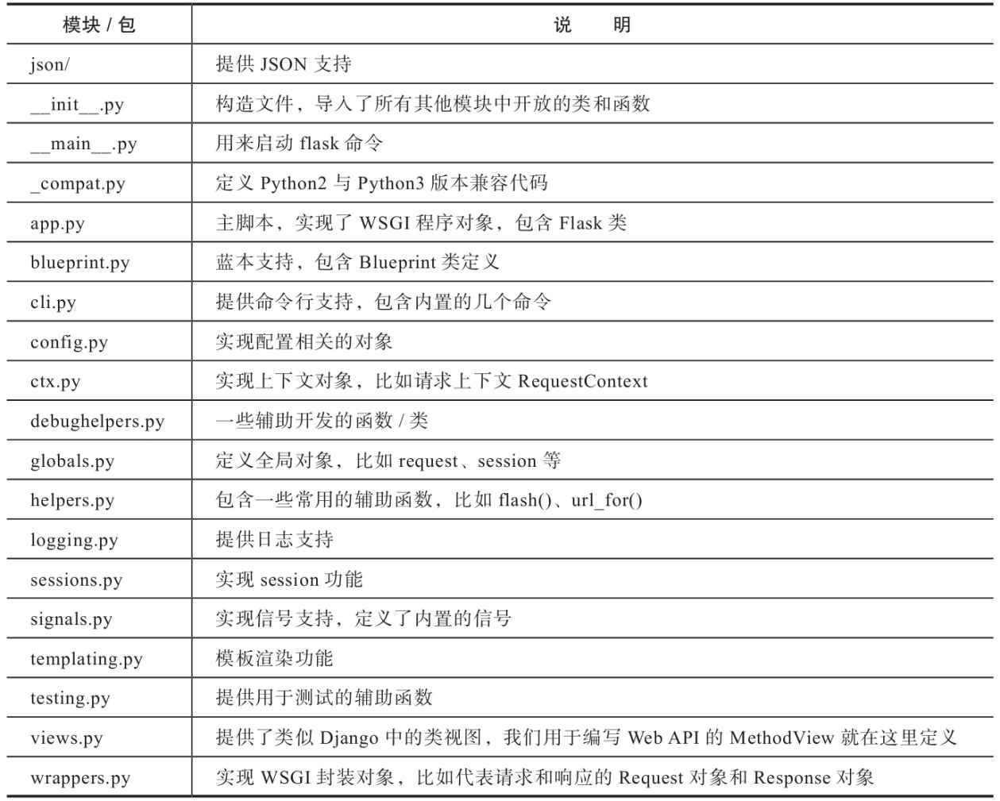
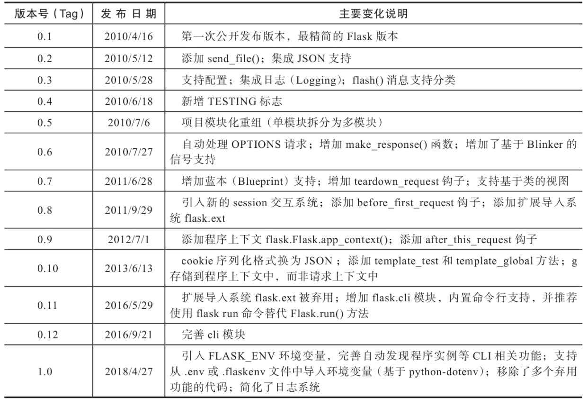
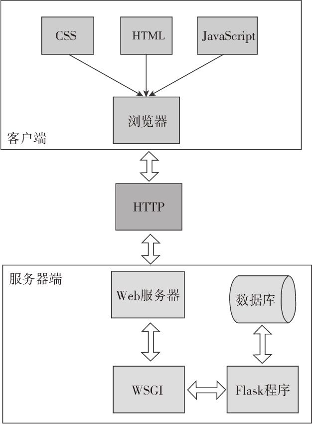

# 第十六章 Flask工作原理与机制解析

## 1. 为何要阅读Flask源码？

阅读源码通常出于以下目的：
* 了解某个功能的具体实现；
* 学习Flask的设计模式和代码组织方式

通过阅读源码，可以使我们在日常开发中更加得心应手，而且在出现错误时可以更好地理解和解决问题。另外，Flask的代码非常Pythonic，而且有丰富的文档字符串，学习和阅读优美的代码也会有助于我们自己编写出优美的代码。

---

## 2. 如何获取Flask源码？

当我们使用pip或Pipenv安装Flask时，Flask会和其他包一样被安装到Python解释器中的`site-packages目录`下。

为了方便阅读，我们可以从Flask的github仓库克隆源码：`git clone https://github.com/pallets/flask.git`

---

## 3. 如何阅读源码？

首先选择一个合适的代码阅读工具或IDE，如PyCharm。附PyChram中symbol含义：[https://www.jetbrains.com/help/pycharm/symbols.html](https://www.jetbrains.com/help/pycharm/symbols.html).

1. 立足整体：
   
   在阅读代码时，一开始不需要关注代码视线中的所有细节。如果把某个项目的源码比作大树，那么我们重点要关注的是树的主干和分支，而不是所有的树叶。

   了解flask包由哪些包和模块组成，各个模块又包含哪些类和函数，分别负责实现什么功能。最主要的是关心几个核心的模块，如：WSGI交互、蓝本、上下文等。

   

   掌握Flask整体结构的另一个方式是阅读API文档：[https://flask.palletsprojects.com/en/2.1.x/api/](https://flask.palletsprojects.com/en/2.1.x/api/)

2. 逐个击破：
   
   在了解了整体结构后，可以尝试从某一个功能点入手，了解具体的实现方法。

   此时阅读代码需要善用搜索、跳转和 “find usages”。

   阅读源码时，需要带着两个问题去读：
   
   * 这段代码实现了什么功能？
   * 它是如何实现的？

3. 由简入繁：
   
   项目早期版本的代码仅保留了核心特性，而且代码量较少，更容易阅读和理解。

   建议切换到Flask 0.1 版本阅读最早期代码。她只有一个flask.py文件。

   本书作者提供了一份注解版的早期代码：[https://github.com/greyli/flask-origin](https://github.com/greyli/flask-origin) 方便阅读学习。

4. 单步调试：
   
   单步调试可以让我们实时观察代码执行流程和上下文环境信息。

   除了使用PyCharm提供的提示功能，还可以使用内置的pdb模块（Python DeBugger）或是集成IPython的[ipdb](https://github.com/gotcha/ipdb) 来进行单步调试。

---

## 4. Flask 发行版本分析：

项目的某些发行版本只是修正了少量错误，添加了一些额外特性，这些小版本可以再阅读时略过。

书中给出的最新发行版本是1.0.2，各版本的change log如下：



比较值得阅读的版本是 **0.1、0.4、0.5、0.7以及最新版本1.0**，其他版本大部分的变动都是在重构、优化代码以及修复错误，因此可以略过。

完整的发型变更信息参考：[https://flask.palletsprojects.com/en/2.1.x/changes/](https://flask.palletsprojects.com/en/2.1.x/changes/)

---

## 5. Flask 的设计理念有哪些？

1. 微框架
2. 两个核心依赖：Werkzeug 和 Jinja2
3. 显式程序对象
4. 本地上下文
5. 三种程序状态：
   1. 程序设置状态
   2. 程序运行状态
   3. 请求运行状态
6. 丰富的自定义支持

### 5.1 Flask 微框架的“微”指什么？

微并不是指Flask功能简陋，而是指其保留核心功能且易于扩展。

有许多Web程序不需要后台管理、用户认证、权限管理，有些甚至不需要表单或数据库，所以Flask并没有内置这类功能，而是把这些功能都交给扩展或用户自己实现。正因为如此，从只需要渲染模板的小项目，到需要各种功能的大项目，Flask几乎能够适应各种情况。

### 5.2 Werkzeug 和 Jinja2 对Flask的重要性是什么？

* Werkzerg是一个优秀的WSGI工具库，用于处理web服务器与WSGI规范的交互。Flask与Werkzeug的联系非常紧密。从路由处理，到请求解析，再到响应的封装，以及上下文和各种数据结构都离不开Werkzeug，有些函数（比如redirect、abort）甚至是直接从Werkzeug引入的。如果要深入了解Flask的实现原理，必然躲不开Werkzeug。
* 使用Jinja2是因为大多数web程序都需要渲染模板，使用Jinja2可以减少大量工作。当然Flask也支持其他模板渲染引擎，如[Mako](http://www.makotemplates.org/)、[Genshi](http://genshi.edgewall.org/)等。

### 5.3 Flask为什么要使用显式的程序对象？

在一些Python web框架中，一个视图函数可能类似这样：
```python
from example_framework import route

@route('/')
def index():
    return 'Hello World!'
```
而在Flask中：
```python
from flask import Flask
app = Flask(__name__)

@app.route('/')
def index():
    return 'Hello World!'
```
显而易见，Flask中存在一个显式的程序对象app，我们需要在全局空间中创建它。

这样设计的主要原因是：
* 隐式程序对象在同一时间只能有一个实例存在，而显式的程序对象允许多个程序实例存在；
* 允许我们通过子类化Falsk类来改变程序行为；
* Flask需要通过传入的包名称来定位资源（模板和静态文件）；
* 允许通过工厂函数来创建程序实例，可以在不同地方传入不同的配置来创建不同的程序实例；
* 允许通过蓝本Blueprint来模块化程序。

### 5.4 本地上下文指什么？

在**多线程环境**下，要想让所有视图函数都获取请求对象。最直接的方法就是在调用视图函数时将所有需要的数据作为参数传递进去，但这样一来程序逻辑就变得冗余且不易于维护。另一种方法是将这些数据设为全局变量，但是如果直接将请求对象设为全局变量，那么必然会在不同的线程中导致混乱（非线程安全）。

本地线程（thread locals）的出现解决了这些问题，它是一个全局对象，可以使用一种特定线程且线程安全的方式来存储和获取数据。即，`同一个变量在不同的线程拥有各自的值，互不干扰`。

其实现原理是`根据线程ID来存取数据`，Flask使用Werkzeug的本地线程对象`werkzeug.local.Local()`来实现本地线程，他增加了对于Greenlet的支持。

[Greenlet](https://github.com/python-greenlet/greenlet)是以C扩展形式接入Python的轻量级**协程**。

lask使用本地线程来让上下文代理对象全局可访问，比如`request、session、current_app、g`，这些对象被称为`本地上下文对象（context locals）`。因此，在不基于线程、greenlet或单进程实现的并发服务器上，这些代理对象将无法正常工作，但好在仅有少部分服务器不被支持。

Flask的设计初衷是为了让传统Web程序的开发更加简单和迅速，而不是用来开发大型程序或异步服务器的。但是Flask的可扩展性却提供了无限的可能性，除了使用扩展，我们还可以子类化Flask类，或是为程序添加中间件。

---

### 5.5 Flask的三种程序状态有什么差异？

Flask提供的四个本地上下文对象分别在特定的程序状态下绑定实际的对象。如果我们在访问或使用它们时还没有绑定，那么就会抛出RuntimeError异常。

Flask有三种状态：

* 程序设置状态 application setuo state：
  
  Flask类被实例化，即创建app后。此时所有全局对象都没有被绑定。
  ```python
  >>> from flask import Flask, current_app, g, request, session
  >>> app = Flask(__name__)
  >>> current_app, g, request, session
  (<LocalProxy unbound>,
   <LocalProxy unbound>,
   <LocalProxy unbound>,
   <LocalProxy unbound>)
  ```
* 程序运行状态 application runtime state:
  
  Flask程序启动，但是还没有请求进入。此时，current_app 和 g 都绑定了各自的对象。

  使用flask shell命令打开的Python shell默认就是这种状态，我们也可以在普通的Python shell中通过手动推送程序上下文来模拟：
  ```python
  >>> from flask import Flask, current_app, g, request, session
  >>> app = Flask(__name__)
  >>> ctx = app.app_context()
  >>> ctx.push()
  >>> current_app, g, request, session
  (<Flask '__main__'>,
   <flask.g of '__main__'>,
   <LocalProxy unbound>,
   <LocalProxy unbound>)
  >>> ctx.pop()
  ```
  手动使用app_context（）方法创建了程序上下文，然后调用push（）方法把它推送到`程序上下文堆栈`里。默认情况下，当请求进入的时候，程序上下文会随着请求上下文一起被自动激活。但是在没有请求进入的场景，比如离线脚本、测试，或是进行交互式调试的时候，手动推送程序上下文以进入程序运行状态会非常方便。

* 请求运行状态 request runtime state:
  
  有请求进入时，或是使用 test_request_context()方法、test_client()时，进入请求运行状态。此时，4个全局变量全都被绑定。
  ```python
  >>> from flask import Flask, current_app, g, request, session
  >>> app = Flask(__name__)
  >>> ctx = app.test_request_context()
  >>> ctx.push()
  >>> current_app, g, request, session
  (<Flask '__main__'>,
   <flask.g of '__main__'>,
   <Request 'http://localhost/' [GET]>,
   <NullSession {}>)
  >>> ctx.pop()
  ```
  这样我们就可以在视图函数或相应的回调函数中直接使用这些上下文对象了。

  这里因为没有设置程序密钥，所以session是表示无效session的`NullSession类`实例。

---

### 5.6 Flask的灵活体现在什么地方？

Flask的灵活不仅体现在易于扩展，不限制项目结构，也体现在其内部的高度可定制化。

如，我们可以创建Flask类的子类，来改变特定的行为：
```python
from flask import Flask

class MyFlask(Flask)
    pass

app = MyFlask(__name__)
...
```
此外，我们还可以自定义请求类和响应类。最常用的方式是子类化Flask内置的请求类和响应类，然后改变一些默认的属性。Flask内部在使用这些类时并不直接写死，而是使用了定义在Flask属性上的中间变量，比如请求类存储在`Flask.request_class`中, 响应类存储在`Flask.response_class属性`上。

如果要使用自己的请求类，那么只需要把请求类赋值给这个属性即可：
```python
from flask import Flask, Request

class MyRequest(Request):
    pass

app = Flask(__name__)
app.request_class = MyRequest  # 修改request类
```

创建响应对象的make_response()并不是直接实例化Response类，而是实例化被存储在`Flask.response_class属性`上的类，默认为Response类。
如果你要自定义响应类，创建后只需赋值给程序实例的response_class属性即可。

---

## 6. Flask 与 WSGI 是什么样的关系？

WSGI指 Python Web Server Gateway Interface，是为了让web服务器与Python程序能够进行数据交流而定义的一套接口标准/规范。其具体定义在[PEP 333](https://www.python.org/dev/peps/pep-0333/) 和 [PEP 3333](https://www.python.org/dev/peps/pep-3333/)（增加了对python3的支持）。


客户端和web服务器之间使用HTTP协议通信，从HTTP请求到我们的Python web程序之间需要一个转换过程：`将HTTP报文转换为WSGI规定的数据格式`。WSGI则可以视为WSGI服务器和我们的Web程序进行沟通的语言。



---

## 7. WSGI 程序的基本特征是什么？

